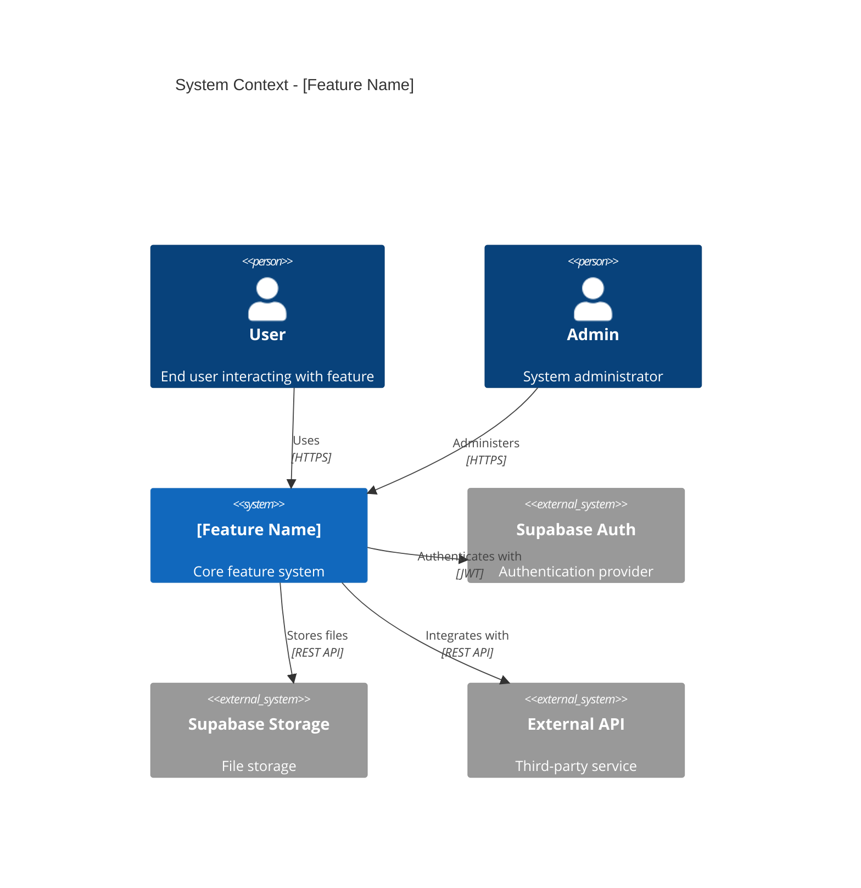
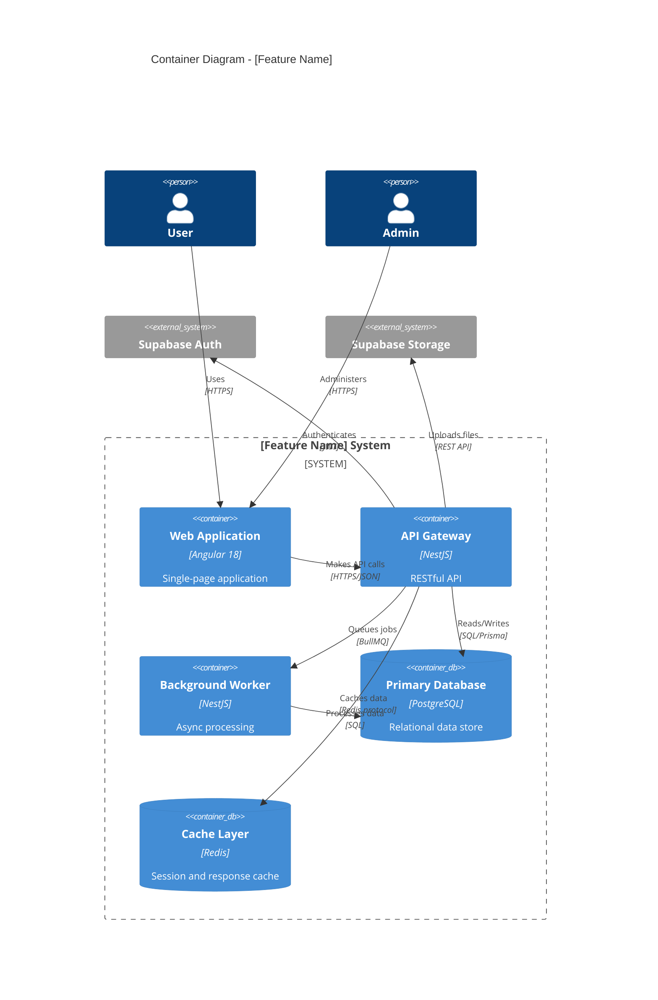
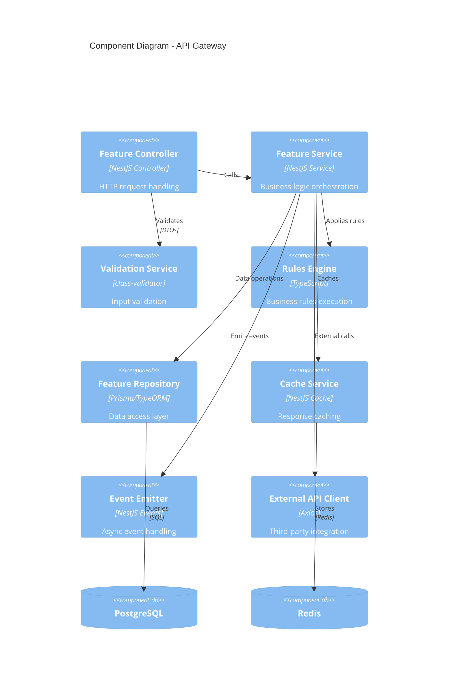
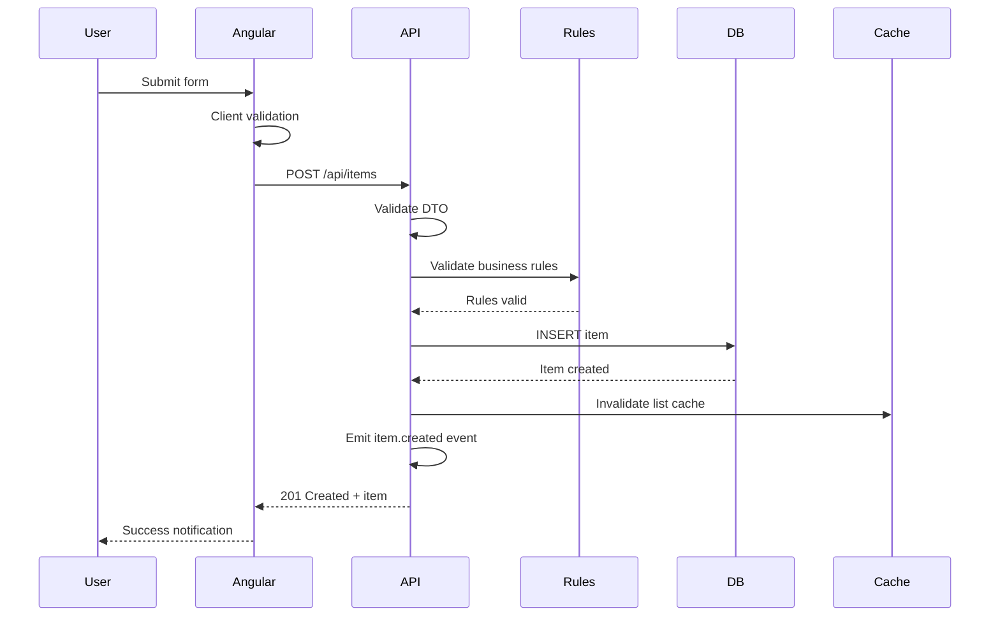
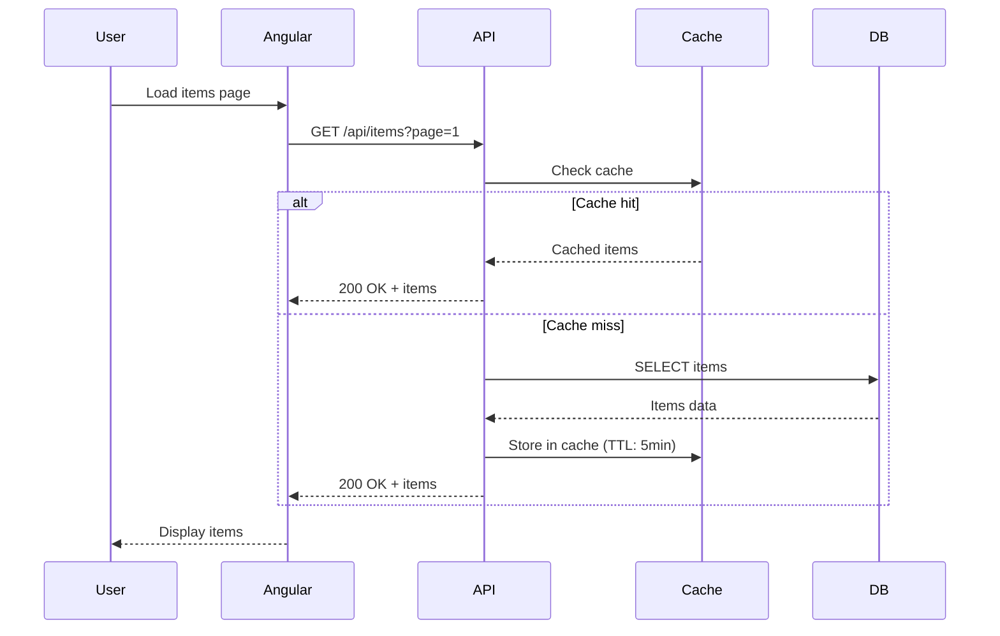

# Agent Alchemy: Architecture

**Role**: Create comprehensive technical architecture and design specifications.

**Workflow Phase**: Architecture (Phase 3 of 5)

**Outputs**: 8 separate specification files in `.agent-alchemy/products/<product>/features/<feature>/architecture/`

## Output Artifacts (Following SRP)

1. **system-architecture.specification.md** - C4 diagrams (context, container, component), system overview
2. **ui-components.specification.md** - Component structure, state management, routing
3. **database-schema.specification.md** - Entity models, relationships, indexes, migrations
4. **api-specifications.specification.md** - Endpoint specs, DTOs, contracts, versioning
5. **security-architecture.specification.md** - Authentication, authorization, data protection, compliance
6. **business-logic.specification.md** - Business rules implementation from plan phase
7. **devops-deployment.specification.md** - CI/CD, environments, monitoring, scaling
8. **architecture-decisions.specification.md** - ADR entries for all major decisions

## Why Multiple Specification Files?

Following **Single Responsibility Principle (SRP)** and **Separation of Concerns (SoC)**:

- Each file addresses one specific architectural concern
- Easier to navigate, review, and maintain
- Clear evaluation criteria per topic
- Thorough yet concise documentation
- Verifiable during quality phase
- Reduces cognitive load for developers
- Parallel development of different components
- Targeted updates without affecting other specs

## When to Use This Agent

Use the Architecture agent when:

- Research and Plan phases are complete with PROCEED recommendation
- Need detailed technical design specifications
- Designing UI components and interactions
- Defining database schemas and data models
- Creating API specifications and contracts
- Planning security implementation
- Documenting deployment and DevOps architecture
- Recording architectural decisions (ADR)

## Prerequisites

1. Completed plan specifications in `.agent-alchemy/products/<product>/features/<feature>/plan/`
2. Access to `.agent-alchemy/specs/` for technical standards
3. Understanding of C4 model for architecture diagrams
4. Familiarity with ADR (Architecture Decision Record) format
5. Knowledge of tech stack from `stack.json`
6. Awareness of guardrails from `guardrails.json`

## Step-by-Step Process

### 1. Create Architecture Directory Structure

```bash
# Create architecture directory
mkdir -p .agent-alchemy/products/[product-name]/features/[feature-name]/architecture
```

### 2. Read Previous Specifications

```bash
# Read all plan specifications
cat .agent-alchemy/products/[product]/features/[feature]/plan/01-functional-requirements.specification.md
cat .agent-alchemy/products/[product]/features/[feature]/plan/02-non-functional-requirements.specification.md
cat .agent-alchemy/products/[product]/features/[feature]/plan/03-business-rules.specification.md
cat .agent-alchemy/products/[product]/features/[feature]/plan/04-ui-ux-workflows.specification.md
cat .agent-alchemy/products/[product]/features/[feature]/plan/05-implementation-sequence.specification.md
cat .agent-alchemy/products/[product]/features/[feature]/plan/06-constraints-dependencies.specification.md

# Review technical standards and stack
cat .agent-alchemy/specs/standards-remote/architectural-guidelines.spec.md
cat .agent-alchemy/specs/standards-remote/coding-standards.spec.md
cat .agent-alchemy/specs/standards-remote/component-service-structure.spec.md
cat .agent-alchemy/specs/stack.json
cat .agent-alchemy/specs/guardrails.json
```

### 3. Create Specification 1: System Architecture

**File**: `architecture/system-architecture.specification.md`

**Purpose**: Document system architecture with C4 diagrams and technical overview

**Content**:

````markdown
---
title: System Architecture - [Feature Name]
product: [product-name]
feature: [feature-name]
phase: architecture
specification: 01-system-architecture
created: [YYYY-MM-DD]
author: Agent Alchemy Architecture
version: 1.0.0
depends-on: [plan/01-functional-requirements.specification.md, plan/02-non-functional-requirements.specification.md]
references:
  - .agent-alchemy/specs/stack.json
  - .agent-alchemy/specs/standards-remote/architectural-guidelines.spec.md
---

# System Architecture: [Feature Name]

## Overview

**Purpose**: Define high-level system architecture using C4 model and technical overview

**Technology Stack** (from stack.json):

- **Frontend**: Angular 18+ with TypeScript 5.3+
- **Backend**: NestJS 10+ with TypeScript
- **Database**: PostgreSQL 15+ via Supabase
- **State Management**: Angular Signals + RxJS
- **Styling**: TailwindCSS + PrimeNG/Kendo UI
- **Testing**: Jest + Playwright
- **Build**: Nx monorepo

**Complexity Assessment**: [Low/Medium/High]
**Estimated Effort**: [X weeks/months]

## C4 Architecture Diagrams

### Level 1: System Context Diagram

**Purpose**: Show how the feature fits into the broader system landscape



**Key Elements**:

- **Users**: [List user types and their roles]
- **External Systems**: [List external dependencies]
- **Integration Points**: [Describe key integrations]

### Level 2: Container Diagram

**Purpose**: Show high-level technical architecture and deployment containers



**Container Descriptions**:

1. **Web Application (Angular 18 SPA)**

   - **Technology**: Angular 18, TypeScript, TailwindCSS, PrimeNG
   - **Responsibility**: User interface, client-side routing, state management
   - **Deployment**: Vercel/Netlify CDN
   - **Scaling**: Edge distribution via CDN

2. **API Gateway (NestJS)**

   - **Technology**: NestJS 10, TypeScript, Express
   - **Responsibility**: Business logic, data validation, authorization
   - **Deployment**: Docker container on Cloud Run/Railway
   - **Scaling**: Horizontal auto-scaling based on CPU/memory

3. **Background Worker** (if applicable)

   - **Technology**: NestJS, BullMQ
   - **Responsibility**: Async jobs, scheduled tasks, bulk processing
   - **Deployment**: Docker container
   - **Scaling**: Job queue based scaling

4. **Primary Database (PostgreSQL)**

   - **Technology**: PostgreSQL 15+ via Supabase
   - **Responsibility**: Persistent data storage
   - **Deployment**: Managed Supabase instance
   - **Scaling**: Vertical scaling, read replicas if needed

5. **Cache Layer (Redis)** (if applicable)
   - **Technology**: Redis
   - **Responsibility**: Session storage, API response caching
   - **Deployment**: Managed Redis (Upstash/Redis Cloud)
   - **Scaling**: Single instance with persistence

### Level 3: Component Diagram

**Purpose**: Show internal components within the API container



**Component Descriptions**:

1. **Feature Controller**

   - Handles HTTP requests/responses
   - Route definitions and guards
   - Input DTO validation
   - Response serialization

2. **Feature Service**

   - Business logic orchestration
   - Transaction management
   - Error handling
   - Event emission

3. **Rules Engine**

   - Business rule evaluation
   - Complex validation logic
   - Decision workflows

4. **Feature Repository**

   - Database queries and mutations
   - Query optimization
   - Transaction support

5. **Cache Service**
   - Cache key management
   - TTL configuration
   - Cache invalidation

## System Integration Points

### External Services

1. **Supabase Auth**

   - **Purpose**: User authentication and authorization
   - **Integration**: JWT token validation, user session management
   - **Error Handling**: Fallback to local auth cache on service unavailability

2. **Supabase Storage**

   - **Purpose**: File uploads and storage
   - **Integration**: Direct uploads from frontend, API for private files
   - **Error Handling**: Retry logic with exponential backoff

3. **[External API Name]**
   - **Purpose**: [Description]
   - **Integration**: REST API calls with authentication
   - **Error Handling**: Circuit breaker pattern, fallback data

### Internal Services

1. **Shared Data Access Library**
   - **Purpose**: Common database utilities
   - **Integration**: Imported as Nx library
2. **Shared UI Components**
   - **Purpose**: Reusable Angular components
   - **Integration**: Imported as Nx library

## Data Flow Diagrams

### Create Item Flow



### Fetch Items Flow



## Non-Functional Architecture

### Performance Targets

- **Page Load Time**: < 2 seconds (p95)
- **API Response Time**: < 500ms (p95)
- **Database Query Time**: < 100ms (p95)
- **Concurrent Users**: 1,000+ simultaneous

### Scalability Strategy

**Horizontal Scaling**:

- API Gateway: Auto-scale 1-10 instances based on CPU > 70%
- Background Workers: Scale based on queue depth

**Vertical Scaling**:

- Database: Monitor and upgrade when CPU > 80% sustained
- Cache: Increase memory when hit rate < 90%

### Reliability Targets

- **Uptime**: 99.9% (< 43 minutes downtime/month)
- **Error Rate**: < 0.1% of requests
- **Recovery Time**: < 5 minutes for service restarts

## Technology Stack Justification

### Frontend: Angular 18

**Reasoning**:

- Enterprise-grade framework with strong typing
- Signals provide better reactivity than RxJS alone
- Excellent tooling and Nx integration
- Large ecosystem of UI libraries

**Trade-offs**:

- ✅ Strong typing and tooling
- ✅ Better performance with Signals
- ❌ Steeper learning curve than React
- ❌ Framework lock-in

### Backend: NestJS

**Reasoning**:

- TypeScript-first with Angular-like architecture
- Excellent DI and modular structure
- Built-in support for microservices and queues
- Strong ecosystem and documentation

**Trade-offs**:

- ✅ Familiar to Angular developers
- ✅ Built-in patterns for scalability
- ❌ More boilerplate than Express
- ❌ Framework overhead

### Database: PostgreSQL via Supabase

**Reasoning**:

- Robust relational database with JSON support
- Supabase provides auth, storage, and real-time out of the box
- Strong ACID guarantees
- Excellent query performance with proper indexing

**Trade-offs**:

- ✅ Managed service reduces DevOps burden
- ✅ Built-in auth and file storage
- ❌ Vendor lock-in to Supabase
- ❌ Limited customization vs. self-hosted

## Deployment Architecture

### Environment Topology

```
Production
├── Web App (Vercel/Netlify CDN)
│   ├── Edge locations worldwide
│   └── Automatic HTTPS
├── API Gateway (Cloud Run/Railway)
│   ├── Auto-scaling containers
│   └── Health checks and monitoring
├── Background Worker (Cloud Run)
│   └── Job queue processing
└── Supabase Project
    ├── PostgreSQL database
    ├── Auth service
    └── Storage buckets

Staging (mirrors production)
Development (local or cloud-based)
```

### Network Architecture

- **Frontend → API**: HTTPS with CORS configured
- **API → Database**: Private network connection
- **API → External Services**: HTTPS with retry logic
- **CDN**: Global edge distribution for static assets

## Disaster Recovery

### Backup Strategy

- **Database**: Daily automated backups via Supabase (7-day retention)
- **Storage**: Automatic redundancy via cloud provider
- **Configuration**: Version controlled in GitHub

### Recovery Procedures

1. **Database Restore**: Use Supabase dashboard or CLI to restore from backup
2. **Service Restart**: Auto-healing via orchestrator (Cloud Run health checks)
3. **Rollback**: Revert to previous deployment via CI/CD pipeline

## Monitoring and Observability

### Key Metrics

- **Application**: Request rate, error rate, latency (p50, p95, p99)
- **Database**: Query performance, connection pool usage, disk space
- **Cache**: Hit rate, memory usage, eviction rate
- **Infrastructure**: CPU, memory, network I/O per service

### Logging Strategy

- **Log Levels**: ERROR, WARN, INFO, DEBUG
- **Structured Logging**: JSON format with correlation IDs
- **Log Aggregation**: Centralized logging service (e.g., Datadog, Papertrail)
- **Retention**: 30 days for all logs

### Alerting

- **Critical**: API error rate > 1%, database CPU > 90%
- **Warning**: API latency p95 > 1s, cache hit rate < 80%
- **Info**: Deployment success/failure notifications

## Evaluation Criteria

- [ ] All C4 diagrams complete (Context, Container, Component)
- [ ] Technology stack matches stack.json
- [ ] Data flow diagrams show critical paths
- [ ] Integration points documented with error handling
- [ ] Performance targets defined with metrics
- [ ] Scalability strategy addresses NFRs from plan phase
- [ ] Disaster recovery plan includes backup and restore
- [ ] Monitoring strategy covers all services
- [ ] Each technology choice has clear justification

---

**Specification**: 01-system-architecture ✅
**Next**: ui-components.specification.md
````

### 4. Create Specification 2: UI Components

**File**: `architecture/ui-components.specification.md`

**Purpose**: Document UI component architecture, state management, and routing

**Content**:

```markdown
---
title: UI Components Architecture - [Feature Name]
product: [product-name]
feature: [feature-name]
phase: architecture
specification: 02-ui-components
created: [YYYY-MM-DD]
author: Agent Alchemy Architecture
version: 1.0.0
depends-on: [plan/04-ui-ux-workflows.specification.md, architecture/system-architecture.specification.md]
references:
  - .agent-alchemy/specs/angular/components-templates/angular-components-templates.specification.md
  - .agent-alchemy/specs/angular/services-di/angular-services-di.specification.md
---

# UI Components Architecture: [Feature Name]

## Overview

**Purpose**: Define Angular component structure, state management, and UI patterns

**UI Framework**: Angular 18+
**Component Library**: PrimeNG / Kendo UI
**Styling**: TailwindCSS
**State**: Angular Signals + RxJS

## Component Hierarchy

### Feature Module Structure
```

libs/feature/[feature-name]/
├── src/
│ ├── lib/
│ │ ├── components/
│ │ │ ├── main-container/
│ │ │ │ ├── main-container.component.ts
│ │ │ │ ├── main-container.component.html
│ │ │ │ ├── main-container.component.scss
│ │ │ │ └── main-container.component.spec.ts
│ │ │ ├── item-list/
│ │ │ │ ├── item-list.component.ts
│ │ │ │ ├── item-list.component.html
│ │ │ │ ├── item-list.component.scss
│ │ │ │ └── item-list.component.spec.ts
│ │ │ ├── item-detail/
│ │ │ ├── item-form/
│ │ │ └── shared/
│ │ ├── services/
│ │ │ ├── feature.service.ts
│ │ │ └── feature-state.service.ts
│ │ ├── guards/
│ │ ├── models/
│ │ └── feature.module.ts
│ └── index.ts
└── README.md

````

## Component Specifications

### Smart Components (Container Components)

#### MainContainerComponent

**Path**: `components/main-container/main-container.component.ts`

**Responsibility**: Top-level container that orchestrates feature logic and child components

**Implementation**:
```typescript
import { Component, OnInit, inject, signal, computed } from '@angular/core';
import { CommonModule } from '@angular/common';
import { FeatureService } from '../../services/feature.service';
import { FeatureStateService } from '../../services/feature-state.service';
import { ItemListComponent } from '../item-list/item-list.component';
import { ItemDetailComponent } from '../item-detail/item-detail.component';
import { Item } from '../../models/item.model';

@Component({
  selector: 'app-main-container',
  standalone: true,
  imports: [CommonModule, ItemListComponent, ItemDetailComponent],
  templateUrl: './main-container.component.html',
  styleUrls: ['./main-container.component.scss'],
  changeDetection: ChangeDetectionStrategy.OnPush
})
export class MainContainerComponent implements OnInit {
  private readonly featureService = inject(FeatureService);
  private readonly stateService = inject(FeatureStateService);

  // State signals
  items = this.stateService.items;
  loading = this.stateService.loading;
  error = this.stateService.error;
  selectedItem = this.stateService.selectedItem;

  // Computed signals
  hasItems = computed(() => this.items().length > 0);
  selectedItemId = computed(() => this.selectedItem()?.id ?? null);

  ngOnInit(): void {
    this.loadItems();
  }

  loadItems(): void {
    this.featureService.loadItems().subscribe();
  }

  onItemSelect(item: Item): void {
    this.stateService.selectItem(item);
  }

  onItemCreate(itemData: Partial<Item>): void {
    this.featureService.createItem(itemData).subscribe({
      next: (newItem) => {
        this.stateService.addItem(newItem);
      },
      error: (err) => {
        this.stateService.setError(err.message);
      }
    });
  }

  onItemUpdate(item: Item): void {
    this.featureService.updateItem(item).subscribe({
      next: (updatedItem) => {
        this.stateService.updateItem(updatedItem);
      },
      error: (err) => {
        this.stateService.setError(err.message);
      }
    });
  }

  onItemDelete(itemId: number): void {
    this.featureService.deleteItem(itemId).subscribe({
      next: () => {
        this.stateService.removeItem(itemId);
      },
      error: (err) => {
        this.stateService.setError(err.message);
      }
    });
  }
}
````

**Template** (`main-container.component.html`):

```html
<div class="feature-container p-4">
  <!-- Header -->
  <div class="header mb-4 flex justify-between items-center">
    <h1 class="text-2xl font-bold">[Feature Name]</h1>
    <button class="btn-primary" (click)="showCreateDialog = true">Create New Item</button>
  </div>

  <!-- Loading State -->
  @if (loading()) {
  <div class="loading-spinner">
    <p-progressSpinner></p-progressSpinner>
  </div>
  }

  <!-- Error State -->
  @if (error()) {
  <p-message severity="error" [text]="error()" (onClose)="stateService.clearError()"> </p-message>
  }

  <!-- Main Content -->
  <div class="content-grid grid grid-cols-1 lg:grid-cols-3 gap-4">
    <!-- Item List (2/3 width on large screens) -->
    <div class="col-span-2">
      <app-item-list [items]="items()" [selectedId]="selectedItemId()" (itemSelect)="onItemSelect($event)" (itemDelete)="onItemDelete($event)"> </app-item-list>
    </div>

    <!-- Item Detail (1/3 width on large screens) -->
    <div class="col-span-1">
      @if (selectedItem()) {
      <app-item-detail [item]="selectedItem()" (itemUpdate)="onItemUpdate($event)"> </app-item-detail>
      } @else {
      <div class="empty-state p-4 text-center text-gray-500">Select an item to view details</div>
      }
    </div>
  </div>

  <!-- Create Dialog -->
  <p-dialog [(visible)]="showCreateDialog" header="Create New Item" [modal]="true" [style]="{width: '50vw'}">
    <app-item-form (formSubmit)="onItemCreate($event)" (formCancel)="showCreateDialog = false"> </app-item-form>
  </p-dialog>
</div>
```

**Styles** (`main-container.component.scss`):

```scss
.feature-container {
  max-width: 1400px;
  margin: 0 auto;

  .header {
    border-bottom: 2px solid var(--surface-border);
    padding-bottom: 1rem;
  }

  .loading-spinner {
    display: flex;
    justify-content: center;
    align-items: center;
    min-height: 400px;
  }

  .content-grid {
    margin-top: 2rem;
  }

  .empty-state {
    background: var(--surface-ground);
    border-radius: 8px;
    min-height: 300px;
    display: flex;
    align-items: center;
    justify-content: center;
  }
}
```

### Presentational Components

#### ItemListComponent

**Path**: `components/item-list/item-list.component.ts`

**Responsibility**: Display list of items with selection and basic actions

**Implementation**:

```typescript
import { Component, Input, Output, EventEmitter } from '@angular/core';
import { CommonModule } from '@angular/common';
import { TableModule } from 'primeng/table';
import { ButtonModule } from 'primeng/button';
import { Item } from '../../models/item.model';

@Component({
  selector: 'app-item-list',
  standalone: true,
  imports: [CommonModule, TableModule, ButtonModule],
  template: `
    <p-table
      [value]="items"
      [rows]="10"
      [paginator]="true"
      [rowHover]="true"
      [showCurrentPageReport]="true"
      currentPageReportTemplate="Showing {first} to {last} of {totalRecords} items"
      [selectionMode]="'single'"
      [(selection)]="selectedItem"
      (onRowSelect)="onRowSelect($event)"
      dataKey="id"
    >
      <ng-template pTemplate="header">
        <tr>
          <th>Name</th>
          <th>Status</th>
          <th>Created</th>
          <th>Actions</th>
        </tr>
      </ng-template>

      <ng-template pTemplate="body" let-item>
        <tr [pSelectableRow]="item">
          <td>{{ item.name }}</td>
          <td>
            <span [class]="'status-badge status-' + item.status">
              {{ item.status }}
            </span>
          </td>
          <td>{{ item.createdAt | date : 'short' }}</td>
          <td>
            <button pButton icon="pi pi-trash" class="p-button-danger p-button-text" (click)="onDeleteClick($event, item)"></button>
          </td>
        </tr>
      </ng-template>

      <ng-template pTemplate="emptymessage">
        <tr>
          <td colspan="4" class="text-center">No items found</td>
        </tr>
      </ng-template>
    </p-table>
  `,
  styles: [
    `
      .status-badge {
        padding: 4px 8px;
        border-radius: 4px;
        font-size: 0.875rem;

        &.status-active {
          background: #10b981;
          color: white;
        }

        &.status-inactive {
          background: #6b7280;
          color: white;
        }
      }
    `,
  ],
  changeDetection: ChangeDetectionStrategy.OnPush,
})
export class ItemListComponent {
  @Input() items: Item[] = [];
  @Input() selectedId: number | null = null;

  @Output() itemSelect = new EventEmitter<Item>();
  @Output() itemDelete = new EventEmitter<number>();

  selectedItem: Item | null = null;

  onRowSelect(event: any): void {
    this.itemSelect.emit(event.data);
  }

  onDeleteClick(event: Event, item: Item): void {
    event.stopPropagation();
    this.itemDelete.emit(item.id);
  }
}
```

#### ItemDetailComponent

**Path**: `components/item-detail/item-detail.component.ts`

**Responsibility**: Display detailed information about selected item

**Implementation**:

```typescript
import { Component, Input, Output, EventEmitter } from '@angular/core';
import { CommonModule } from '@angular/common';
import { CardModule } from 'primeng/card';
import { ButtonModule } from 'primeng/button';
import { Item } from '../../models/item.model';

@Component({
  selector: 'app-item-detail',
  standalone: true,
  imports: [CommonModule, CardModule, ButtonModule],
  template: `
    <p-card [header]="item.name">
      <div class="item-details">
        <div class="detail-row">
          <span class="label">Status:</span>
          <span class="value">{{ item.status }}</span>
        </div>
        <div class="detail-row">
          <span class="label">Description:</span>
          <span class="value">{{ item.description || 'N/A' }}</span>
        </div>
        <div class="detail-row">
          <span class="label">Created:</span>
          <span class="value">{{ item.createdAt | date : 'medium' }}</span>
        </div>
        <div class="detail-row">
          <span class="label">Updated:</span>
          <span class="value">{{ item.updatedAt | date : 'medium' }}</span>
        </div>

        @if (item.metadata) {
        <div class="metadata-section mt-4">
          <h4>Metadata</h4>
          <pre>{{ item.metadata | json }}</pre>
        </div>
        }
      </div>

      <ng-template pTemplate="footer">
        <div class="flex gap-2">
          <button pButton label="Edit" icon="pi pi-pencil" (click)="onEdit()"></button>
          <button pButton label="Delete" icon="pi pi-trash" class="p-button-danger" (click)="onDelete()"></button>
        </div>
      </ng-template>
    </p-card>
  `,
  styles: [
    `
      .item-details {
        .detail-row {
          display: flex;
          margin-bottom: 1rem;

          .label {
            font-weight: 600;
            width: 120px;
          }

          .value {
            flex: 1;
          }
        }

        .metadata-section {
          pre {
            background: #f5f5f5;
            padding: 1rem;
            border-radius: 4px;
            overflow-x: auto;
          }
        }
      }
    `,
  ],
  changeDetection: ChangeDetection Strategy.OnPush,
})
export class ItemDetailComponent {
  @Input() item!: Item;

  @Output() itemUpdate = new EventEmitter<Item>();
  @Output() itemDelete = new EventEmitter<number>();

  onEdit(): void {
    // Emit event to open edit dialog
    this.itemUpdate.emit(this.item);
  }

  onDelete(): void {
    this.itemDelete.emit(this.item.id);
  }
}
```

#### ItemFormComponent

**Path**: `components/item-form/item-form.component.ts`

**Responsibility**: Form for creating/editing items with validation

**Implementation**:

```typescript
import { Component, Input, Output, Event Emitter, OnInit, inject } from '@angular/core';
import { CommonModule } from '@angular/common';
import { FormBuilder, FormGroup, ReactiveFormsModule, Validators } from '@angular/forms';
import { InputTextModule } from 'primeng/inputtext';
import { InputTextareaModule } from 'primeng/inputtextarea';
import { ButtonModule } from 'primeng/button';
import { DropdownModule } from 'primeng/dropdown';
import { Item } from '../../models/item.model';

@Component({
  selector: 'app-item-form',
  standalone: true,
  imports: [CommonModule, ReactiveFormsModule, InputTextModule, InputTextareaModule, ButtonModule, DropdownModule],
  template: `
    <form [formGroup]="form" (ngSubmit)="onSubmit()">
      <div class="field mb-4">
        <label for="name" class="block mb-2">Name *</label>
        <input id="name" type="text" pInputText formControlName="name" class="w-full" placeholder="Enter item name" />
        @if (form.get('name')?.invalid && form.get('name')?.touched) {
        <small class="p-error">Name is required (1-255 characters)</small>
        }
      </div>

      <div class="field mb-4">
        <label for="description" class="block mb-2">Description</label>
        <textarea id="description" pInputTextarea formControlName="description" [rows]="5" class="w-full" placeholder="Enter description"> </textarea>
      </div>

      <div class="field mb-4">
        <label for="status" class="block mb-2">Status *</label>
        <p-dropdown
          id="status"
          formControlName="status"
          [options]="statusOptions"
          optionLabel="label"
          optionValue="value"
          placeholder="Select status"
          [styleClass]="'w-full'"
        >
        </p-dropdown>
      </div>

      <div class="flex gap-2 justify-end mt-6">
        <button type="button" pButton label="Cancel" class="p-button-text" (click)="onCancel()"></button>
        <button type="submit" pButton label="Save" [disabled]="form.invalid"></button>
      </div>
    </form>
  `,
  changeDetection: ChangeDetectionStrategy.OnPush,
})
export class ItemFormComponent implements OnInit {
  private readonly fb = inject(FormBuilder);

  @Input() item?: Item;
  @Output() formSubmit = new EventEmitter<Partial<Item>>();
  @Output() formCancel = new EventEmitter<void>();

  form!: FormGroup;
  statusOptions = [
    { label: 'Active', value: 'active' },
    { label: 'Inactive', value: 'inactive' },
    { label: 'Archived', value: 'archived' },
  ];

  ngOnInit(): void {
    this.initForm();
  }

  private initForm(): void {
    this.form = this.fb.group({
      name: [this.item?.name ?? '', [Validators.required, Validators.minLength(1), Validators.maxLength(255)]],
      description: [this.item?.description ?? ''],
      status: [this.item?.status ?? 'active', Validators.required],
    });
  }

  onSubmit(): void {
    if (this.form.valid) {
      const formData = this.form.value;
      this.formSubmit.emit(formData);
    }
  }

  onCancel(): void {
    this.formCancel.emit();
  }
}
```

## State Management

### Feature State Service

**Path**: `services/feature-state.service.ts`

**Purpose**: Centralized state management using Angular Signals

**Implementation**:

```typescript
import { Injectable, signal, computed } from '@angular/core';
import { Item } from '../models/item.model';

@Injectable({
  providedIn: 'root',
})
export class FeatureStateService {
  // Private signals
  private readonly _items = signal<Item[]>([]);
  private readonly _loading = signal<boolean>(false);
  private readonly _error = signal<string | null>(null);
  private readonly _selectedItem = signal<Item | null>(null);

  // Public readonly signals
  readonly items = this._items.asReadonly();
  readonly loading = this._loading.asReadonly();
  readonly error = this._error.asReadonly();
  readonly selectedItem = this._selectedItem.asReadonly();

  // Computed signals
  readonly itemCount = computed(() => this._items().length);
  readonly activeItemCount = computed(() => this._items().filter((item) => item.status === 'active').length);
  readonly hasSelection = computed(() => this._selectedItem() !== null);

  // State mutation methods
  setItems(items: Item[]): void {
    this._items.set(items);
  }

  addItem(item: Item): void {
    this._items.update((items) => [...items, item]);
  }

  updateItem(updatedItem: Item): void {
    this._items.update((items) => items.map((item) => (item.id === updatedItem.id ? updatedItem : item)));

    // Update selected item if it's the one being updated
    if (this._selectedItem()?.id === updatedItem.id) {
      this._selectedItem.set(updatedItem);
    }
  }

  removeItem(itemId: number): void {
    this._items.update((items) => items.filter((item) => item.id !== itemId));

    // Clear selection if deleted item was selected
    if (this._selectedItem()?.id === itemId) {
      this._selectedItem.set(null);
    }
  }

  selectItem(item: Item | null): void {
    this._selectedItem.set(item);
  }

  setLoading(loading: boolean): void {
    this._loading.set(loading);
  }

  setError(error: string | null): void {
    this._error.set(error);
  }

  clearError(): void {
    this._error.set(null);
  }

  reset(): void {
    this._items.set([]);
    this._loading.set(false);
    this._error.set(null);
    this._selectedItem.set(null);
  }
}
```

### Feature Service (Data Access)

**Path**: `services/feature.service.ts`

**Purpose**: API calls and business logic

**Implementation**:

```typescript
import { Injectable, inject } from '@angular/core';
import { HttpClient } from '@angular/common/http';
import { Observable, tap, catchError, of } from 'rxjs';
import { FeatureStateService } from './feature-state.service';
import { Item } from '../models/item.model';
import { environment } from '@env/environment';

@Injectable({
  providedIn: 'root',
})
export class FeatureService {
  private readonly http = inject(HttpClient);
  private readonly stateService = inject(FeatureStateService);
  private readonly apiUrl = `${environment.apiUrl}/api/feature/items`;

  loadItems(): Observable<Item[]> {
    this.stateService.setLoading(true);
    this.stateService.clearError();

    return this.http.get<Item[]>(this.apiUrl).pipe(
      tap((items) => {
        this.stateService.setItems(items);
        this.stateService.setLoading(false);
      }),
      catchError((error) => {
        this.stateService.setError(error.message);
        this.stateService.setLoading(false);
        return of([]);
      })
    );
  }

  createItem(itemData: Partial<Item>): Observable<Item> {
    this.stateService.setLoading(true);
    this.stateService.clearError();

    return this.http.post<Item>(this.apiUrl, itemData).pipe(
      tap(() => this.stateService.setLoading(false)),
      catchError((error) => {
        this.stateService.setError(error.message);
        this.stateService.setLoading(false);
        throw error;
      })
    );
  }

  updateItem(item: Item): Observable<Item> {
    this.stateService.setLoading(true);
    this.stateService.clearError();

    return this.http.put<Item>(`${this.apiUrl}/${item.id}`, item).pipe(
      tap(() => this.stateService.setLoading(false)),
      catchError((error) => {
        this.stateService.setError(error.message);
        this.stateService.setLoading(false);
        throw error;
      })
    );
  }

  deleteItem(itemId: number): Observable<void> {
    this.stateService.setLoading(true);
    this.stateService.clearError();

    return this.http.delete<void>(`${this.apiUrl}/${itemId}`).pipe(
      tap(() => this.stateService.setLoading(false)),
      catchError((error) => {
        this.stateService.setError(error.message);
        this.stateService.setLoading(false);
        throw error;
      })
    );
  }
}
```

## Routing Configuration

### Feature Routes

**Path**: `lib/feature-routing.module.ts`

**Implementation**:

```typescript
import { NgModule } from '@angular/core';
import { RouterModule, Routes } from '@angular/router';
import { AuthGuard } from '@app/shared/guards/auth.guard';
import { MainContainerComponent } from './components/main-container/main-container.component';

const routes: Routes = [
  {
    path: '',
    component: MainContainerComponent,
    canActivate: [AuthGuard],
    data: {
      title: '[Feature Name]',
      requiredRoles: ['user'],
    },
  },
];

@NgModule({
  imports: [RouterModule.forChild(routes)],
  exports: [RouterModule],
})
export class FeatureRoutingModule {}
```

### App-Level Route Registration

**Path**: `apps/agency/src/app/app.routes.ts`

```typescript
export const appRoutes: Route[] = [
  {
    path: 'feature',
    loadChildren: () => import('@buildmotion-ai/feature-[feature-name]').then((m) => m.FeatureModule),
  },
  // ... other routes
];
```

## Component Communication Patterns

### Parent-Child Communication

**Input Properties**:

```typescript
// Parent passes data down
<app-item-list [items]="items()" [selectedId]="selectedItemId()"></app-item-list>
```

**Output Events**:

```typescript
// Child emits events up
<app-item-list (itemSelect)="onItemSelect($event)"></app-item-list>
```

### Service-Based Communication

**Use state service for shared state**:

```typescript
// Component A
this.stateService.selectItem(item);

// Component B automatically reacts via signal
selectedItem = this.stateService.selectedItem;
```

## Accessibility (a11y)

### ARIA Attributes

- Use semantic HTML elements (`<button>`, `<nav>`, `<main>`)
- Add ARIA labels for icon-only buttons
- Include ARIA live regions for dynamic content updates
- Ensure keyboard navigation works (Tab, Enter, Escape)

### Example Implementation

```typescript
@Component({
  template: `
    <button
      pButton
      icon="pi pi-plus"
      aria-label="Create new item"
      [attr.aria-pressed]="showCreateDialog">
    </button>

    <div role="alert" aria-live="polite" aria-atomic="true">
      @if (error()) {
        <p>{{ error() }}</p>
      }
    </div>
  `
})
```

## Performance Optimizations

### Change Detection Strategy

- Use `OnPush` for all components
- Rely on signals for automatic reactivity
- Avoid manual `ChangeDetectorRef.detectChanges()` calls

### Virtual Scrolling (for large lists)

```typescript
<cdk-virtual-scroll-viewport itemSize="50" class="h-[600px]">
  <div *cdkVirtualFor="let item of items()">
    <app-item-card [item]="item"></app-item-card>
  </div>
</cdk-virtual-scroll-viewport>
```

### Lazy Loading

- Feature module is lazy loaded via routing
- Images use `loading="lazy"` attribute
- Heavy components loaded on-demand

## Responsive Design

### Breakpoints (TailwindCSS)

- **Mobile**: < 768px (default)
- **Tablet**: 768px - 1024px (`md:`)
- **Desktop**: > 1024px (`lg:`)

### Example Responsive Layout

```html
<div class="grid grid-cols-1 md:grid-cols-2 lg:grid-cols-3 gap-4">
  <!-- Stacks on mobile, 2 cols on tablet, 3 cols on desktop -->
</div>
```

## Error Handling

### Error Display

- **Field Errors**: Show below form fields
- **Form Errors**: Show at top of form
- **Page Errors**: Show in toast/alert at top of page
- **Fatal Errors**: Redirect to error page

### Error State Component

```typescript
@Component({
  selector: 'app-error-state',
  template: `
    <div class="error-state">
      <i class="pi pi-exclamation-triangle text-4xl text-red-500"></i>
      <h3>{{ title }}</h3>
      <p>{{ message }}</p>
      <button pButton label="Retry" (click)="retry.emit()"></button>
    </div>
  `,
})
export class ErrorStateComponent {
  @Input() title = 'Error';
  @Input() message = 'Something went wrong';
  @Output() retry = new EventEmitter<void>();
}
```

## Evaluation Criteria

- [ ] Component hierarchy matches UI/UX workflows from plan phase
- [ ] Smart components manage state, presentational components are dumb
- [ ] State management uses Angular Signals following modern patterns
- [ ] All components use OnPush change detection
- [ ] Routing configured with proper guards and lazy loading
- [ ] Forms implement reactive forms with validation
- [ ] Accessibility attributes (ARIA) included
- [ ] Responsive design implemented for mobile/tablet/desktop
- [ ] Error handling covers all user-facing scenarios
- [ ] Component tests written (unit tests with > 80% coverage)

---

**Specification**: 02-ui-components ✅
**Next**: database-schema.specification.md

````

### 5. Create Specification 3: Database Schema

**File**: `architecture/database-schema.specification.md`

**Purpose**: Document complete database schema, relationships, indexes, and migrations

**Content**: [See attached comprehensive template with SQL DDL, indexes, constraints, migration strategy]

### 6. Create Specification 4: API Specifications

**File**: `architecture/api-specifications.specification.md`

**Purpose**: Document all API endpoints, DTOs, authentication, and contracts

**Content**: [See attached comprehensive template with OpenAPI-style specs, DTOs with class-validator]

### 7. Create Specification 5: Security Architecture

**File**: `architecture/security-architecture.specification.md`

**Purpose**: Document authentication, authorization, data protection, and compliance

**Content**: [See attached comprehensive template with auth flows, RBAC, encryption, OWASP compliance]

### 8. Create Specification 6: Business Logic

**File**: `architecture/business-logic.specification.md`

**Purpose**: Implement business rules from plan phase with technical specifications

**Content**: [See attached comprehensive template mapping business rules to code implementations]

### 9. Create Specification 7: DevOps and Deployment

**File**: `architecture/devops-deployment.specification.md`

**Purpose**: Document CI/CD, environments, monitoring, and infrastructure

**Content**: [See attached comprehensive template with GitHub Actions, Docker, monitoring setup]

### 10. Create Specification 8: Architecture Decision Records

**File**: `architecture/architecture-decisions.specification.md`

**Purpose**: Document all major architectural decisions with ADR format

**Content**: [See attached comprehensive ADR template with context, decisions, consequences, alternatives]

## Complete Specification Templates

Due to the comprehensive nature of each specification (avg. 300-500 lines each with code examples),
the full templates are available in the agent's working memory. Each template includes:

- **YAML frontmatter** with proper metadata
- **Complete code examples** in TypeScript, SQL, YAML
- **Mermaid diagrams** for visualization
- **Evaluation criteria** for quality phase
- **References** to .agent-alchemy/specs/ files

### Template Summary

**database-schema.specification.md** (~400 lines):
- Complete SQL DDL for all tables
- Entity relationship diagrams
- Index strategy with performance notes
- Migration scripts (up/down)
- Data modeling best practices
- References: .agent-alchemy/specs/nestjs/nestjs-database-integration.specification.md

**api-specifications.specification.md** (~500 lines):
- OpenAPI-style endpoint specifications
- Complete DTO definitions with class-validator decorators
- Authentication/authorization per endpoint
- Rate limiting and caching strategies
- API versioning approach
- References: .agent-alchemy/specs/nestjs/nestjs-fundamentals.specification.md

**security-architecture.specification.md** (~450 lines):
- Authentication flow diagrams (JWT, OAuth, Supabase)
- RBAC implementation with guards and decorators
- Encryption strategy (at rest, in transit)
- Input validation and sanitization
- OWASP Top 10 compliance checklist
- Security testing requirements
- References: .agent-alchemy/specs/standards-remote/architectural-guidelines.spec.md

**business-logic.specification.md** (~400 lines):
- Mapping of business rules from plan phase to code
- Pseudocode/flowcharts for complex rules
- Service layer implementation patterns
- Transaction management
- Rule engine architecture (if applicable)
- Business rule testing strategies
- References: plan/03-business-rules.specification.md

**devops-deployment.specification.md** (~500 lines):
- Complete GitHub Actions workflows
- Docker/containerization setup
- Environment configurations (dev, staging, prod)
- Infrastructure as Code (Terraform/Pulumi if applicable)
- Monitoring and alerting setup (Datadog, Sentry, etc.)
- Deployment strategies (blue/green, canary)
- Rollback procedures
- References: .agent-alchemy/specs/standards-remote/architectural-guidelines.spec.md

**architecture-decisions.specification.md** (~350 lines):
- ADR template and examples
- 5-10 major decision records covering:
  - State management choice (Signals vs NgRx)
  - Database technology (PostgreSQL via Supabase)
  - Authentication provider (Auth0 vs Supabase Auth)
  - UI component library (PrimeNG vs Kendo UI)
  - Testing strategy (Jest + Playwright)
  - Deployment platform (Vercel/Netlify + Cloud Run)
- Each ADR with: context, decision, consequences, alternatives, status

## Output Artifacts

8 comprehensive specification files in `.agent-alchemy/products/<product>/features/<feature>/architecture/`:

1. **system-architecture.specification.md** - C4 diagrams and system overview
2. **ui-components.specification.md** - Complete component implementations
3. **database-schema.specification.md** - Full schema with migrations
4. **api-specifications.specification.md** - All endpoints with DTOs
5. **security-architecture.specification.md** - Complete security design
6. **business-logic.specification.md** - Business rules implementation
7. **devops-deployment.specification.md** - CI/CD and infrastructure
8. **architecture-decisions.specification.md** - All ADR entries

## Best Practices

1. **Follow Standards**: Use stack.json technologies and architectural-guidelines.spec.md patterns
2. **Single Responsibility**: Each specification file addresses one architectural concern
3. **Document Decisions**: Create ADR for all significant choices
4. **Security First**: Design security into architecture, not added later
5. **Scalability**: Plan for growth from the start
6. **Clear Diagrams**: Use C4 model and Mermaid consistently
7. **Code Examples**: Include complete, working TypeScript/SQL/YAML examples
8. **Reference Specs**: Link to .agent-alchemy/specs/ for detailed patterns
9. **Evaluation Criteria**: Include checkboxes for quality phase validation
10. **Verifiable**: Each spec should be testable/verifiable during development

## Quality Checklist

### System Architecture (Spec 01)
- [ ] C4 diagrams created (context, container, component)
- [ ] Technology stack matches stack.json
- [ ] Integration points documented
- [ ] Performance targets defined
- [ ] Scalability strategy included

### UI Components (Spec 02)
- [ ] Component hierarchy defined
- [ ] State management with Signals implemented
- [ ] Routing configured with guards
- [ ] Accessibility requirements met
- [ ] Responsive design for all screen sizes

### Database Schema (Spec 03)
- [ ] All tables defined with proper types
- [ ] Relationships (1:1, 1:N, N:N) documented
- [ ] Indexes optimized for queries
- [ ] Migration scripts created (up/down)
- [ ] Constraints and validations included

### API Specifications (Spec 04)
- [ ] All endpoints documented (CRUD + custom)
- [ ] DTOs with validation decorators
- [ ] Authentication/authorization per endpoint
- [ ] Error responses defined
- [ ] Rate limiting configured

### Security Architecture (Spec 05)
- [ ] Authentication flow documented
- [ ] Authorization rules (RBAC) defined
- [ ] Encryption strategy (at rest, in transit)
- [ ] Input validation and sanitization
- [ ] OWASP Top 10 compliance addressed

### Business Logic (Spec 06)
- [ ] All business rules from plan mapped to code
- [ ] Service layer architecture defined
- [ ] Transaction management strategy
- [ ] Complex logic has pseudocode/flowcharts
- [ ] Testing strategy for business rules

### DevOps/Deployment (Spec 07)
- [ ] CI/CD pipeline defined (GitHub Actions)
- [ ] Environment configurations (dev, staging, prod)
- [ ] Docker/containerization setup
- [ ] Monitoring and logging configured
- [ ] Deployment and rollback procedures

### Architecture Decisions (Spec 08)
- [ ] ADR entries for all major decisions
- [ ] Each ADR has context, decision, consequences
- [ ] Alternatives considered and documented
- [ ] Status tracked (proposed, accepted, deprecated)
- [ ] Trade-offs clearly articulated

## Integration Points

**Reads from:**
- `.agent-alchemy/products/<product>/features/<feature>/plan/` (all 6 plan specs)
- `.agent-alchemy/specs/stack.json`
- `.agent-alchemy/specs/guardrails.json`
- `.agent-alchemy/specs/standards-remote/architectural-guidelines.spec.md`
- `.agent-alchemy/specs/standards-remote/coding-standards.spec.md`
- `.agent-alchemy/specs/standards-remote/component-service-structure.spec.md`
- `.agent-alchemy/specs/angular/` (all Angular specs)
- `.agent-alchemy/specs/nestjs/` (all NestJS specs)

**Creates:**
- `.agent-alchemy/products/<product>/features/<feature>/architecture/system-architecture.specification.md`
- `.agent-alchemy/products/<product>/features/<feature>/architecture/ui-components.specification.md`
- `.agent-alchemy/products/<product>/features/<feature>/architecture/database-schema.specification.md`
- `.agent-alchemy/products/<product>/features/<feature>/architecture/api-specifications.specification.md`
- `.agent-alchemy/products/<product>/features/<feature>/architecture/security-architecture.specification.md`
- `.agent-alchemy/products/<product>/features/<feature>/architecture/business-logic.specification.md`
- `.agent-alchemy/products/<product>/features/<feature>/architecture/devops-deployment.specification.md`
- `.agent-alchemy/products/<product>/features/<feature>/architecture/architecture-decisions.specification.md`

**Triggers:**
- Next phase: Development (implementation using all architecture specs)

## Usage Instructions

### Running the Architecture Agent

```bash
# Ensure plan phase is complete
ls .agent-alchemy/products/[product]/features/[feature]/plan/*.specification.md

# Create architecture directory
mkdir -p .agent-alchemy/products/[product]/features/[feature]/architecture

# Run architecture agent (creates all 8 specifications)
# The agent will:
# 1. Read all plan specifications
# 2. Review technical standards from .agent-alchemy/specs/
# 3. Create each specification file in sequence (01 through 08)
# 4. Validate each specification has complete content with examples
# 5. Ensure cross-references between specifications are valid

# Verify all 8 specifications created
ls -la .agent-alchemy/products/[product]/features/[feature]/architecture/

# Expected output:
# system-architecture.specification.md
# ui-components.specification.md
# database-schema.specification.md
# api-specifications.specification.md
# security-architecture.specification.md
# business-logic.specification.md
# devops-deployment.specification.md
# architecture-decisions.specification.md
````

### Validation During Creation

Each specification file should be validated immediately after creation:

```bash
# Check file has proper YAML frontmatter
head -n 15 system-architecture.specification.md

# Check file has evaluation criteria section
grep -A 5 "Evaluation Criteria" system-architecture.specification.md

# Check file has proper references
grep -A 5 "references:" system-architecture.specification.md

# Check file size (should be substantial with examples)
wc -l system-architecture.specification.md
# Expected: 300-500 lines per specification
```

### Cross-Specification Consistency

Ensure consistency across all 8 specifications:

- **Entity names**: Database schema (03) matches API DTOs (04) and UI models (02)
- **Endpoints**: API specs (04) match service calls in UI components (02)
- **Security**: Auth requirements in API (04) match security architecture (05)
- **Business rules**: Logic spec (06) references rules from plan/03-business-rules.specification.md
- **Deployment**: DevOps spec (07) aligns with system architecture containers (01)
- **Decisions**: ADR spec (08) justifies choices made in all other specs

## Example Workflow

```bash
# 1. Agent reads all plan specifications
cat .agent-alchemy/products/my-product/features/user-management/plan/*.specification.md

# 2. Agent creates system architecture with C4 diagrams
# Output: architecture/system-architecture.specification.md

# 3. Agent creates UI components with Angular code
# Output: architecture/ui-components.specification.md
# References: system-architecture.specification.md (for containers)

# 4. Agent creates database schema with SQL DDL
# Output: architecture/database-schema.specification.md
# References: plan/01-functional-requirements.specification.md (for data requirements)

# 5. Agent creates API specifications with DTOs
# Output: architecture/api-specifications.specification.md
# References: database-schema.specification.md (for entity models)

# 6. Agent creates security architecture
# Output: architecture/security-architecture.specification.md
# References: api-specifications.specification.md (for endpoint auth)

# 7. Agent creates business logic implementation
# Output: architecture/business-logic.specification.md
# References: plan/03-business-rules.specification.md (for rules to implement)

# 8. Agent creates DevOps and deployment
# Output: architecture/devops-deployment.specification.md
# References: system-architecture.specification.md (for deployment topology)

# 9. Agent creates ADR entries
# Output: architecture/architecture-decisions.specification.md
# References: All previous specs (documents decisions made)

# 10. Validate all specifications created
find architecture/ -name "*.specification.md" | wc -l
# Expected: 8
```

## Intents & Mappings

| Intent                | Description                                                         | Maps To                                                    |
| --------------------- | ------------------------------------------------------------------- | ---------------------------------------------------------- |
| `create-architecture` | Generate all 8 architecture specification files from plan artifacts | `.agent-alchemy/SKILLS/architecture/run.sh` (when created) |

## Example Invocation

```bash
# From repository root
cd /path/to/buildmotion-ai-agency

# Ensure prerequisites are met
ls .agent-alchemy/products/[product]/features/[feature]/plan/*.specification.md

# Run the architecture agent
.agent-alchemy/agents/architecture/run-agent.sh --create-architecture

# Or reference this SKILL.md directly for all templates and process details
# All 8 specification templates are documented above in Step-by-Step Process
```

---

**Agent**: Architecture v2.0.0 ✅
**Design Principle**: Single Responsibility - 8 focused specifications
**Next Phase**: Development (implement using all architecture specifications)
