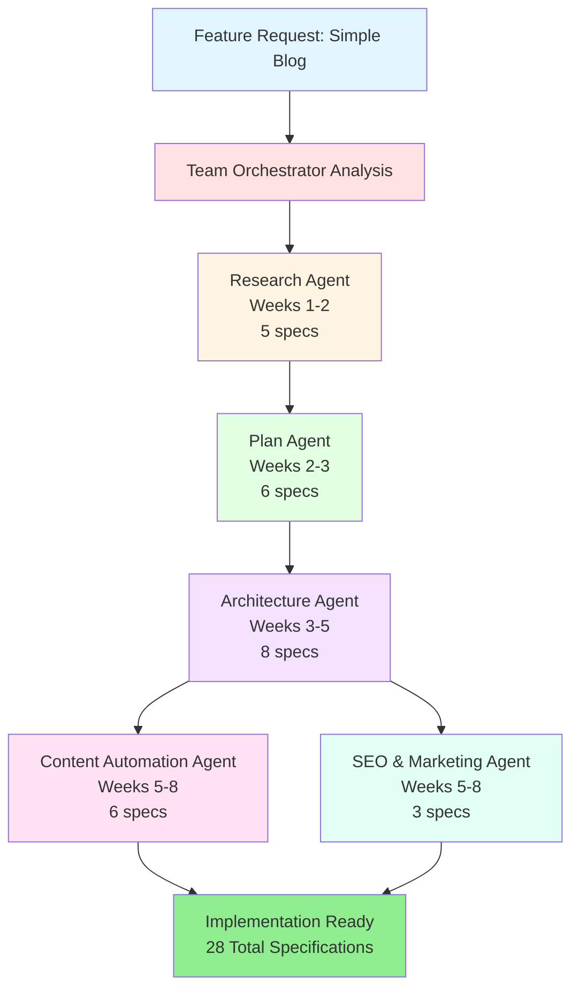

# Example: Add Simple Blog Feature

## Feature Request

**Description**: Add a simple blog feature with markdown support to the copilot-agent-alchemy-dev application.

**Requirements**:
- Markdown editor for content creation
- Preview functionality
- Categories and tags
- SEO optimization
- Search functionality
- RSS feed
- Author management
- Publishing workflow

## Team Orchestrator Analysis

### Feature Analysis

```yaml
feature: simple-blog-with-markdown
type: content
complexity: medium
timeline: standard
estimated_duration: 8 weeks
domains:
  - frontend: 40%
  - backend: 30%
  - content: 30%
primary_stakeholders:
  - product_team
  - marketing_team
  - content_creators
success_criteria:
  - SEO score > 90
  - Page load < 2 seconds
  - Content discoverability
  - Easy publishing workflow
```

### Recommended Team Composition

**Team Pattern**: Content Feature Team

**Agents Selected**:

1. **Research Agent (v2.0.0)**
   - **Role**: Analyze blog market, user needs, competitive landscape
   - **Outputs**: 5 research specifications
   - **Duration**: 2 weeks
   - **Justification**: Need to understand blog feature requirements, market standards, and user expectations

2. **Plan Agent (v2.0.0)**
   - **Role**: Define blog requirements, UI/UX workflows, implementation sequence
   - **Outputs**: 6 plan specifications
   - **Duration**: 1 week
   - **Justification**: Comprehensive planning needed for editor, publishing workflow, and SEO requirements

3. **Architecture Agent (v2.0.0)**
   - **Role**: Design blog system architecture, database schema, API contracts
   - **Outputs**: 8 architecture specifications
   - **Duration**: 2 weeks
   - **Justification**: Technical architecture required for markdown processing, search, and content delivery

4. **Content Automation Agent (v1.0.0)**
   - **Role**: Create content pipeline, scheduling, analytics
   - **Outputs**: 6 content specifications
   - **Duration**: 2 weeks
   - **Justification**: Automate content workflow from creation to publishing and analytics

5. **SEO & Marketing Agent (v1.0.0)**
   - **Role**: Optimize for search, create content strategy
   - **Outputs**: 3 marketing specifications
   - **Duration**: 1 week
   - **Justification**: SEO critical for blog discoverability and content reach

**Total Team Size**: 5 agents  
**Total Specifications**: 28 (5+6+8+6+3)  
**Estimated Timeline**: 8 weeks  
**Parallel Execution**: Content Automation and SEO & Marketing (saves 1 week)

## Workflow Orchestration

### Phase 1: Research (Weeks 1-2)

**Agent**: Research Agent  
**Dependencies**: None (entry point)  
**Execution Mode**: Sequential

**Tasks**:
1. Analyze blog market and trends
2. Research markdown editor options
3. Study competitive blog platforms
4. Identify user personas and needs
5. Assess technical feasibility
6. Generate GO/NO-GO recommendation

**Outputs**:
- `research/feasibility-analysis.specification.md` - Technical and business feasibility
- `research/market-research.specification.md` - Market opportunity and competitors
- `research/user-research.specification.md` - User personas, pain points, needs
- `research/risk-assessment.specification.md` - Risk identification and mitigation
- `research/recommendations.specification.md` - GO/PROCEED decision

**Success Criteria**: PROCEED recommendation with justified business case

### Phase 2: Planning (Weeks 2-3)

**Agent**: Plan Agent  
**Dependencies**: Research Phase complete with PROCEED  
**Execution Mode**: Sequential

**Tasks**:
1. Define functional requirements for blog
2. Document non-functional requirements (performance, SEO)
3. Create business rules for publishing workflow
4. Design UI/UX workflows (editor, preview, publish)
5. Sequence implementation (MVP → V1 → V2)
6. Document constraints and dependencies

**Outputs**:
- `plan/functional-requirements.specification.md` - 20+ functional requirements
- `plan/non-functional-requirements.specification.md` - Performance, security, SEO
- `plan/business-rules.specification.md` - Publishing workflow, approval process
- `plan/ui-ux-workflows.specification.md` - Editor, preview, list, search interfaces
- `plan/implementation-sequence.specification.md` - 3 phases over 8 weeks
- `plan/constraints-dependencies.specification.md` - Markdown library, CDN, search

**Success Criteria**: All requirements documented with acceptance criteria

### Phase 3: Architecture (Weeks 3-5)

**Agent**: Architecture Agent  
**Dependencies**: Plan Phase complete  
**Execution Mode**: Sequential

**Tasks**:
1. Design system architecture with C4 diagrams
2. Define UI components (Editor, Preview, List, Search)
3. Create database schema (posts, authors, categories, tags)
4. Specify API contracts (CRUD, search, publish, RSS)
5. Design security architecture (auth, XSS protection)
6. Document business logic (markdown parsing, SEO optimization)
7. Plan DevOps (CI/CD, CDN, caching strategy)
8. Record architecture decisions (ADRs)

**Outputs**:
- `architecture/system-architecture.specification.md` - C4 diagrams, tech stack
- `architecture/ui-components.specification.md` - Angular components with Signals
- `architecture/database-schema.specification.md` - PostgreSQL schema via Supabase
- `architecture/api-specifications.specification.md` - NestJS REST API endpoints
- `architecture/security-architecture.specification.md` - Auth, XSS, CSRF protection
- `architecture/business-logic.specification.md` - Markdown processor, SEO generator
- `architecture/devops-deployment.specification.md` - Nx build, Vercel deployment, CDN
- `architecture/architecture-decisions.specification.md` - ADRs for tech choices

**Success Criteria**: Complete technical design ready for implementation

### Phase 4: Content & Marketing (Weeks 5-8) - PARALLEL EXECUTION

#### Content Automation Agent (Parallel Track 1)

**Dependencies**: Architecture Phase complete  
**Execution Mode**: Parallel with SEO & Marketing

**Tasks**:
1. Design content discovery pipeline
2. Create content generation workflow
3. Define review queue process
4. Plan scheduling and publishing
5. Design analytics and reporting
6. Integrate with blog architecture

**Outputs**:
- `content-automation/strategy.specification.md` - Content strategy, goals, KPIs
- `content-automation/discovery.specification.md` - Source analysis, topic generation
- `content-automation/generation.specification.md` - Content templates, automation
- `content-automation/review-queue.specification.md` - Approval workflow
- `content-automation/scheduling.specification.md` - Content calendar, publishing
- `content-automation/analytics.specification.md` - Performance metrics, optimization

**Success Criteria**: Automated content pipeline integrated with blog

#### SEO & Marketing Agent (Parallel Track 2)

**Dependencies**: Architecture Phase complete  
**Execution Mode**: Parallel with Content Automation

**Tasks**:
1. Conduct SEO research and keyword analysis
2. Create content strategy and guidelines
3. Plan marketing campaigns for blog launch
4. Define deliverable content artifacts
5. Integrate SEO into blog architecture

**Outputs**:
- `seo/research.specification.md` - SEO analysis, keywords, competitive research
- `seo/plan.specification.md` - Content strategy, campaigns, distribution channels
- `seo/features.specification.md` - Blog launch content, social media, landing pages

**Success Criteria**: SEO strategy achieving >90 SEO score, content plan ready

## Workflow Visualization



## Timeline Breakdown

| Week | Phase | Agent | Activities | Outputs |
|------|-------|-------|------------|---------|
| 1 | Research | Research | Market analysis, competitor research | 2 specs |
| 2 | Research | Research | User research, feasibility, recommendations | 3 specs |
| 2-3 | Planning | Plan | Requirements, business rules, workflows | 6 specs |
| 3-4 | Architecture | Architecture | System design, components, database | 4 specs |
| 4-5 | Architecture | Architecture | APIs, security, DevOps, ADRs | 4 specs |
| 5-6 | Content | Content Automation | Strategy, discovery, generation | 3 specs |
| 5-6 | Marketing | SEO & Marketing | SEO research, content plan | 2 specs |
| 6-7 | Content | Content Automation | Review, scheduling, analytics | 3 specs |
| 7-8 | Marketing | SEO & Marketing | Marketing features, launch plan | 1 spec |

**Total Duration**: 8 weeks  
**Time Saved via Parallel Execution**: 1 week (Content + SEO run concurrently)

## Agent Coordination Points

### Coordination Point 1: Research → Plan Handoff

**Trigger**: Research recommendations = PROCEED  
**Data Transfer**: All 5 research specifications  
**Validation**: Plan agent confirms understanding of user needs and market requirements

**Handoff Checklist**:
- [ ] Research recommendations show GO/PROCEED
- [ ] User personas clearly defined
- [ ] Market opportunity validated
- [ ] Technical feasibility confirmed
- [ ] Risk mitigation strategies documented

### Coordination Point 2: Plan → Architecture Handoff

**Trigger**: All plan specifications complete  
**Data Transfer**: All 6 plan specifications  
**Validation**: Architecture agent validates requirements clarity and completeness

**Handoff Checklist**:
- [ ] All functional requirements documented with acceptance criteria
- [ ] Non-functional requirements (performance, SEO) specified
- [ ] Business rules for publishing workflow defined
- [ ] UI/UX workflows designed
- [ ] Implementation sequence planned
- [ ] Constraints and dependencies identified

### Coordination Point 3: Architecture → Content/SEO Handoff

**Trigger**: All architecture specifications complete  
**Data Transfer**: All 8 architecture specifications  
**Validation**: Both Content and SEO agents confirm understanding of technical design

**Handoff Checklist**:
- [ ] System architecture with C4 diagrams available
- [ ] UI components structure defined
- [ ] Database schema documented
- [ ] API specifications complete
- [ ] Security architecture planned
- [ ] Business logic implementation detailed
- [ ] DevOps and deployment strategy ready
- [ ] Architecture decisions recorded

## Expected Outputs

### Total Specifications: 28

**Research Phase (5 specs)**:
- Feasibility Analysis
- Market Research
- User Research
- Risk Assessment
- Recommendations

**Plan Phase (6 specs)**:
- Functional Requirements (20+ FRs)
- Non-Functional Requirements
- Business Rules
- UI/UX Workflows
- Implementation Sequence
- Constraints & Dependencies

**Architecture Phase (8 specs)**:
- System Architecture (C4 diagrams)
- UI Components (Angular Signals)
- Database Schema (PostgreSQL/Supabase)
- API Specifications (NestJS REST)
- Security Architecture
- Business Logic
- DevOps & Deployment
- Architecture Decisions (ADRs)

**Content Automation Phase (6 specs)**:
- Content Strategy
- Content Discovery
- Content Generation
- Review Queue
- Scheduling
- Analytics

**SEO & Marketing Phase (3 specs)**:
- SEO Research
- Content Plan
- Marketing Features

## Success Criteria

### Technical Success
- [ ] All 28 specifications created and validated
- [ ] System architecture complete with C4 diagrams
- [ ] Database schema designed for PostgreSQL
- [ ] API contracts documented for NestJS
- [ ] Security architecture planned
- [ ] DevOps pipeline defined

### Business Success
- [ ] Market opportunity validated
- [ ] User needs documented
- [ ] GO/PROCEED recommendation justified
- [ ] Timeline and budget estimated
- [ ] Risk mitigation strategies defined

### Content Success
- [ ] Content pipeline automated
- [ ] SEO strategy achieving >90 score
- [ ] Content calendar planned
- [ ] Analytics dashboard designed

### Quality Success
- [ ] All requirements have acceptance criteria
- [ ] Architecture complies with guardrails
- [ ] Security requirements met
- [ ] Performance targets defined
- [ ] Testing strategy documented

## Implementation Ready

After 8 weeks, the virtual team will have produced:
- **28 comprehensive specifications** ready for development
- **Complete technical architecture** with C4 diagrams
- **Detailed requirements** with acceptance criteria
- **Content pipeline** design and automation plan
- **SEO strategy** for blog discoverability
- **Timeline and budget** for implementation phase

The development team can begin implementation with confidence, having complete specifications covering all aspects of the blog feature from research through marketing.

## Team Orchestrator Value

Without Team Orchestrator:
- **Manual agent invocation** - 5+ separate commands
- **Sequential execution only** - No parallel optimization
- **Manual coordination** - Developer tracks dependencies
- **Estimated time**: 9-10 weeks (no parallel execution)

With Team Orchestrator:
- **Single invocation** - One command starts entire workflow
- **Parallel execution** - Content + SEO run concurrently
- **Automatic coordination** - Team Orchestrator manages handoffs
- **Estimated time**: 8 weeks (1-2 weeks saved)

**Time Savings**: 10-20% reduction in specification creation time  
**Quality Improvement**: Guaranteed complete coverage, no agent gaps  
**Developer Experience**: Single command instead of complex manual orchestration
