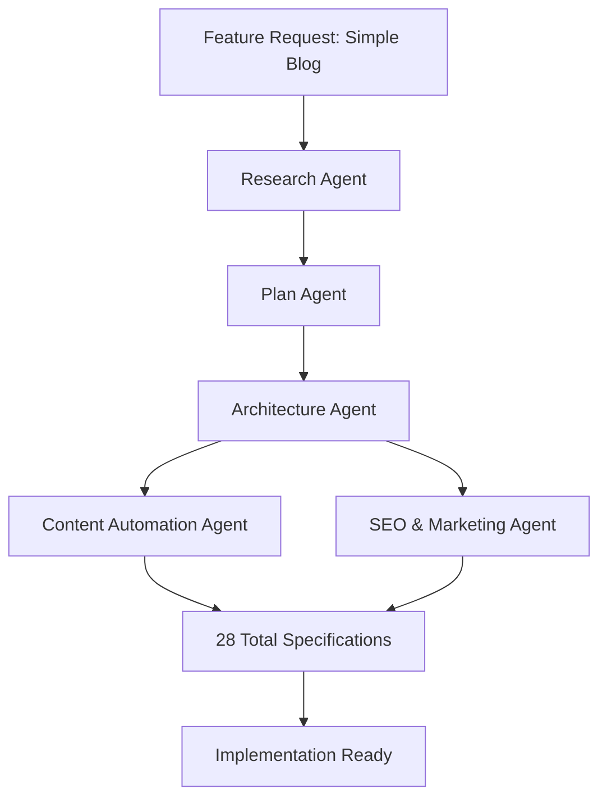

# Agent Alchemy: Team Orchestrator

## Overview

The Team Orchestrator is a **meta-agent** that revolutionizes how Agent Alchemy agents work together. Instead of manually invoking agents sequentially, the Team Orchestrator analyzes feature requests and dynamically composes **virtual teams** of existing agents to handle contextual work optimally.

## Key Innovation: Agents Creating Agent Teams

**Traditional Approach**:
```bash
# Manual sequential invocation
@workspace /agent research analyze "blog feature"
# Wait for completion...
@workspace /agent plan create plan for blog
# Wait for completion...
@workspace /agent architecture design blog architecture
# Wait for completion...
```

**Team Orchestrator Approach**:
```bash
# Single invocation - automatic team composition and orchestration
@workspace /agent team-orchestrator analyze "add simple blog feature with markdown support"

# Team Orchestrator automatically:
# 1. Analyzes the feature request
# 2. Determines optimal agent team composition
# 3. Creates workflow orchestration plan
# 4. Executes agents in optimal sequence
# 5. Coordinates inter-agent dependencies
# 6. Produces comprehensive team documentation
```

## What is a Virtual Team?

A **virtual team** is a dynamically composed group of Agent Alchemy agents selected and orchestrated specifically for a feature's unique requirements. The Team Orchestrator acts as the team leader, ensuring:

- **Right agents** are selected based on feature analysis
- **Optimal sequence** is determined considering dependencies
- **Parallel execution** opportunities are identified
- **Coordination points** are managed between agents
- **Quality gates** are enforced at each phase

## Team Composition Patterns

The Team Orchestrator recognizes common feature patterns and recommends proven team compositions:

### Pattern 1: Content Feature Team
**When to Use**: Blog systems, documentation platforms, content management  
**Team**: Research → Plan → Architecture → Content Automation → SEO & Marketing  
**Timeline**: 8-10 weeks  
**Specifications**: 28 total (5+6+8+6+3)

**Example Use Cases**:
- Blog with markdown support
- Documentation site with search
- Knowledge base with categorization
- Content management system

### Pattern 2: Full-Stack Feature Team
**When to Use**: Complete features requiring research through deployment  
**Team**: Research → Plan → Architecture → Quality  
**Timeline**: 6-8 weeks  
**Specifications**: 25 total (5+6+8+6)

**Example Use Cases**:
- User authentication system
- Payment processing integration
- Real-time collaboration features
- Data analytics dashboard

### Pattern 3: API/Service Feature Team
**When to Use**: Backend services, APIs, integrations  
**Team**: Research → Plan → Architecture → Quality  
**Timeline**: 4-6 weeks  
**Specifications**: 25 total (5+6+8+6)

**Example Use Cases**:
- REST API for resource management
- GraphQL service
- Third-party API integration
- Microservice implementation

### Pattern 4: Marketing Feature Team
**When to Use**: Marketing campaigns, landing pages, conversion optimization  
**Team**: Research → SEO & Marketing → Plan → Architecture → Content Automation  
**Timeline**: 8-12 weeks  
**Specifications**: 28 total (5+3+6+8+6)

**Example Use Cases**:
- Product launch landing page
- Marketing campaign microsite
- Conversion funnel optimization
- Email marketing automation

### Pattern 5: UI/Component Feature Team
**When to Use**: User interface components, design systems  
**Team**: Research → Plan → Architecture → Quality  
**Timeline**: 4-6 weeks  
**Specifications**: 25 total (5+6+8+6)

**Example Use Cases**:
- Component library
- Design system
- UI toolkit
- Interactive widget collection

### Pattern 6: Rapid MVP Team
**When to Use**: Quick prototypes, proof of concepts, technical spikes  
**Team**: Research (condensed) → Plan (MVP only) → Architecture (simplified)  
**Timeline**: 2-3 weeks  
**Specifications**: 19 total (5+6+8)

**Example Use Cases**:
- Feature validation prototype
- Technical feasibility spike
- Proof of concept
- Quick MVP for user testing

## How It Works

### Step 1: Feature Analysis

The Team Orchestrator analyzes the feature request using multiple dimensions:

**Analysis Dimensions**:
- **Feature Type**: Content, API, UI, Full-Stack, Marketing
- **Complexity**: Low, Medium, High
- **Timeline**: Rapid, Standard, Comprehensive
- **Domains**: Frontend, Backend, Content, Marketing, Infrastructure
- **Stakeholders**: Technical, Business, Marketing
- **Success Criteria**: Performance, Quality, Timeline

**Example Analysis**:
```
Feature: "Add simple blog feature with markdown support"

Analysis Results:
- Type: Content
- Complexity: Medium
- Timeline: Standard
- Domains: Frontend (40%), Backend (30%), Content (30%)
- Primary Stakeholder: Product & Marketing
- Success Criteria: SEO optimization, Content discoverability, Fast page loads
```

### Step 2: Team Composition

Based on the analysis, the Team Orchestrator selects the optimal agent team:

```
Recommended Team for Blog Feature:
✓ Research Agent - Analyze blog market, user needs, competitive landscape
✓ Plan Agent - Define blog requirements, UI/UX workflows, implementation sequence
✓ Architecture Agent - Design blog system architecture, database schema, API contracts
✓ Content Automation Agent - Create content pipeline, scheduling, analytics
✓ SEO & Marketing Agent - Optimize for search, create content strategy

Team Pattern: Content Feature Team
Total Agents: 5
Total Specifications: 28
Estimated Timeline: 8 weeks
```

### Step 3: Workflow Orchestration

The Team Orchestrator creates an execution plan with:

**Sequential Execution**:
```
Phase 1: Research (Week 1-2)
  └─ Research Agent creates 5 specifications
  
Phase 2: Planning (Week 2-3)
  └─ Plan Agent creates 6 specifications (depends on Research)
  
Phase 3: Architecture (Week 3-5)
  └─ Architecture Agent creates 8 specifications (depends on Plan)
  
Phase 4: Content & Marketing (Week 5-8)
  ├─ Content Automation Agent creates 6 specifications (parallel)
  └─ SEO & Marketing Agent creates 3 specifications (parallel)
```

**Parallel Execution Opportunities**:
- Content Automation and SEO & Marketing can run in parallel after Architecture completes
- Reduces timeline by 2-3 weeks
- No dependencies between these two agents

### Step 4: Coordination & Execution

The Team Orchestrator manages coordination between agents:

**Coordination Points**:
1. **Research → Plan Handoff**: Validates PROCEED recommendation before invoking Plan Agent
2. **Plan → Architecture Handoff**: Ensures all requirements documented before Architecture begins
3. **Architecture → Content/SEO Handoff**: Provides system design for content and SEO implementation

**Data Flow**:
```
Research Outputs (5 specs)
    ↓
Plan Agent consumes research data
    ↓
Plan Outputs (6 specs)
    ↓
Architecture Agent consumes plan data
    ↓
Architecture Outputs (8 specs)
    ↓ (parallel)
    ├─→ Content Automation Agent consumes architecture
    └─→ SEO & Marketing Agent consumes architecture
```

### Step 5: Team Documentation

The Team Orchestrator produces 5 orchestration specifications:

1. **team-plan.specification.md** - Team composition, roles, justifications
2. **workflow-orchestration.specification.md** - Execution sequence, dependencies
3. **agent-coordination.specification.md** - Inter-agent communication, data flow
4. **execution-timeline.specification.md** - Timeline, milestones, deliverables
5. **team-output-summary.specification.md** - Expected outputs, success criteria

## Output Directory Structure

```
.agent-alchemy/products/<product>/features/<feature>/
├── team-composition/                           # Meta-agent orchestration
│   ├── team-plan.specification.md             # Team composition and roles
│   ├── workflow-orchestration.specification.md # Execution workflow
│   ├── agent-coordination.specification.md    # Inter-agent coordination
│   ├── execution-timeline.specification.md    # Timeline and milestones
│   └── team-output-summary.specification.md   # Expected outputs
├── research/                                   # Research Agent outputs
│   ├── feasibility-analysis.specification.md
│   ├── market-research.specification.md
│   ├── user-research.specification.md
│   ├── risk-assessment.specification.md
│   └── recommendations.specification.md
├── plan/                                       # Plan Agent outputs
│   ├── functional-requirements.specification.md
│   ├── non-functional-requirements.specification.md
│   ├── business-rules.specification.md
│   ├── ui-ux-workflows.specification.md
│   ├── implementation-sequence.specification.md
│   └── constraints-dependencies.specification.md
└── architecture/                               # Architecture Agent outputs
    ├── system-architecture.specification.md
    ├── ui-components.specification.md
    ├── database-schema.specification.md
    ├── api-specifications.specification.md
    ├── security-architecture.specification.md
    ├── business-logic.specification.md
    ├── devops-deployment.specification.md
    └── architecture-decisions.specification.md
```

## Real-World Example: Simple Blog Feature

### Request
```bash
@workspace /agent team-orchestrator analyze "add simple blog feature with markdown support"
```

### Team Orchestrator Output

**Feature Analysis**:
```markdown
Feature: Simple Blog with Markdown Support
Type: Content Feature
Complexity: Medium
Timeline: Standard (8 weeks)
Domains: Frontend (40%), Backend (30%), Content (30%)
```

**Recommended Team**:
```markdown
Content Feature Team:
1. Research Agent - Analyze blog market and user needs
2. Plan Agent - Define blog requirements and workflows
3. Architecture Agent - Design blog system architecture
4. Content Automation Agent - Create content pipeline
5. SEO & Marketing Agent - Optimize for search and discoverability

Total Specifications: 28 (5+6+8+6+3)
Timeline: 8 weeks
```

**Workflow Orchestration**:


**Timeline**:
```
Week 1-2: Research Agent
  - Blog market analysis
  - User persona research
  - Competitive analysis
  - Feasibility assessment
  - GO/NO-GO recommendation

Week 2-3: Plan Agent
  - Functional requirements (20+ FRs)
  - Non-functional requirements (performance, SEO)
  - Business rules (publishing workflow)
  - UI/UX workflows (editor, preview, publish)
  - Implementation sequence (MVP → V1 → V2)
  - Constraints and dependencies

Week 3-5: Architecture Agent
  - System architecture (C4 diagrams)
  - UI components (Editor, Preview, List)
  - Database schema (posts, authors, categories)
  - API specifications (CRUD, search, publish)
  - Security architecture (auth, XSS protection)
  - Business logic (markdown parsing, SEO)
  - DevOps (CI/CD, CDN, caching)
  - Architecture decisions (ADRs)

Week 5-8: Content Automation & SEO (Parallel)
  - Content pipeline automation
  - Scheduling and publishing
  - SEO optimization strategy
  - Content marketing plan
  - Analytics and tracking
```

## Benefits

### 1. Intelligent Automation
- **Automatic team composition** based on feature analysis
- **Optimal workflow** with parallel execution opportunities
- **Reduced manual overhead** in agent orchestration

### 2. Consistency & Quality
- **Proven team patterns** for common feature types
- **Complete coverage** - no agent gaps or overlaps
- **Quality gates** enforced at each phase

### 3. Efficiency
- **Parallel execution** where possible
- **Optimized timeline** through intelligent scheduling
- **Reduced waiting time** between phases

### 4. Transparency
- **Clear documentation** of team composition decisions
- **Visible workflow** orchestration
- **Traceable agent coordination**

### 5. Scalability
- **New agents** easily added to agent pool
- **Custom patterns** can be defined
- **Multi-product** orchestration support

## Integration with Existing Agents

The Team Orchestrator **does not replace** existing agents. Instead:

- **Composes** virtual teams from existing Agent Alchemy agents
- **Orchestrates** workflow execution across the team
- **Coordinates** inter-agent dependencies
- **Monitors** team progress and outputs

All existing agents (Research, Plan, Architecture, Quality, SEO & Marketing, Content Automation) remain fully functional and can still be invoked independently when needed.

## Getting Started

### 1. Analyze a Feature

```bash
@workspace /agent team-orchestrator analyze "<feature description>"
```

### 2. Review Team Composition

The Team Orchestrator will create:
- Feature analysis
- Recommended team composition
- Workflow orchestration plan
- Timeline estimate

### 3. Approve & Execute

Approve the recommended team and the Team Orchestrator will:
- Execute agents in optimal sequence
- Manage dependencies and coordination
- Produce all specifications
- Provide progress updates

## Future Enhancements

### Version 1.1.0 (Planned)
- Dynamic team composition based on real-time analysis
- Learning from past feature executions
- Automated bottleneck detection and mitigation
- Agent performance metrics

### Version 1.2.0 (Planned)
- Custom team patterns definable by users
- Agent substitution and alternatives
- Multi-product team orchestration
- Advanced parallel execution strategies

## License

Proprietary - BuildMotion AI Agency
