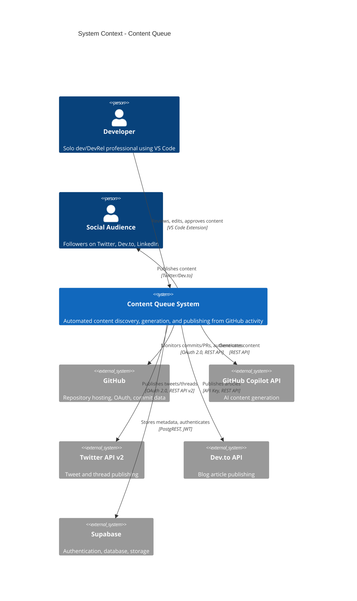
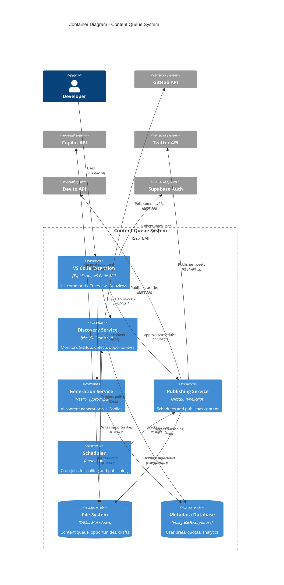
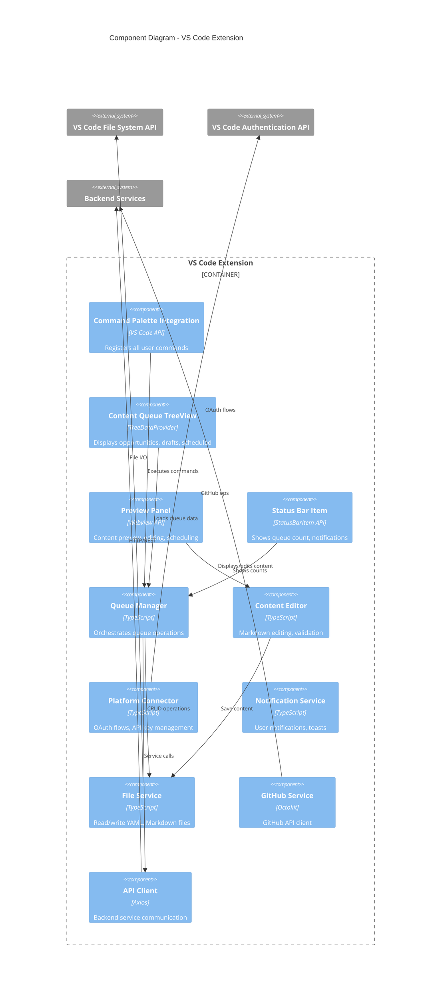
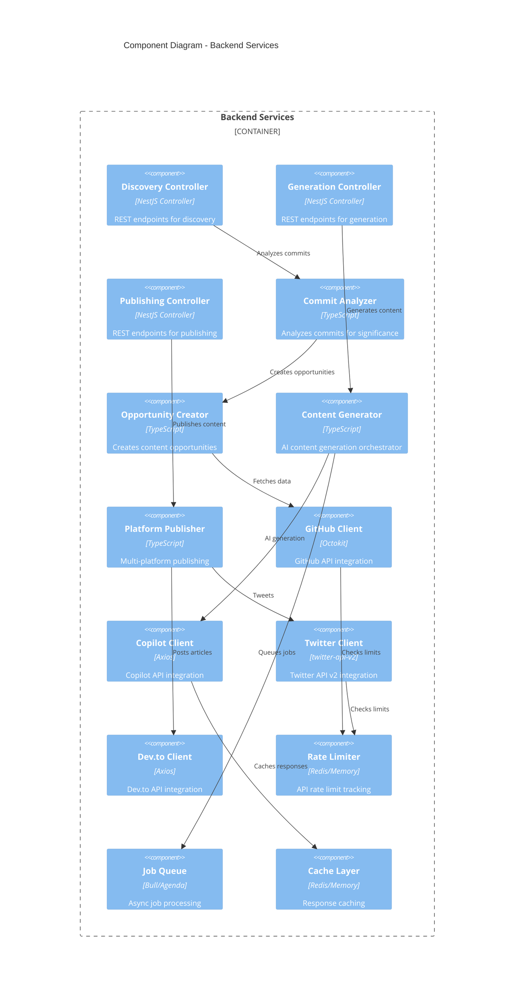

---
meta:
  id: specs-products-agent-alchemy-dev-features-content-queue-architecture-system-architecture
  title: System Architecture - Content Queue Feature
  version: 1.0.0
  status: draft
  specType: specification
  scope: feature
  tags: []
  createdBy: unknown
  createdAt: '2026-02-24'
  reviewedAt: null
title: System Architecture - Content Queue Feature
category: Products
feature: content-queue
lastUpdated: '2026-03-12'
source: Agent Alchemy
version: 1.0.0
aiContext: true
product: agent-alchemy-dev
phase: architecture
applyTo: []
keywords: []
topics: []
useCases: []
specification: system-architecture
---

# System Architecture: Content Queue Feature

## Overview

**Purpose**: Define the high-level technical architecture for the Content Queue feature using C4 model diagrams, showing system context, containers, components, and deployment views.

**Architectural Style**: Event-driven microservices with file-based persistence and VS Code extension frontend

**Technology Stack**:

- **Frontend/Extension**: TypeScript 5.5.2, VS Code Extension API, Angular Signals
- **Backend**: NestJS 10.0.2, Node.js 18.16.9
- **Database**: File system (YAML/Markdown) + Supabase PostgreSQL 15+ (metadata)
- **AI Processing**: GitHub Copilot API
- **External APIs**: GitHub REST API v3, Twitter API v2, Dev.to API
- **Build System**: Nx 19.8.4 monorepo
- **Testing**: Jest 29.7.0 (unit), Playwright 1.36.0 (E2E)

**Complexity Assessment**: Medium-High
**Estimated Effort**: 6-7 weeks for MVP

---

## C4 Architecture Diagrams

### Level 1: System Context Diagram

**Purpose**: Show how Content Queue fits into the developer's workflow and external system landscape



**Key Elements**:

- **Primary User**: Developer in VS Code who commits code and wants to share their work
- **Secondary User**: Social media audience consuming published content
- **Core System**: Content Queue - discovers, generates, schedules, and publishes content
- **External Systems**:
  - GitHub: Source of content opportunities (commits, PRs, releases)
  - GitHub Copilot: AI engine for content generation
  - Twitter/Dev.to: Publication platforms
  - Supabase: Authentication and metadata storage

**Integration Boundaries**:

- All external API calls are rate-limited and retryable
- Authentication tokens stored securely (encrypted)
- File system used for content storage (Git-versioned)
- No direct database dependencies (file-based for MVP)

---

### Level 2: Container Diagram

**Purpose**: Show deployment containers and technical architecture



**Container Descriptions**:

1. **VS Code Extension** (Frontend):

   - Language: TypeScript 5.5.2
   - Framework: VS Code Extension API
   - Responsibilities: UI/UX, user interactions, file previews, command palette
   - Communication: IPC with background services, direct file system access

2. **Discovery Service** (Backend):

   - Language: TypeScript/NestJS
   - Responsibilities: GitHub monitoring, commit analysis, opportunity creation
   - Scheduling: Polls every 15 minutes (configurable)
   - Output: YAML opportunity files in `.agent-alchemy/content-queue/opportunities/`

3. **Generation Service** (Backend):

   - Language: TypeScript/NestJS
   - Responsibilities: AI content generation via GitHub Copilot API
   - Processing: Async job queue (Bull or similar)
   - Output: Markdown content files (3 variants per platform)

4. **Publishing Service** (Backend):

   - Language: TypeScript/NestJS
   - Responsibilities: Schedule management, platform API integration, publishing
   - Scheduling: Cron-based execution (checks every minute)
   - Retry Logic: Exponential backoff for failures

5. **Scheduler** (Infrastructure):

   - Technology: node-cron
   - Jobs: Discovery polling (15 min), publishing checks (1 min), cleanup (daily)

6. **File System** (Storage):

   - Format: YAML (metadata), Markdown (content)
   - Structure: Date-based directories for organization
   - Versioning: Git-tracked for history and rollback

7. **Supabase Database** (Metadata):
   - Technology: PostgreSQL 15+ via Supabase
   - Responsibilities: User profiles, quotas, analytics, platform connections
   - Access: PostgREST API, Row Level Security (RLS)

---

### Level 3: Component Diagram - Extension Container

**Purpose**: Show internal components of the VS Code Extension



**Component Descriptions**:

**UI Layer**:

- **Command Palette Integration**: Registers 15+ commands (approve, reject, schedule, etc.)
- **TreeView**: Hierarchical view of content by status (pending, approved, scheduled, published)
- **Webview Panel**: Rich preview with syntax highlighting, metadata, action buttons
- **Status Bar**: Persistent indicator with click-to-open behavior

**Business Logic Layer**:

- **Queue Manager**: Central orchestrator for all queue operations (CRUD, state transitions)
- **Content Editor**: Markdown editing, auto-save, validation, character counting
- **Platform Connector**: OAuth flows for Twitter, API key management for Dev.to
- **Notification Service**: Toast notifications, error messages, success confirmations

**Data Access Layer**:

- **File Service**: File system abstraction with error handling and retry logic
- **GitHub Service**: GitHub API wrapper using Octokit library
- **API Client**: HTTP client for backend service communication

---

### Level 3: Component Diagram - Backend Services

**Purpose**: Show internal components of backend services



---

## Deployment Architecture

### MVP Deployment (Single Instance)

**Environment**: Development machine or single server
**Scale**: 50 concurrent users, 500 generations/hour

```
┌─────────────────────────────────────────────────────────┐
│                    Developer Machine                     │
├─────────────────────────────────────────────────────────┤
│                                                           │
│  ┌──────────────────────────────────────────────────┐   │
│  │            VS Code Process                       │   │
│  │  ┌────────────────────────────────────────┐     │   │
│  │  │   Content Queue Extension              │     │   │
│  │  │   (Extension Host)                     │     │   │
│  │  └────────────────────────────────────────┘     │   │
│  └──────────────────────────────────────────────────┘   │
│                           │                              │
│                           │ IPC                          │
│                           ▼                              │
│  ┌──────────────────────────────────────────────────┐   │
│  │     Backend Services (Node.js Process)           │   │
│  │  ┌─────────────┬─────────────┬──────────────┐   │   │
│  │  │  Discovery  │ Generation  │  Publishing  │   │   │
│  │  │  Service    │  Service    │   Service    │   │   │
│  │  └─────────────┴─────────────┴──────────────┘   │   │
│  └──────────────────────────────────────────────────┘   │
│                           │                              │
│                           │ File I/O                     │
│                           ▼                              │
│  ┌──────────────────────────────────────────────────┐   │
│  │   .agent-alchemy/content-queue/                  │   │
│  │   ├── opportunities/                             │   │
│  │   ├── generated/                                 │   │
│  │   ├── scheduled/                                 │   │
│  │   └── published/                                 │   │
│  └──────────────────────────────────────────────────┘   │
│                                                           │
└─────────────────────────────────────────────────────────┘
                           │
                           │ HTTPS
                           ▼
    ┌─────────────────────────────────────────────────┐
    │          External Services (Cloud)              │
    │  ┌──────────┬──────────┬──────────┬──────────┐ │
    │  │  GitHub  │ Copilot  │ Twitter  │  Dev.to  │ │
    │  │   API    │   API    │   API    │   API    │ │
    │  └──────────┴──────────┴──────────┴──────────┘ │
    │  ┌──────────────────────────────────────────┐  │
    │  │         Supabase (PostgreSQL)            │  │
    │  │  Auth, User Metadata, Quotas, Analytics  │  │
    │  └──────────────────────────────────────────┘  │
    └─────────────────────────────────────────────────┘
```

**Deployment Characteristics**:

- **Stateless Services**: All state in file system + Supabase
- **Process Model**: Extension runs in VS Code, backend as child process
- **Communication**: IPC for local, HTTP for external APIs
- **Persistence**: File system (primary), Supabase (metadata)
- **Caching**: In-memory (no Redis for MVP)

---

### Production Deployment (Future - Post-MVP)

**Environment**: Cloud infrastructure (AWS/GCP/Azure)
**Scale**: 1,000 concurrent users, 10,000 generations/hour

```
┌──────────────────────────────────────────────────────────┐
│                   Cloud Load Balancer                    │
└────────────────────────┬─────────────────────────────────┘
                         │
         ┌───────────────┼───────────────┐
         │               │               │
         ▼               ▼               ▼
    ┌────────┐      ┌────────┐      ┌────────┐
    │ API    │      │ API    │      │ API    │
    │ Server │      │ Server │      │ Server │
    │   1    │      │   2    │      │   N    │
    └────────┘      └────────┘      └────────┘
         │               │               │
         └───────────────┼───────────────┘
                         │
         ┌───────────────┼────────────────────────┐
         │               │                        │
         ▼               ▼                        ▼
    ┌────────┐      ┌─────────┐          ┌──────────────┐
    │ Redis  │      │ Job     │          │  Supabase    │
    │ Cache  │      │ Queue   │          │  PostgreSQL  │
    │ Cluster│      │ (Bull)  │          │  + Storage   │
    └────────┘      └─────────┘          └──────────────┘
                         │
                         ▼
                    ┌─────────┐
                    │ Worker  │
                    │ Processes│
                    │ (Scaled) │
                    └─────────┘
```

**Production Enhancements**:

- **Horizontal Scaling**: Multiple API server instances
- **Load Balancing**: Distribute traffic across instances
- **Distributed Cache**: Redis for shared state
- **Job Queue**: Bull/Agenda for async processing
- **Worker Pool**: Dedicated workers for content generation
- **CDN**: Static assets and file storage
- **Monitoring**: Datadog, Sentry for observability

---

## Data Flow Architecture

### End-to-End Content Flow

```
┌─────────────────────────────────────────────────────────────┐
│                   1. Content Discovery                      │
│                                                               │
│  GitHub Commit                                               │
│        ↓                                                     │
│  Discovery Service (polls every 15 min)                     │
│        ↓                                                     │
│  Commit Analyzer (calculates significance score)            │
│        ↓                                                     │
│  IF score ≥ 50: Create Opportunity                          │
│        ↓                                                     │
│  Write opportunities/{date}/{id}.yaml                        │
│        ↓                                                     │
│  Notify User (status bar badge, daily digest)               │
└─────────────────────────────────────────────────────────────┘
                           │
                           ▼
┌─────────────────────────────────────────────────────────────┐
│                   2. Content Generation                     │
│                                                               │
│  User Selects Opportunity (TreeView)                        │
│        ↓                                                     │
│  Generation Service                                          │
│        ↓                                                     │
│  Load Opportunity Context (commit, repo, user prefs)        │
│        ↓                                                     │
│  Call GitHub Copilot API (generate 3 variants × 2 platforms)│
│        ↓                                                     │
│  Validate Content Quality (BR-2.3)                          │
│        ↓                                                     │
│  Write generated/{date}/{id}/twitter-*.md, devto-*.md       │
│        ↓                                                     │
│  Update Opportunity Status → "generated"                    │
└─────────────────────────────────────────────────────────────┘
                           │
                           ▼
┌─────────────────────────────────────────────────────────────┐
│                   3. Content Review                         │
│                                                               │
│  User Opens Preview Panel (Webview)                         │
│        ↓                                                     │
│  Display Content with Metadata                              │
│        ↓                                                     │
│  User Actions: [Approve] [Edit] [Regenerate] [Reject]      │
│        ↓                                                     │
│  IF Edit: Open Markdown Editor, Auto-save                   │
│  IF Regenerate: Call Generation Service with new prompt     │
│  IF Reject: Move to rejected/, Archive                      │
│  IF Approve: Proceed to Scheduling                          │
└─────────────────────────────────────────────────────────────┘
                           │
                           ▼
┌─────────────────────────────────────────────────────────────┐
│                   4. Content Scheduling                     │
│                                                               │
│  User Approves Content                                       │
│        ↓                                                     │
│  Show Optimal Time Recommendations (BR-4.1)                 │
│        ↓                                                     │
│  User Selects Time or Custom Date/Time                      │
│        ↓                                                     │
│  Check Scheduling Conflicts (BR-4.2)                        │
│        ↓                                                     │
│  Write scheduled/{date}/{id}.yaml                            │
│        ↓                                                     │
│  Update Content Status → "scheduled"                        │
│        ↓                                                     │
│  Confirm to User (notification)                             │
└─────────────────────────────────────────────────────────────┘
                           │
                           ▼
┌─────────────────────────────────────────────────────────────┐
│                   5. Automated Publishing                   │
│                                                               │
│  Scheduler (Cron: checks every 1 minute)                    │
│        ↓                                                     │
│  Load scheduled content WHERE scheduledAt ≤ NOW             │
│        ↓                                                     │
│  FOR EACH item:                                              │
│    ├─ Check Rate Limits (BR-5.2)                            │
│    ├─ Check Idempotency (BR-5.3)                            │
│    ├─ Check Prerequisites (BR-5.1)                          │
│    ├─ IF all pass: Publish to Platform API                  │
│    ├─ IF success:                                            │
│    │    ├─ Write published/{date}/{id}.yaml                 │
│    │    ├─ Update Status → "published"                      │
│    │    └─ Notify User (success + URL)                      │
│    └─ IF failure:                                            │
│         ├─ Implement Retry Logic (BR-4.3)                   │
│         ├─ Log Error with Correlation ID                    │
│         └─ Notify User (if permanent failure)               │
└─────────────────────────────────────────────────────────────┘
```

---

## Security Architecture Overview

**Authentication Flow**:

1. User authenticates with GitHub OAuth (VS Code Auth API)
2. GitHub token stored encrypted in VS Code SecretStorage
3. Supabase JWT issued for metadata access
4. Platform tokens (Twitter, Dev.to) stored encrypted separately

**Authorization Model**:

- User can only access their own content queue
- Row Level Security (RLS) in Supabase enforces data isolation
- File system permissions prevent cross-user access

**Data Protection**:

- All tokens encrypted at rest (AES-256)
- All API calls over HTTPS/TLS 1.3
- No sensitive data in logs or error messages
- Git-tracked files contain no credentials

_Detailed security architecture in security-architecture.specification.md_

---

## Performance Characteristics

**Latency Targets** (from NFR-1.1):
| Operation | Target | Maximum |
|-----------|--------|---------|
| Queue load | < 500ms | 1s |
| Content preview | < 200ms | 500ms |
| Content generation | < 15s | 30s |
| Approval action | < 200ms | 500ms |
| Publishing | < 5s | 10s |

**Throughput Targets** (from NFR-1.2):
| Metric | MVP | Production |
|--------|-----|------------|
| Concurrent users | 50 | 1,000 |
| Generations/hour | 500 | 10,000 |
| Publishes/hour | 200 | 5,000 |

**Scalability Approach**:

- **Vertical**: Single instance for MVP (sufficient for 50 users)
- **Horizontal**: Multiple instances + load balancer for production
- **Database**: File system for MVP, migrate to PostgreSQL if needed
- **Caching**: In-memory for MVP, Redis for production

_Detailed performance architecture in devops-deployment.specification.md_

---

## Technology Stack Justification

### Why File System Storage?

**Advantages**:

- ✅ Git version control built-in
- ✅ Human-readable (YAML, Markdown)
- ✅ Zero database setup
- ✅ Works offline
- ✅ Easy backup and restore

**Limitations**:

- ⚠️ No ACID transactions
- ⚠️ Limited query capabilities
- ⚠️ Performance degrades > 1,000 items

**Decision**: Use file system for MVP (100 items/user), migrate to database if scale requires

### Why NestJS Backend?

**Advantages**:

- ✅ TypeScript throughout stack
- ✅ Excellent module system (matches Nx)
- ✅ Built-in dependency injection
- ✅ Strong API patterns (REST, GraphQL)
- ✅ Active ecosystem and community

**Decision**: NestJS for backend services, VS Code Extension API for frontend

### Why GitHub Copilot for AI?

**Advantages**:

- ✅ Integrated with GitHub workflow
- ✅ Developer-focused AI model
- ✅ No separate API key management
- ✅ Cost-effective (included in subscription)

**Limitations**:

- ⚠️ Token limits (~4K tokens)
- ⚠️ Rate limits (TBD)
- ⚠️ Content generation quality needs validation

**Decision**: Use GitHub Copilot, implement fallback to OpenAI GPT-4 if needed

_Detailed technology decisions in architecture-decisions.specification.md_

---

## Non-Functional Architecture

### Reliability

**Availability Target**: 95% uptime for MVP, 99.5% for production

**Fault Tolerance**:

- Retry logic for all external API calls (3 retries, exponential backoff)
- Queue-based publishing with persistent retry queue
- Graceful degradation (discovery fails → user can still review existing content)

**Error Handling**:

- Structured error logging (correlation IDs)
- User-friendly error messages
- No silent failures (all errors surfaced or alerted)

### Performance

**Response Time Optimization**:

- Async I/O for all file operations
- Request caching (5-minute TTL for GitHub API)
- Lazy loading (only load visible queue items)
- Debounced auto-save (500ms delay)

**Resource Efficiency**:

- Memory: < 100 MB per user session
- Disk: < 500 MB per user (with 90-day archival)
- CPU: < 50% (background tasks low priority)

### Security

**Defense in Depth**:

- Input validation (all user inputs)
- Output encoding (prevent XSS)
- SQL injection prevention (parameterized queries)
- Rate limiting (prevent abuse)
- CORS whitelist (only trusted origins)

**Compliance**:

- GDPR: Data export, erasure, consent flows
- CCPA: Privacy policy, opt-out mechanisms
- OWASP Top 10: Security testing and remediation

---

## Integration Architecture

### External API Integration Pattern

**Standard Pattern for All APIs**:

```typescript
interface APIIntegration {
  client: HTTPClient; // Axios with retry logic
  rateLimiter: RateLimiter; // Track and enforce limits
  cache: CacheLayer; // Response caching (optional)
  errorHandler: ErrorHandler; // Standardized error handling

  // Health check
  healthCheck(): Promise<boolean>;

  // Rate limit check
  canMakeRequest(): Promise<boolean>;

  // Execute with retry
  execute<T>(request: APIRequest): Promise<T>;
}
```

**GitHub API Integration**:

- Client: Octokit REST API v3
- Rate Limit: 5,000 requests/hour (monitored)
- Retry: 3 attempts, exponential backoff
- Cache: 5-minute TTL for repository data

**Twitter API Integration**:

- Client: twitter-api-v2 library
- Rate Limit: 300 tweets/3 hours (enforced)
- Retry: Queue for retry after cooldown
- Idempotency: Content hash deduplication

**Dev.to API Integration**:

- Client: Axios with custom wrapper
- Rate Limit: 30 requests/minute (buffered)
- Retry: Simple retry (no rate limit issues)
- Authentication: API key (user-provided)

**GitHub Copilot API Integration**:

- Client: Axios with custom authentication
- Rate Limit: TBD (to be validated in Phase 1)
- Retry: Limited retries (expensive operation)
- Cache: Disabled (dynamic generation)

---

## Architecture Quality Attributes

### Modifiability

**Score**: High

- Clear separation of concerns (SRP)
- Plugin architecture for platforms (add LinkedIn later)
- File-based storage easily migrated to database
- Service-oriented design (swap services independently)

### Testability

**Score**: High

- Dependency injection throughout
- Mock-friendly interfaces
- File system abstraction (easy to mock)
- No global state or singletons

### Usability

**Score**: High

- Command Palette integration (keyboard-first)
- VS Code native patterns (TreeView, Webview)
- Contextual help and tooltips
- Progressive disclosure (simple → advanced)

### Scalability

**Score**: Medium

- MVP: Single instance (50 users) ✓
- Production: Requires refactoring (load balancing, distributed cache)
- File system limitation (migrate to DB at scale)
- Stateless services enable horizontal scaling

---

## Architecture Assumptions

**Critical Assumptions** (must validate):

1. GitHub Copilot API can generate quality long-form content (800-1500 words)
2. GitHub Copilot API rate limits are sufficient (>100 requests/hour/user)
3. File system performance adequate for 100 items/user
4. VS Code Extension Host can run backend services efficiently
5. Twitter API elevated access approved for production use

**Dependency Assumptions**:

1. GitHub API availability: 99.9% uptime
2. Supabase availability: 99.9% uptime
3. Twitter/Dev.to APIs: 95%+ uptime
4. Developer machines have Node.js 18+ installed

**Validation Plan**:

- Phase 0: Validate GitHub Copilot content generation quality
- Phase 1: Measure file system performance with 100 items
- Phase 2: Test VS Code Extension Host resource usage
- Phase 3: Confirm Twitter API elevated access timeline

---

## Architecture Evolution Roadmap

### Phase 1: MVP (Weeks 1-7)

- File-based storage
- Single-instance deployment
- 2 platforms (Twitter, Dev.to)
- Manual approval workflow

### Phase 2: Scale (Months 2-3)

- Migrate to Supabase PostgreSQL
- Add Redis caching
- Implement job queue (Bull)
- Support 100+ concurrent users

### Phase 3: Growth (Months 4-6)

- Horizontal scaling (multiple instances)
- Add platforms (LinkedIn, YouTube)
- Team collaboration features
- Advanced analytics

### Phase 4: Enterprise (Months 7+)

- Multi-tenancy support
- Custom branding
- API for third-party integrations
- White-label deployment

---

## Architecture Validation Checklist

**MVP Architecture Complete When**:

- [ ] C4 diagrams reviewed and approved
- [ ] Technology stack validated (especially Copilot API)
- [ ] Deployment model tested (single instance)
- [ ] Integration points defined and documented
- [ ] Security architecture reviewed
- [ ] Performance targets validated with load testing
- [ ] All components mapped to implementation phases
- [ ] Architecture decisions documented (ADR)

**Quality Gates**:

- ✓ All plan specifications reviewed
- ✓ Tech stack from stack.json applied
- ✓ Guardrails from guardrails.json followed
- ✓ NFRs from non-functional-requirements.specification.md addressed
- ✓ Constraints from constraints-dependencies.specification.md incorporated

---

**Next Steps**:

1. Review ui-components.specification.md for detailed component design
2. Review database-schema.specification.md for data model
3. Review api-specifications.specification.md for API contracts
4. Validate architecture assumptions in Phase 0/1
