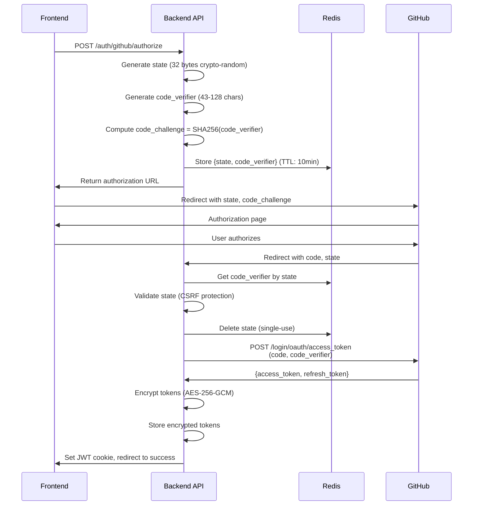

---
meta:
  id: specs-products-agent-alchemy-dev-features-github-app-onboarding-architecture-security-architecture
  title: GitHub App Onboarding - Security Architecture
  version: 1.0.0
  status: draft
  specType: specification
  scope: feature
  tags: []
  createdBy: unknown
  createdAt: '2026-02-08'
  reviewedAt: null
title: GitHub App Onboarding - Security Architecture
category: architecture
feature: github-app-onboarding
lastUpdated: '2026-02-08'
source: Agent Alchemy
version: 1.0.0
aiContext: true
product: agent-alchemy-dev
phase: architecture
applyTo: []
keywords: []
topics: []
useCases: []
---

# GitHub App Onboarding - Security Architecture Specification

## Executive Summary

This specification defines the complete security architecture for GitHub App integration, covering authentication, authorization, data encryption, secure communication, threat mitigation, and compliance. The system implements defense-in-depth with multiple security layers.

**Security Principles**:
- **Zero Trust**: Verify every request, assume breach
- **Least Privilege**: Minimum necessary permissions
- **Defense in Depth**: Multiple overlapping security controls
- **Encryption Everywhere**: Data encrypted in transit and at rest
- **Audit Everything**: Comprehensive security logging
- **Fail Securely**: Default deny on errors

**Compliance Targets**:
- GDPR (EU data privacy)
- SOC 2 Type II readiness
- OAuth 2.0 RFC 6749
- PKCE RFC 7636
- OWASP Top 10 mitigation

---

## 1. Security Architecture Layers

```
┌────────────────────────────────────────────────────────────────┐
│ Layer 1: Network Security                                      │
│ • HTTPS/TLS 1.3 (all connections)                             │
│ • Vercel WAF (DDoS protection, rate limiting)                 │
│ • IP allowlisting for admin endpoints                         │
│ • DNS security (DNSSEC)                                       │
└────────────────────────────────────────────────────────────────┘
                              ↓
┌────────────────────────────────────────────────────────────────┐
│ Layer 2: Application Security                                  │
│ • OAuth 2.0 + PKCE (CSRF protection)                          │
│ • JWT authentication (RS256, 24-hour expiry)                  │
│ • Rate limiting (100 req/min per user)                        │
│ • CORS (restricted origins)                                   │
│ • Content Security Policy (CSP)                               │
│ • Input validation (DTOs with class-validator)               │
└────────────────────────────────────────────────────────────────┘
                              ↓
┌────────────────────────────────────────────────────────────────┐
│ Layer 3: Data Security                                         │
│ • OAuth tokens encrypted at rest (AES-256-GCM)                │
│ • Database SSL/TLS connections                                │
│ • Redis TLS encryption                                        │
│ • Secrets in AWS Secrets Manager (production)                │
│ • Row-Level Security (RLS) in database                       │
└────────────────────────────────────────────────────────────────┘
                              ↓
┌────────────────────────────────────────────────────────────────┐
│ Layer 4: Monitoring & Incident Response                       │
│ • Audit logging (2-year retention)                            │
│ • Security alerts (Sentry + PagerDuty)                        │
│ • Intrusion detection                                         │
│ • Anomaly detection (failed auth attempts)                    │
│ • GDPR compliance (data export, deletion)                     │
└────────────────────────────────────────────────────────────────┘
```

---

## 2. OAuth 2.0 + PKCE Implementation

### 2.1 Authorization Code Flow with PKCE

**PKCE (Proof Key for Code Exchange) - RFC 7636**

Purpose: Prevent authorization code interception attacks

**Flow Diagram**:


### 2.2 Security Parameters

**State Parameter** (CSRF Protection):
```typescript
// Generate cryptographically secure state
const state = crypto.randomBytes(32).toString('hex'); // 64 hex characters
```

**PKCE Parameters**:
```typescript
// Code verifier (43-128 characters)
const codeVerifier = base64UrlEncode(crypto.randomBytes(32)); // 43 chars

// Code challenge (SHA256 hash)
const codeChallenge = base64UrlEncode(
  crypto.createHash('sha256').update(codeVerifier).digest()
);
```

**Redis Storage**:
```typescript
// Store with 10-minute TTL
await redis.setex(
  `oauth:state:${state}`,
  600,
  JSON.stringify({ codeVerifier, timestamp: Date.now() })
);
```

### 2.3 Attack Mitigation

| Attack | Mitigation | Implementation |
|--------|-----------|----------------|
| **CSRF** | State parameter | Cryptographically random, single-use |
| **Authorization Code Interception** | PKCE | Code challenge/verifier prevents replay |
| **Token Leakage** | Encrypted storage | AES-256-GCM with unique IV |
| **Session Hijacking** | HttpOnly cookies | Secure, SameSite=Strict |
| **Replay Attacks** | Single-use codes | State deleted after validation |

---

## 3. Token Management Security

### 3.1 Token Encryption at Rest

**Algorithm**: AES-256-GCM (Galois/Counter Mode)

**Why GCM?**
- Authenticated encryption (integrity + confidentiality)
- Prevents tampering
- Industry standard for sensitive data

**Implementation**:
```typescript
import { createCipheriv, createDecipheriv, randomBytes } from 'crypto';

interface EncryptedToken {
  ciphertext: string;
  iv: string;
  authTag: string;
  algorithm: 'aes-256-gcm';
}

export class TokenEncryptionService {
  private readonly algorithm = 'aes-256-gcm';
  private readonly keyLength = 32; // 256 bits

  constructor(private readonly encryptionKey: Buffer) {
    if (encryptionKey.length !== this.keyLength) {
      throw new Error('Encryption key must be 32 bytes (256 bits)');
    }
  }

  encrypt(plaintext: string): EncryptedToken {
    // Generate unique IV (Initialization Vector) for each encryption
    const iv = randomBytes(16); // 128 bits

    // Create cipher
    const cipher = createCipheriv(this.algorithm, this.encryptionKey, iv);

    // Encrypt
    let ciphertext = cipher.update(plaintext, 'utf8', 'hex');
    ciphertext += cipher.final('hex');

    // Get authentication tag
    const authTag = cipher.getAuthTag();

    return {
      ciphertext,
      iv: iv.toString('hex'),
      authTag: authTag.toString('hex'),
      algorithm: this.algorithm
    };
  }

  decrypt(encryptedToken: EncryptedToken): string {
    // Validate algorithm
    if (encryptedToken.algorithm !== this.algorithm) {
      throw new Error('Unsupported encryption algorithm');
    }

    // Convert hex strings to buffers
    const iv = Buffer.from(encryptedToken.iv, 'hex');
    const authTag = Buffer.from(encryptedToken.authTag, 'hex');

    // Create decipher
    const decipher = createDecipheriv(this.algorithm, this.encryptionKey, iv);
    decipher.setAuthTag(authTag);

    // Decrypt
    let plaintext = decipher.update(encryptedToken.ciphertext, 'hex', 'utf8');
    plaintext += decipher.final('utf8');

    return plaintext;
  }
}
```

### 3.2 Key Management

**Development**: Environment variable
```env
ENCRYPTION_KEY=your-32-byte-key-here-base64-encoded
```

**Production**: AWS Secrets Manager
```typescript
import { SecretsManagerClient, GetSecretValueCommand } from '@aws-sdk/client-secrets-manager';

async function getEncryptionKey(): Promise<Buffer> {
  const client = new SecretsManagerClient({ region: 'us-east-1' });
  const command = new GetSecretValueCommand({
    SecretId: 'agent-alchemy/oauth-encryption-key'
  });
  
  const response = await client.send(command);
  return Buffer.from(response.SecretString, 'base64');
}
```

**Key Rotation Strategy**:
1. Generate new encryption key
2. Store in AWS Secrets Manager with version
3. Decrypt existing tokens with old key
4. Re-encrypt with new key
5. Update key reference in application
6. Schedule old key deletion after 30 days

### 3.3 Token Lifecycle

**Token Expiration**:
- GitHub installation tokens: 1 hour
- JWT session tokens: 24 hours
- Refresh tokens: 6 months (if used)

**Automatic Refresh**:
```typescript
// Background job runs every 30 minutes
async function refreshExpiringTokens(): Promise<void> {
  // Find tokens expiring in <60 minutes
  const expiringTokens = await prisma.oauthToken.findMany({
    where: {
      expiresAt: {
        lte: new Date(Date.now() + 60 * 60 * 1000), // 1 hour
        gte: new Date()
      },
      isActive: true
    }
  });

  for (const token of expiringTokens) {
    try {
      // Decrypt current token
      const plainToken = await tokenEncryption.decrypt({
        ciphertext: token.encryptedToken,
        iv: token.iv,
        authTag: token.authTag,
        algorithm: 'aes-256-gcm'
      });

      // Request new token from GitHub
      const newToken = await githubApp.getInstallationAccessToken({
        installationId: token.installation.githubInstallationId
      });

      // Encrypt new token
      const encrypted = await tokenEncryption.encrypt(newToken.token);

      // Update database
      await prisma.oauthToken.update({
        where: { id: token.id },
        data: {
          encryptedToken: encrypted.ciphertext,
          iv: encrypted.iv,
          authTag: encrypted.authTag,
          expiresAt: new Date(newToken.expiresAt),
          refreshedAt: new Date()
        }
      });

      // Update cache
      await redis.setex(
        `token:installation:${token.installationId}`,
        3600,
        JSON.stringify(encrypted)
      );

    } catch (error) {
      logger.error('Token refresh failed', { tokenId: token.id, error });
      // Alert security team if refresh fails
    }
  }
}
```

---

## 4. JWT Session Security

### 4.1 JWT Configuration

**Algorithm**: RS256 (RSA with SHA-256)
- Asymmetric signing (public/private key pair)
- More secure than HS256 (symmetric)
- Private key never leaves backend

**JWT Structure**:
```json
{
  "header": {
    "alg": "RS256",
    "typ": "JWT"
  },
  "payload": {
    "sub": "user-uuid",
    "email": "user@example.com",
    "iat": 1707552000,
    "exp": 1707638400,
    "iss": "agent-alchemy",
    "aud": "agent-alchemy-web"
  },
  "signature": "..."
}
```

**Implementation**:
```typescript
import * as jwt from 'jsonwebtoken';
import { readFileSync } from 'fs';

@Injectable()
export class JwtService {
  private readonly privateKey: Buffer;
  private readonly publicKey: Buffer;

  constructor() {
    this.privateKey = readFileSync('/path/to/private.pem');
    this.publicKey = readFileSync('/path/to/public.pem');
  }

  sign(payload: JwtPayload): string {
    return jwt.sign(payload, this.privateKey, {
      algorithm: 'RS256',
      expiresIn: '24h',
      issuer: 'agent-alchemy',
      audience: 'agent-alchemy-web'
    });
  }

  verify(token: string): JwtPayload {
    return jwt.verify(token, this.publicKey, {
      algorithms: ['RS256'],
      issuer: 'agent-alchemy',
      audience: 'agent-alchemy-web'
    }) as JwtPayload;
  }
}
```

### 4.2 JWT Storage

**Cookie Configuration**:
```typescript
res.cookie('auth_token', jwtToken, {
  httpOnly: true,        // Prevent XSS
  secure: true,          // HTTPS only
  sameSite: 'strict',    // CSRF protection
  maxAge: 86400000,      // 24 hours
  domain: '.agent-alchemy.dev',
  path: '/'
});
```

**Why cookies over localStorage?**
- HttpOnly prevents JavaScript access (XSS protection)
- Secure flag ensures HTTPS-only transmission
- SameSite prevents CSRF attacks
- Automatic expiration

---

## 5. Webhook Security

### 5.1 Signature Validation

**HMAC-SHA256 Verification**:
```typescript
import * as crypto from 'crypto';

@Injectable()
export class WebhookSignatureValidator {
  constructor(
    @Inject('GITHUB_WEBHOOK_SECRET') private readonly secret: string
  ) {}

  validate(payload: string, signature: string): boolean {
    // Compute HMAC-SHA256
    const expectedSignature = 'sha256=' + crypto
      .createHmac('sha256', this.secret)
      .update(payload)
      .digest('hex');

    // Timing-safe comparison (prevent timing attacks)
    return crypto.timingSafeEqual(
      Buffer.from(signature),
      Buffer.from(expectedSignature)
    );
  }
}
```

**Webhook Handler with Security**:
```typescript
@Post('webhooks/github')
async handleWebhook(
  @Req() req: Request,
  @Headers('x-github-delivery') deliveryId: string,
  @Headers('x-github-event') eventType: string,
  @Headers('x-hub-signature-256') signature: string,
  @Body() payload: any
): Promise<void> {
  // 1. Validate signature
  const isValid = this.signatureValidator.validate(
    JSON.stringify(payload),
    signature
  );

  if (!isValid) {
    this.logger.error('Invalid webhook signature', { deliveryId, eventType });
    throw new UnauthorizedException('Invalid webhook signature');
  }

  // 2. Check for duplicate delivery (idempotency)
  const isDuplicate = await this.redis.get(`webhook:${deliveryId}`);
  if (isDuplicate) {
    this.logger.warn('Duplicate webhook delivery', { deliveryId });
    return; // Already processed
  }

  // 3. Mark as processed (24-hour TTL)
  await this.redis.setex(`webhook:${deliveryId}`, 86400, '1');

  // 4. Process event
  await this.webhookService.handleEvent(eventType, payload, deliveryId);
}
```

### 5.2 Webhook Threat Mitigation

| Threat | Mitigation |
|--------|-----------|
| **Signature Forgery** | HMAC-SHA256 verification with timing-safe comparison |
| **Replay Attacks** | Delivery ID tracking (idempotency) |
| **DoS Attacks** | Rate limiting, async processing with job queue |
| **Payload Tampering** | Signature validation detects modifications |

---

## 6. Input Validation & Sanitization

### 6.1 DTO Validation

**Using class-validator**:
```typescript
import { IsString, IsEmail, IsNotEmpty, IsOptional, Length, Matches } from 'class-validator';

export class CreateUserDto {
  @IsEmail()
  @IsNotEmpty()
  email: string;

  @IsString()
  @Length(2, 50)
  @Matches(/^[a-zA-Z0-9_-]+$/, { message: 'Username must be alphanumeric' })
  username: string;

  @IsString()
  @IsOptional()
  @Length(0, 500)
  bio?: string;
}
```

**Global Validation Pipe**:
```typescript
app.useGlobalPipes(new ValidationPipe({
  whitelist: true,           // Strip unknown properties
  forbidNonWhitelisted: true, // Reject unknown properties
  transform: true,           // Auto-transform types
  transformOptions: {
    enableImplicitConversion: false // Explicit type conversion
  }
}));
```

### 6.2 SQL Injection Prevention

**Use Prisma ORM (parameterized queries)**:
```typescript
// ✅ SAFE: Prisma parameterizes queries
const user = await prisma.user.findUnique({
  where: { email: userInput }
});

// ✅ SAFE: Prisma raw query with parameters
const users = await prisma.$queryRaw`
  SELECT * FROM users WHERE email = ${userInput}
`;

// ❌ UNSAFE: String concatenation (never do this)
// const users = await prisma.$queryRawUnsafe(
//   `SELECT * FROM users WHERE email = '${userInput}'`
// );
```

---

## 7. Rate Limiting

### 7.1 Rate Limit Configuration

**Per-User Rate Limits**:
```typescript
import { RateLimiterRedis } from 'rate-limiter-flexible';

@Injectable()
export class RateLimiterService {
  private readonly limiter: RateLimiterRedis;

  constructor(private readonly redis: Redis) {
    this.limiter = new RateLimiterRedis({
      storeClient: redis,
      keyPrefix: 'ratelimit',
      points: 100,           // 100 requests
      duration: 60,          // per 60 seconds
      blockDuration: 60      // block for 60 seconds if exceeded
    });
  }

  async consume(userId: string): Promise<void> {
    try {
      await this.limiter.consume(userId);
    } catch (error) {
      if (error instanceof RateLimiterRes) {
        const retryAfter = Math.round(error.msBeforeNext / 1000);
        throw new TooManyRequestsException(`Rate limit exceeded. Retry after ${retryAfter} seconds.`);
      }
      throw error;
    }
  }
}
```

**Rate Limiter Middleware**:
```typescript
@Injectable()
export class RateLimiterMiddleware implements NestMiddleware {
  constructor(private readonly rateLimiter: RateLimiterService) {}

  async use(req: Request, res: Response, next: NextFunction): Promise<void> {
    const userId = req.user?.id || req.ip;
    
    try {
      await this.rateLimiter.consume(userId);
      next();
    } catch (error) {
      if (error instanceof TooManyRequestsException) {
        res.status(429).json({
          statusCode: 429,
          message: error.message
        });
      } else {
        throw error;
      }
    }
  }
}
```

---

## 8. CORS Configuration

```typescript
app.enableCors({
  origin: [
    'https://agent-alchemy.dev',
    'https://app.agent-alchemy.dev'
  ],
  methods: ['GET', 'POST', 'PUT', 'PATCH', 'DELETE'],
  allowedHeaders: ['Content-Type', 'Authorization'],
  credentials: true, // Allow cookies
  maxAge: 3600      // Cache preflight for 1 hour
});
```

---

## 9. Security Headers

```typescript
import helmet from 'helmet';

app.use(helmet({
  contentSecurityPolicy: {
    directives: {
      defaultSrc: ["'self'"],
      scriptSrc: ["'self'", "'unsafe-inline'"],
      styleSrc: ["'self'", "'unsafe-inline'"],
      imgSrc: ["'self'", "data:", "https:"],
      connectSrc: ["'self'", "https://api.agent-alchemy.dev"],
      fontSrc: ["'self'"],
      objectSrc: ["'none'"],
      mediaSrc: ["'self'"],
      frameSrc: ["'none'"]
    }
  },
  hsts: {
    maxAge: 31536000,
    includeSubDomains: true,
    preload: true
  },
  referrerPolicy: { policy: 'strict-origin-when-cross-origin' },
  noSniff: true,
  xssFilter: true,
  hidePoweredBy: true
}));
```

---

## 10. Audit Logging

### 10.1 Security Event Logging

```typescript
interface AuditLogEntry {
  userId?: string;
  installationId?: string;
  eventType: 'oauth_flow' | 'token_refresh' | 'installation_action' | 'permission_change';
  action: string;
  context: Record<string, any>;
  ipAddress: string;
  userAgent: string;
  timestamp: Date;
}

@Injectable()
export class AuditLogService {
  constructor(private readonly prisma: PrismaService) {}

  async log(entry: AuditLogEntry): Promise<void> {
    await this.prisma.auditLog.create({
      data: entry
    });
  }

  async logOAuthFlow(userId: string, action: string, context: any, req: Request): Promise<void> {
    await this.log({
      userId,
      eventType: 'oauth_flow',
      action,
      context,
      ipAddress: req.ip,
      userAgent: req.headers['user-agent'],
      timestamp: new Date()
    });
  }
}
```

**Events to Log**:
- OAuth authorization initiation
- OAuth callback success/failure
- Token refresh (scheduled and on-demand)
- Installation created/suspended/deleted
- Permission changes
- Failed authentication attempts (>5 in 10 minutes = alert)
- Admin actions

---

## 11. Threat Detection & Response

### 11.1 Anomaly Detection

**Failed Authentication Monitoring**:
```typescript
@Injectable()
export class SecurityMonitorService {
  private readonly FAILED_AUTH_THRESHOLD = 5;
  private readonly TIME_WINDOW = 600; // 10 minutes

  async trackFailedAuth(userId: string, req: Request): Promise<void> {
    const key = `failed_auth:${userId}`;
    const count = await this.redis.incr(key);
    
    if (count === 1) {
      await this.redis.expire(key, this.TIME_WINDOW);
    }

    if (count >= this.FAILED_AUTH_THRESHOLD) {
      // Alert security team
      await this.alertService.sendSecurityAlert({
        type: 'SUSPICIOUS_ACTIVITY',
        severity: 'HIGH',
        message: `${count} failed auth attempts for user ${userId}`,
        metadata: {
          userId,
          ipAddress: req.ip,
          userAgent: req.headers['user-agent'],
          timestamp: new Date()
        }
      });

      // Lock account temporarily
      await this.userService.lockAccount(userId, 3600); // 1 hour
    }
  }
}
```

---

## 12. Compliance

### 12.1 GDPR Compliance

**Data Export**:
```typescript
async function exportUserData(userId: string): Promise<UserDataExport> {
  const user = await prisma.user.findUnique({ where: { id: userId } });
  const installations = await prisma.githubInstallation.findMany({ where: { userId } });
  const auditLogs = await prisma.auditLog.findMany({ where: { userId } });

  return {
    user: {
      id: user.id,
      email: user.email,
      createdAt: user.createdAt
    },
    installations: installations.map(i => ({
      githubInstallationId: i.githubInstallationId,
      installedAt: i.installedAt
    })),
    auditLogs: auditLogs.map(log => ({
      eventType: log.eventType,
      action: log.action,
      timestamp: log.createdAt
    }))
  };
}
```

**Data Deletion (Right to be Forgotten)**:
```typescript
async function deleteUserData(userId: string): Promise<void> {
  await prisma.$transaction([
    // Soft delete installations
    prisma.githubInstallation.updateMany({
      where: { userId },
      data: { removedAt: new Date() }
    }),
    
    // Anonymize audit logs (keep for compliance)
    prisma.auditLog.updateMany({
      where: { userId },
      data: {
        userId: null,
        context: { anonymized: true }
      }
    }),
    
    // Delete OAuth tokens
    prisma.oauthToken.deleteMany({
      where: {
        installation: { userId }
      }
    }),
    
    // Soft delete user
    prisma.user.update({
      where: { id: userId },
      data: {
        email: `deleted-${userId}@anonymized.local`,
        metadata: { deleted: true }
      }
    })
  ]);
}
```

---

## 13. Security Testing

### 13.1 Security Test Checklist

- [ ] OAuth state validation prevents CSRF
- [ ] PKCE code verifier never exposed to client
- [ ] Token encryption/decryption works correctly
- [ ] JWT signature validation rejects tampered tokens
- [ ] Webhook signature validation rejects invalid signatures
- [ ] Rate limiting enforces limits correctly
- [ ] SQL injection attempts blocked by ORM
- [ ] XSS attempts sanitized by CSP
- [ ] CORS policy restricts unauthorized origins
- [ ] Audit logs capture all security events

### 13.2 Penetration Testing

**Annual Security Audit**:
- OWASP Top 10 testing
- OAuth/OIDC flow security
- API security testing
- Network security testing
- Social engineering testing

---

## 14. Acceptance Criteria

- [ ] OAuth 2.0 + PKCE implemented correctly
- [ ] All OAuth tokens encrypted with AES-256-GCM
- [ ] JWT authentication with RS256 algorithm
- [ ] Webhook signature validation with HMAC-SHA256
- [ ] Rate limiting enforced (100 req/min per user)
- [ ] CORS configured with restricted origins
- [ ] Security headers (CSP, HSTS, etc.) configured
- [ ] Audit logging captures all security events
- [ ] GDPR data export/deletion implemented
- [ ] External security audit passed

---

**Document Status**: Draft v1.0.0  
**Next Review**: 2026-03-08  
**Maintained By**: Agent Alchemy Security Team
