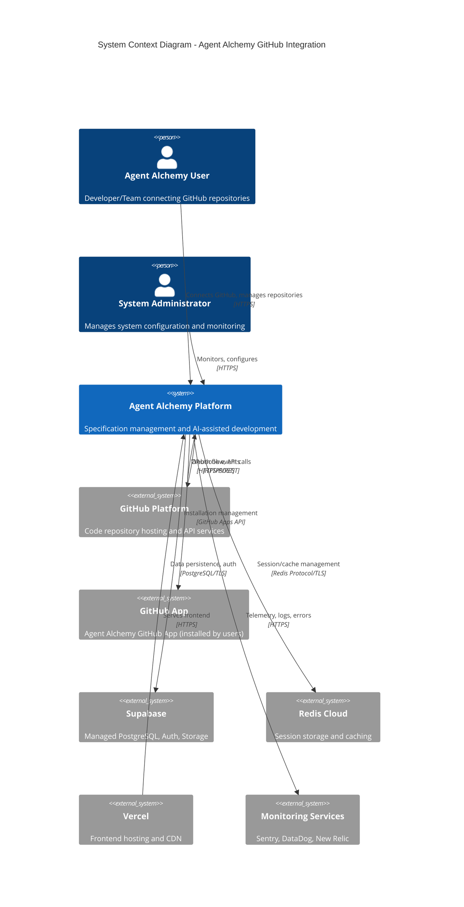
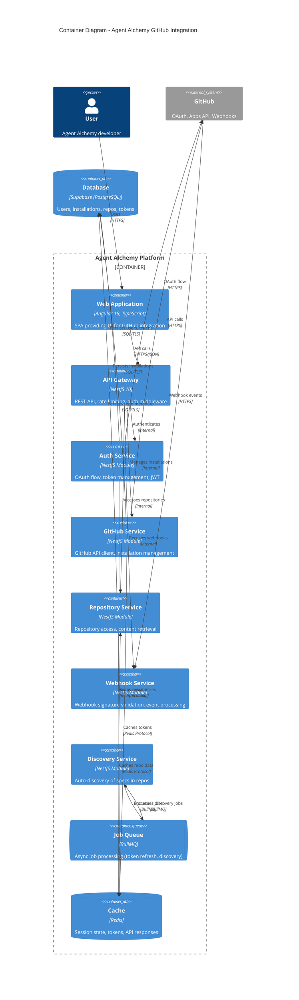
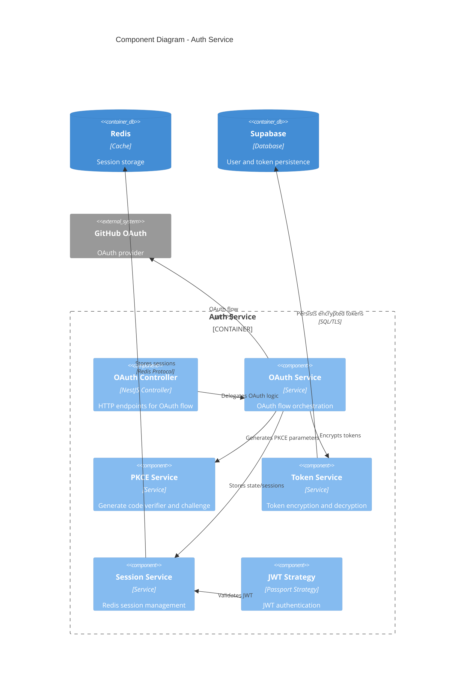
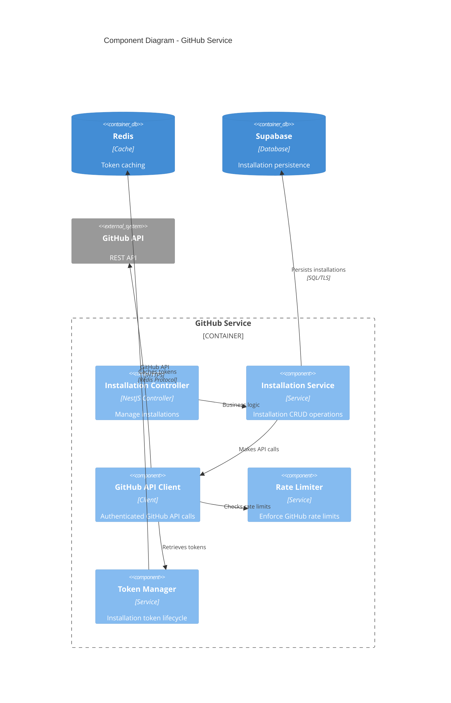
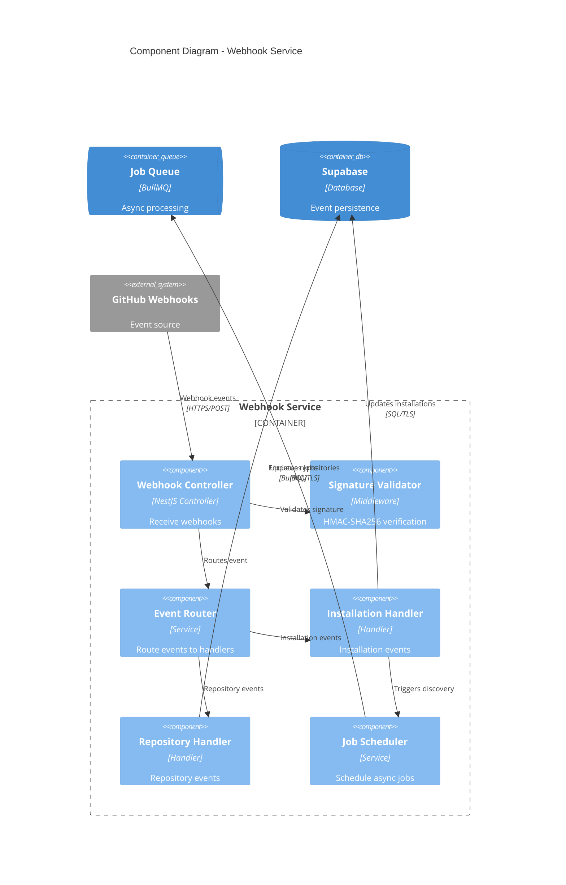
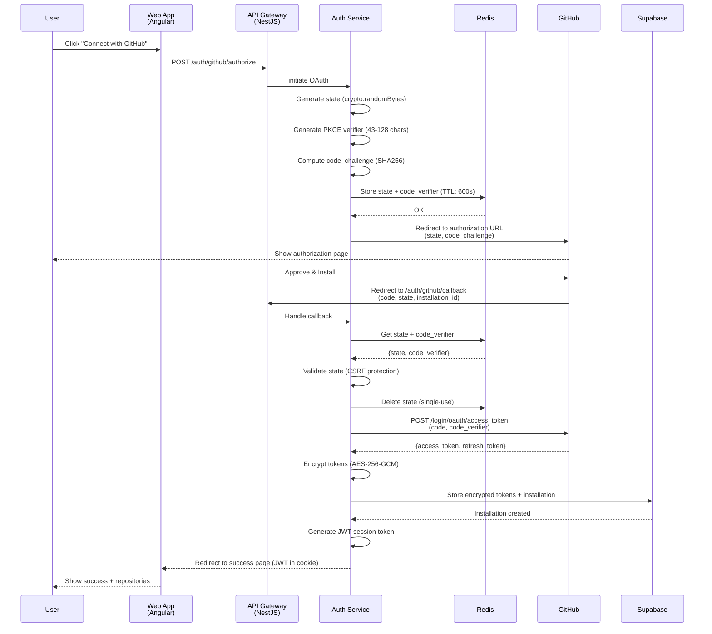
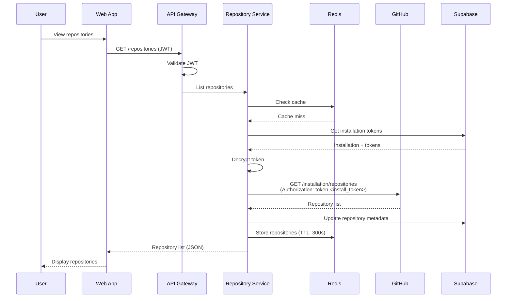
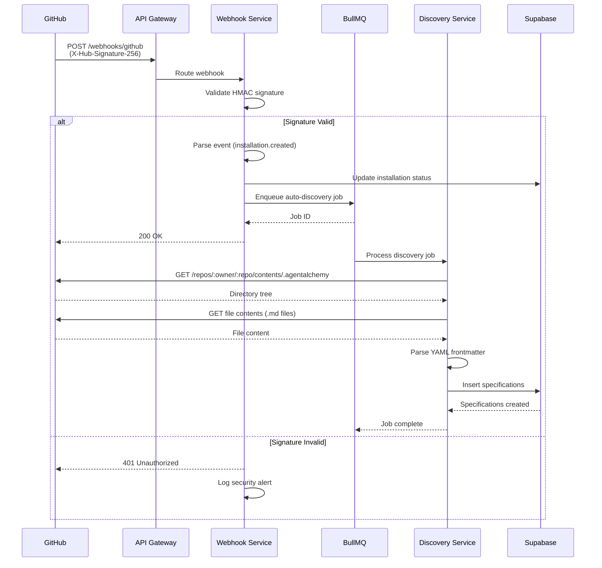
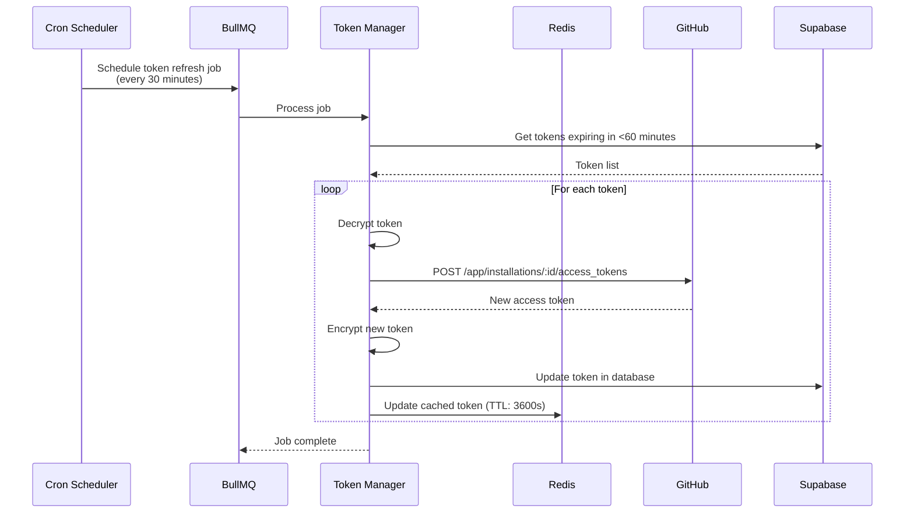
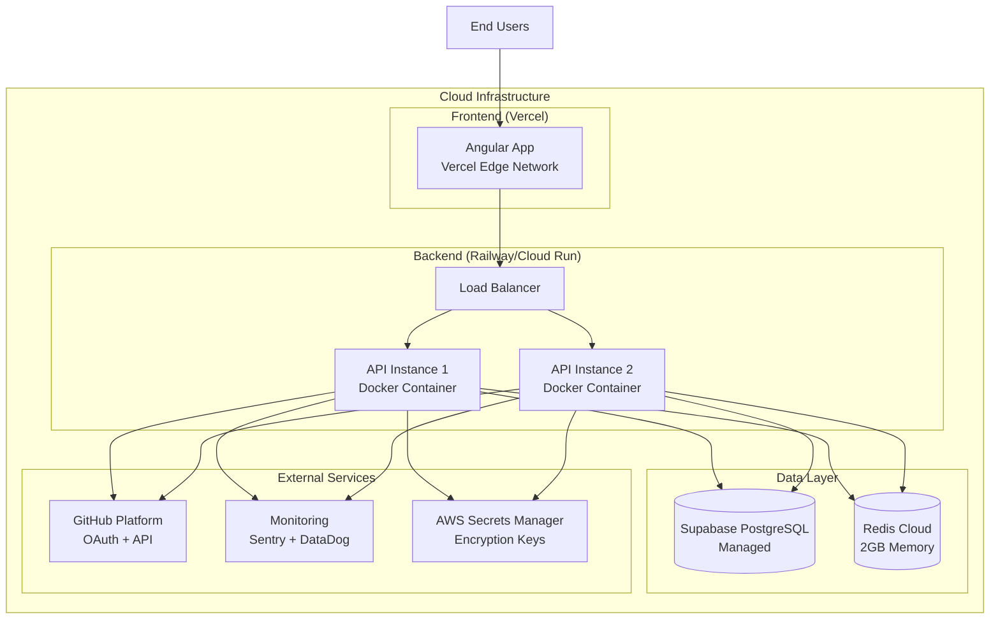

---
meta:
  id: specs-products-agent-alchemy-dev-features-github-app-onboarding-architecture-system-architecture
  title: GitHub App Onboarding - System Architecture
  version: 1.0.0
  status: draft
  specType: specification
  scope: feature
  tags: []
  createdBy: unknown
  createdAt: '2026-02-08'
  reviewedAt: null
title: GitHub App Onboarding - System Architecture
category: architecture
feature: github-app-onboarding
lastUpdated: '2026-02-08'
source: Agent Alchemy
version: 1.0.0
aiContext: true
product: agent-alchemy-dev
phase: architecture
applyTo: []
keywords: []
topics: []
useCases: []
---

# GitHub App Onboarding - System Architecture Specification

## Executive Summary

This specification defines the complete system architecture for GitHub App integration and onboarding in Agent Alchemy. The system enables OAuth 2.0 authentication with PKCE, GitHub App installation management, repository access control, and automatic specification discovery. The architecture leverages Angular 18 for the frontend, NestJS 10 for the backend, PostgreSQL via Supabase for data persistence, and Redis for caching/sessions.

**Key Architecture Decisions:**
- **OAuth 2.0 + PKCE**: Enhanced security for authorization code flow
- **Monorepo Architecture**: Nx workspace for unified frontend/backend development
- **Microservices Pattern**: Separation of concerns between auth, installation, and repository services
- **Event-Driven Architecture**: Webhook processing with async job queues
- **Token Encryption**: AES-256-GCM for OAuth tokens at rest
- **Caching Strategy**: Redis for session state and token caching

**Performance Targets:**
- <60s onboarding completion time
- <500ms API response time (p95)
- Support 100,000+ concurrent users
- 99.9% uptime SLA

---

## 1. System Context (C4 Level 1)

### 1.1 System Context Diagram



### 1.2 System Boundary

**Inside System Boundary:**
- Agent Alchemy Web Application (Angular 18)
- Agent Alchemy API Backend (NestJS 10)
- Authentication Service
- GitHub Integration Service
- Repository Management Service
- Webhook Processing Service
- Token Management Service
- Auto-Discovery Service

**Outside System Boundary:**
- GitHub Platform (OAuth provider, API, webhooks)
- Supabase (database, auth, storage)
- Redis Cloud (caching layer)
- Vercel (frontend hosting)
- Monitoring/Observability services

### 1.3 External System Integrations

| External System | Integration Type | Protocol | Purpose | Rate Limits |
|----------------|------------------|----------|---------|-------------|
| GitHub OAuth | OAuth 2.0 + PKCE | HTTPS/REST | User authentication | N/A |
| GitHub Apps API | REST API | HTTPS | Installation management, repo access | 5,000 req/hr per installation |
| GitHub Webhooks | Event-driven | HTTPS/POST | Real-time installation updates | Unlimited inbound |
| Supabase | Client library | PostgreSQL/TLS | Data persistence, auth | Connection pooling (100 max) |
| Redis Cloud | Client library | Redis Protocol/TLS | Session storage, caching | 10,000 ops/sec |
| Vercel | Deployment | HTTPS | Frontend hosting, CDN | Unlimited bandwidth (Pro plan) |
| Sentry | SDK | HTTPS | Error tracking | 50K events/month |
| DataDog | Agent | HTTPS | APM, logs, metrics | Custom plan |

---

## 2. Container Architecture (C4 Level 2)

### 2.1 Container Diagram



### 2.2 Container Descriptions

#### 2.2.1 Web Application (Angular 18)

**Technology Stack:**
- Angular 18.2.0 with TypeScript 5.5.2
- Angular Signals for state management
- TailwindCSS 3.4.10 + PrimeNG 18.0.2 for UI
- RxJS 7.8.0 for reactive programming

**Responsibilities:**
- Render user interface for onboarding workflow
- Initiate OAuth flow with GitHub
- Display repository list and discovered specifications
- Manage client-side state with Angular Signals
- Handle real-time updates via WebSocket (future)

**Key Components:**
- `OnboardingComponent`: OAuth initiation and success screens
- `RepositoryListComponent`: Display connected repositories
- `InstallationManagementComponent`: Install/suspend/uninstall UI
- `SpecificationBrowserComponent`: View discovered specifications

**Deployment:**
- Platform: Vercel (Pro plan)
- Build: Nx + Angular CLI
- CDN: Vercel Edge Network
- SSL: Automatic via Vercel

#### 2.2.2 API Gateway (NestJS 10)

**Technology Stack:**
- NestJS 10.0.2 with TypeScript 5.5.2
- Express.js (underlying HTTP server)
- Helmet for security headers
- CORS middleware for cross-origin requests

**Responsibilities:**
- Route incoming HTTP requests to appropriate services
- Enforce authentication via JWT middleware
- Rate limiting (100 req/min per user)
- Request/response transformation
- Global exception handling
- API documentation (Swagger/OpenAPI)

**Middleware Chain:**
```
Request → CORS → Rate Limiter → Auth Guard → Service Router → Response
```

**Endpoints:**
- `POST /auth/github/authorize` - Initiate OAuth
- `GET /auth/github/callback` - OAuth callback
- `GET /installations` - List user installations
- `POST /installations/:id/repositories` - Grant repo access
- `POST /webhooks/github` - Receive GitHub webhooks
- `GET /repositories/:id/specifications` - List discovered specs

**Deployment:**
- Platform: Railway or Google Cloud Run
- Containerization: Docker
- Scaling: Horizontal auto-scaling (2-10 instances)
- Health checks: `/health` endpoint

#### 2.2.3 Auth Service (NestJS Module)

**Responsibilities:**
- Implement OAuth 2.0 authorization code flow with PKCE
- Generate and validate state parameters (CSRF protection)
- Exchange authorization code for tokens
- Encrypt tokens before storage (AES-256-GCM)
- Manage JWT sessions for authenticated users
- Handle token refresh workflow

**Dependencies:**
- `crypto` (Node.js built-in) for PKCE and encryption
- `@supabase/supabase-js` for user management
- `ioredis` for session storage
- `@octokit/auth-oauth-app` for GitHub OAuth

**Key Classes:**
- `OAuthService`: OAuth flow orchestration
- `TokenEncryptionService`: AES-256-GCM encryption/decryption
- `SessionService`: Redis session management
- `JwtStrategy`: Passport JWT strategy

#### 2.2.4 GitHub Service (NestJS Module)

**Responsibilities:**
- Manage GitHub App installations
- Handle installation lifecycle (install, suspend, uninstall)
- Retrieve installation access tokens
- Call GitHub API on behalf of installations
- Implement rate limiting and retry logic

**Dependencies:**
- `@octokit/rest` for GitHub REST API
- `@octokit/app` for GitHub App authentication
- `bottleneck` for rate limiting (5000 req/hr)

**Key Classes:**
- `GitHubInstallationService`: Installation CRUD operations
- `GitHubApiClient`: Authenticated API client wrapper
- `RateLimiter`: Rate limit enforcement
- `TokenRefreshService`: Background token refresh

#### 2.2.5 Repository Service (NestJS Module)

**Responsibilities:**
- List repositories accessible by installation
- Retrieve repository metadata (name, owner, description, topics)
- Fetch file contents from repositories
- Cache repository data in Redis
- Handle repository permission changes

**Dependencies:**
- `@octokit/rest` for GitHub API
- `ioredis` for caching
- `prisma` for database access

**Key Classes:**
- `RepositoryService`: Repository CRUD operations
- `ContentService`: File content retrieval
- `CacheService`: Redis caching strategy
- `PermissionService`: Repository permission validation

#### 2.2.6 Webhook Service (NestJS Module)

**Responsibilities:**
- Validate webhook signatures (HMAC-SHA256)
- Parse webhook payloads
- Route events to appropriate handlers
- Handle installation events (created, suspended, deleted)
- Handle repository events (added, removed)
- Trigger async jobs for long-running operations

**Dependencies:**
- `@octokit/webhooks` for signature validation
- `bullmq` for job queue
- `prisma` for database updates

**Key Classes:**
- `WebhookController`: HTTP endpoint for webhooks
- `SignatureValidator`: HMAC verification
- `InstallationEventHandler`: Installation lifecycle events
- `RepositoryEventHandler`: Repository permission events

#### 2.2.7 Discovery Service (NestJS Module)

**Responsibilities:**
- Auto-discover specification files in repositories
- Scan `.agentalchemy/specs/` directory
- Parse and index specification metadata
- Update database with discovered specs
- Handle incremental updates (new/modified files)

**Dependencies:**
- `@octokit/rest` for GitHub API
- `gray-matter` for YAML frontmatter parsing
- `bullmq` for async processing

**Key Classes:**
- `DiscoveryService`: Orchestrate discovery workflow
- `FileScanner`: Scan repository directory tree
- `MetadataParser`: Parse specification frontmatter
- `IndexService`: Update specification index

#### 2.2.8 Job Queue (BullMQ)

**Responsibilities:**
- Asynchronous job processing
- Token refresh jobs (scheduled every 30 minutes)
- Discovery jobs (triggered by installation/webhook)
- Retry failed jobs with exponential backoff
- Job status monitoring and logging

**Job Types:**
```typescript
enum JobType {
  TOKEN_REFRESH = 'token-refresh',
  AUTO_DISCOVERY = 'auto-discovery',
  WEBHOOK_PROCESSING = 'webhook-processing',
  INSTALLATION_SYNC = 'installation-sync'
}
```

**Configuration:**
- Backend: Redis
- Concurrency: 10 workers per job type
- Retry: 3 attempts with exponential backoff (1s, 5s, 25s)
- TTL: Completed jobs retained for 24 hours

#### 2.2.9 Cache (Redis)

**Responsibilities:**
- Store OAuth state and code_verifier (10-minute TTL)
- Cache installation access tokens (1-hour TTL)
- Cache repository metadata (5-minute TTL)
- Store user sessions (24-hour TTL)
- Rate limiting counters (1-minute TTL)

**Data Structures:**
```
oauth:state:{state} → {codeVerifier, timestamp} (TTL: 600s)
token:installation:{id} → {encryptedToken, expiresAt} (TTL: 3600s)
repo:metadata:{id} → {name, owner, fullName, ...} (TTL: 300s)
session:user:{id} → {jwt, expiresAt} (TTL: 86400s)
ratelimit:{userId}:{endpoint} → {count} (TTL: 60s)
```

**Configuration:**
- Provider: Redis Cloud or AWS ElastiCache
- TLS: Enabled for all connections
- Persistence: RDB snapshots every 5 minutes
- Max memory: 2GB with eviction policy `allkeys-lru`

#### 2.2.10 Database (Supabase - PostgreSQL)

**Responsibilities:**
- Persist users, installations, repositories, tokens
- Enforce referential integrity with foreign keys
- Row-level security (RLS) policies
- Full-text search on specification content
- Audit logging for compliance

**Schema Highlights:**
- `users`: User accounts (managed by Supabase Auth)
- `github_installations`: GitHub App installations
- `github_accounts`: Personal accounts or organizations
- `repositories`: Connected repositories
- `specifications`: Discovered specification files
- `audit_logs`: Security and compliance audit trail

**Access Patterns:**
- Connection pooling (max 100 connections)
- Read replicas for analytics queries
- Indexes on foreign keys and frequently queried columns

---

## 3. Component Architecture (C4 Level 3)

### 3.1 Auth Service Component Diagram



### 3.2 GitHub Service Component Diagram



### 3.3 Webhook Service Component Diagram



---

## 4. Technology Stack Details

### 4.1 Frontend Stack (Web Application)

| Layer | Technology | Version | Purpose | Documentation |
|-------|-----------|---------|---------|---------------|
| **Framework** | Angular | 18.2.0 | SPA framework | https://angular.io/docs |
| **Language** | TypeScript | 5.5.2 | Type-safe JavaScript | https://www.typescriptlang.org/docs |
| **State Management** | Angular Signals | 18.2.0 | Reactive state | https://angular.io/guide/signals |
| **UI Library** | PrimeNG | 18.0.2 | UI components | https://primeng.org |
| **Styling** | TailwindCSS | 3.4.10 | Utility-first CSS | https://tailwindcss.com/docs |
| **HTTP Client** | Angular HttpClient | 18.2.0 | HTTP requests | https://angular.io/guide/http |
| **Routing** | Angular Router | 18.2.0 | SPA routing | https://angular.io/guide/router |
| **Forms** | Reactive Forms | 18.2.0 | Form handling | https://angular.io/guide/reactive-forms |
| **Testing** | Jest + Playwright | 29.7.0 / 1.36.0 | Unit/E2E testing | https://jestjs.io, https://playwright.dev |

### 4.2 Backend Stack (API Gateway & Services)

| Layer | Technology | Version | Purpose | Documentation |
|-------|-----------|---------|---------|---------------|
| **Framework** | NestJS | 10.0.2 | Node.js framework | https://docs.nestjs.com |
| **Language** | TypeScript | 5.5.2 | Type-safe JavaScript | https://www.typescriptlang.org/docs |
| **Runtime** | Node.js | 18.16.9 | JavaScript runtime | https://nodejs.org/docs |
| **HTTP Server** | Express.js | 4.x | Underlying HTTP server | https://expressjs.com |
| **ORM** | Prisma | 5.x | Database ORM | https://www.prisma.io/docs |
| **Authentication** | Passport.js | 0.6.x | Auth middleware | https://www.passportjs.org |
| **GitHub Integration** | @octokit/rest | 20.x | GitHub API client | https://octokit.github.io/rest.js |
| **Job Queue** | BullMQ | 5.x | Redis-based queue | https://docs.bullmq.io |
| **Cache Client** | ioredis | 5.x | Redis client | https://github.com/redis/ioredis |
| **Testing** | Jest | 29.7.0 | Unit testing | https://jestjs.io |

### 4.3 Database & Caching

| Component | Technology | Version | Purpose | Configuration |
|-----------|-----------|---------|---------|---------------|
| **Primary Database** | Supabase (PostgreSQL) | 15+ | Data persistence | Connection pooling: 100 max |
| **Auth Provider** | Supabase Auth | 2.52.0 | User authentication | OAuth integrations enabled |
| **Cache** | Redis | 7.x | Session & data caching | TLS enabled, 2GB max memory |
| **Job Queue Backend** | Redis | 7.x | BullMQ backend | Persistence: RDB snapshots |

### 4.4 Monorepo Tooling

| Tool | Technology | Version | Purpose | Configuration |
|------|-----------|---------|---------|---------------|
| **Monorepo Manager** | Nx | 19.8.4 | Build system | Nx Cloud enabled |
| **Package Manager** | Yarn Classic | 1.22.22 | Dependency management | Workspace configuration |
| **Linting** | ESLint | 9.8.0 | Code quality | Angular ESLint, SonarJS rules |
| **Formatting** | Prettier | 2.6.2 | Code formatting | Integrated with ESLint |
| **Commit Conventions** | Commitlint | 19.3.0 | Conventional Commits | Pre-commit hooks |

### 4.5 DevOps & Deployment

| Component | Technology | Purpose | Configuration |
|-----------|-----------|---------|---------------|
| **CI/CD** | GitHub Actions | Automated builds, tests | Nx Cloud caching |
| **Frontend Hosting** | Vercel | Angular app deployment | Pro plan, auto SSL |
| **Backend Hosting** | Railway / Cloud Run | NestJS API deployment | Docker containers |
| **Monitoring** | Sentry + DataDog | Error tracking, APM | 50K events/month |
| **Secrets Management** | AWS Secrets Manager | Encryption keys, tokens | Production only |
| **Containerization** | Docker | Backend deployment | Multi-stage builds |

---

## 5. Data Flow Diagrams

### 5.1 OAuth Authorization Flow



### 5.2 Repository Access Flow



### 5.3 Webhook Event Processing Flow



### 5.4 Token Refresh Flow



---

## 6. Deployment Architecture

### 6.1 Deployment Diagram



### 6.2 Environment Configuration

| Environment | Frontend | Backend | Database | Cache | Monitoring |
|------------|----------|---------|----------|-------|------------|
| **Development** | localhost:4200 | localhost:3000 | Supabase (dev project) | Local Redis | Console logs |
| **Staging** | staging.agent-alchemy.dev | api-staging.railway.app | Supabase (staging project) | Redis Cloud (dev tier) | Sentry + DataDog |
| **Production** | agent-alchemy.dev | api.agent-alchemy.dev | Supabase (prod project) | Redis Cloud (pro tier) | Sentry + DataDog + PagerDuty |

### 6.3 Scaling Strategy

**Horizontal Scaling (API Backend):**
- Auto-scaling based on CPU (target: 70%)
- Min instances: 2 (high availability)
- Max instances: 10 (cost control)
- Scale-up threshold: >80% CPU for 2 minutes
- Scale-down threshold: <30% CPU for 5 minutes

**Database Scaling:**
- Supabase auto-scaling (managed)
- Connection pooling (PgBouncer)
- Read replicas for analytics queries
- Vertical scaling available (up to 64GB RAM)

**Cache Scaling:**
- Redis Cloud auto-scaling
- Memory limit: 2GB → 8GB (as needed)
- Eviction policy: `allkeys-lru`
- Persistence: RDB snapshots + AOF (optional)

**Frontend Scaling:**
- Vercel Edge Network (global CDN)
- Automatic scaling (serverless)
- No manual configuration required

---

## 7. Security Architecture

### 7.1 Security Layers

```
┌──────────────────────────────────────────────────────────┐
│  Layer 1: Network Security                               │
│  - HTTPS/TLS 1.3 (all connections)                       │
│  - Vercel WAF (DDoS protection)                          │
│  - IP allowlisting for admin endpoints                   │
└──────────────────────────────────────────────────────────┘
                          ↓
┌──────────────────────────────────────────────────────────┐
│  Layer 2: Application Security                           │
│  - OAuth 2.0 + PKCE (CSRF protection)                    │
│  - JWT authentication (24-hour expiry)                   │
│  - Rate limiting (100 req/min per user)                  │
│  - CORS (restricted origins)                             │
└──────────────────────────────────────────────────────────┘
                          ↓
┌──────────────────────────────────────────────────────────┐
│  Layer 3: Data Security                                  │
│  - Token encryption at rest (AES-256-GCM)                │
│  - Database SSL/TLS connections                          │
│  - Redis TLS encryption                                  │
│  - Secrets in AWS Secrets Manager                        │
└──────────────────────────────────────────────────────────┘
                          ↓
┌──────────────────────────────────────────────────────────┐
│  Layer 4: Monitoring & Compliance                        │
│  - Audit logging (2-year retention)                      │
│  - Security alerts (Sentry + PagerDuty)                  │
│  - GDPR compliance (data export, deletion)               │
│  - SOC 2 Type II readiness                               │
└──────────────────────────────────────────────────────────┘
```

### 7.2 Authentication Flow Security

**OAuth 2.0 + PKCE Implementation:**
1. State parameter: 32-byte crypto-random (CSRF protection)
2. Code verifier: 43-128 characters (RFC 7636)
3. Code challenge: SHA256 hash of verifier
4. Single-use state (deleted after validation)
5. 10-minute TTL for state storage
6. Secure token exchange (client_secret never exposed)

**JWT Session Management:**
- Algorithm: RS256 (asymmetric signing)
- Expiration: 24 hours (configurable)
- Refresh: Silent refresh 5 minutes before expiry
- Storage: HttpOnly cookie (XSS protection)
- Claims: `sub` (user ID), `iat`, `exp`, `iss`

**Token Encryption:**
```typescript
// AES-256-GCM encryption
interface EncryptedToken {
  ciphertext: string;      // Encrypted token
  iv: string;              // Initialization vector (unique per token)
  authTag: string;         // Authentication tag
  algorithm: 'aes-256-gcm';
}
```

### 7.3 Webhook Security

**Signature Validation:**
```typescript
// HMAC-SHA256 signature verification
const signature = crypto
  .createHmac('sha256', webhookSecret)
  .update(requestBody)
  .digest('hex');

// Timing-safe comparison (prevent timing attacks)
if (!crypto.timingSafeEqual(Buffer.from(signature), Buffer.from(headerSignature))) {
  throw new UnauthorizedException('Invalid webhook signature');
}
```

---

## 8. Monitoring & Observability

### 8.1 Monitoring Stack

| Category | Tool | Metrics Tracked | Alerting |
|----------|------|----------------|----------|
| **Error Tracking** | Sentry | Exceptions, errors, crashes | Slack + PagerDuty |
| **APM** | DataDog | Response times, throughput, DB queries | Email + Slack |
| **Infrastructure** | DataDog | CPU, memory, disk, network | PagerDuty |
| **Logs** | DataDog Logs | Application logs, audit logs | Custom queries |
| **Uptime** | Vercel Monitoring | Frontend uptime, page load times | Email |
| **User Analytics** | Google Analytics 4 | User behavior, conversion rates | Dashboard |

### 8.2 Key Metrics & SLIs

**Service Level Indicators (SLIs):**
- API availability: 99.9% (8.76 hours downtime/year max)
- API latency (p95): <500ms
- API latency (p99): <1000ms
- OAuth flow success rate: >95%
- Auto-discovery success rate: >98%
- Token refresh success rate: >99.5%

**Service Level Objectives (SLOs):**
- Monthly uptime: 99.9%
- Monthly error rate: <0.1%
- Monthly failed authentication rate: <2%

**Key Performance Indicators (KPIs):**
- Onboarding completion time: <60s (target: 30-45s)
- Conversion rate (OAuth success): >85%
- Average repositories per user: Tracked
- Auto-discovery success rate: >98%
- User satisfaction score: >4/5

### 8.3 Alert Configuration

**Critical Alerts (Immediate Response - PagerDuty):**
- API downtime >2 minutes
- Database connection failures
- Redis unavailability
- OAuth token decryption failures >5 in 1 minute
- Webhook signature validation failures >10 in 1 minute

**High Priority Alerts (30-minute Response - Slack):**
- API response time p95 >1s for 5 minutes
- Error rate >1% for 5 minutes
- Failed authentication rate >5% for 10 minutes
- Token refresh failures >5% for 10 minutes

**Medium Priority Alerts (4-hour Response - Email):**
- Cache hit rate <80% for 30 minutes
- Auto-discovery success rate <95% for 1 hour
- Database query slow queries >100ms (p95)

---

## 9. Performance Optimization

### 9.1 Caching Strategy

**Cache Hierarchy:**
```
Browser Cache (5 minutes)
    ↓
CDN Cache (Vercel, 1 hour)
    ↓
Application Cache (Redis, configurable TTL)
    ↓
Database Query
```

**Redis Caching Patterns:**
- **Session State**: 24-hour TTL (sliding expiration)
- **OAuth State**: 10-minute TTL (single-use)
- **Installation Tokens**: 1-hour TTL (auto-refresh at 55 minutes)
- **Repository Metadata**: 5-minute TTL (frequently updated)
- **Repository Content**: 30-minute TTL (infrequently updated)
- **Rate Limiting Counters**: 1-minute TTL (sliding window)

**Cache Invalidation:**
- Webhook events trigger cache invalidation (installation/repo changes)
- Manual invalidation via admin API
- Soft TTL for background refresh (serve stale while revalidating)

### 9.2 Database Optimization

**Indexing Strategy:**
```sql
-- Users table
CREATE INDEX idx_users_email ON users(email);
CREATE INDEX idx_users_github_id ON users(github_user_id);

-- Installations table
CREATE UNIQUE INDEX idx_installations_github_id ON github_installations(github_installation_id);
CREATE INDEX idx_installations_status ON github_installations(status) WHERE removed_at IS NULL;
CREATE INDEX idx_installations_user_id ON github_installations(user_id);

-- Repositories table
CREATE UNIQUE INDEX idx_repositories_github_id ON repositories(github_repository_id);
CREATE INDEX idx_repositories_installation_id ON repositories(installation_id);
CREATE INDEX idx_repositories_full_name ON repositories(full_name);

-- Tokens table
CREATE INDEX idx_tokens_installation_id ON oauth_tokens(installation_id);
CREATE INDEX idx_tokens_expires_at ON oauth_tokens(expires_at) WHERE is_active = true;

-- Specifications table
CREATE INDEX idx_specifications_repository_id ON specifications(repository_id);
CREATE INDEX idx_specifications_file_path ON specifications(file_path);
CREATE INDEX idx_specifications_fulltext ON specifications USING GIN (to_tsvector('english', content));
```

**Query Optimization:**
- Use `EXPLAIN ANALYZE` for slow queries
- Implement pagination for large result sets (limit 100 per page)
- Use connection pooling (PgBouncer)
- Leverage Supabase read replicas for analytics

### 9.3 API Optimization

**Response Compression:**
- Enable gzip/brotli compression (NestJS middleware)
- Reduce JSON payload size (exclude null fields)

**Request Batching:**
- Batch GitHub API calls (reduce rate limit consumption)
- Use GraphQL for complex queries (GitHub GraphQL API v4)

**Pagination:**
- Cursor-based pagination (more efficient than offset)
- Default page size: 25, max: 100

**Rate Limiting:**
- Per-user limits: 100 requests/minute
- Per-IP limits: 300 requests/minute
- Webhook endpoint: Unlimited (signature validated)

---

## 10. Disaster Recovery & Business Continuity

### 10.1 Backup Strategy

**Database Backups:**
- Automated daily backups (Supabase Point-in-Time Recovery)
- Retention: 7 days (rolling)
- Manual snapshots before major releases
- Cross-region backup replication (optional)

**Redis Persistence:**
- RDB snapshots every 5 minutes
- AOF (Append-Only File) for durability
- Retention: 24 hours

**Code Repository:**
- GitHub repository (primary source of truth)
- Branch protection rules (require reviews)
- Tag-based releases

### 10.2 Failover & Recovery

**API Failover:**
- Multi-instance deployment (min 2 instances)
- Health check endpoint: `/health`
- Automatic failover via load balancer
- Recovery Time Objective (RTO): <5 minutes

**Database Failover:**
- Supabase automatic failover (managed)
- RTO: <1 minute (Supabase SLA)
- RPO: <5 minutes (Point-in-Time Recovery)

**Cache Failover:**
- Redis Cloud automatic failover
- Multi-AZ deployment
- RTO: <1 minute

### 10.3 Incident Response

**Incident Severity Levels:**
- **P0 (Critical)**: Complete system outage, data loss
- **P1 (High)**: Partial outage, major feature unavailable
- **P2 (Medium)**: Performance degradation, minor feature issue
- **P3 (Low)**: Cosmetic issue, minor bug

**Response Time SLAs:**
- P0: Immediate response (PagerDuty escalation)
- P1: 30-minute response
- P2: 4-hour response
- P3: Next business day

---

## 11. Testing Strategy

### 11.1 Test Pyramid

```
           ┌─────────────────────┐
           │   E2E Tests (5%)    │  Playwright
           │  - OAuth flow       │
           │  - Repository access│
           └─────────────────────┘
                    ↑
           ┌─────────────────────┐
           │ Integration (20%)   │  Jest + Testcontainers
           │  - API endpoints    │
           │  - Service contracts│
           └─────────────────────┘
                    ↑
           ┌─────────────────────┐
           │  Unit Tests (75%)   │  Jest
           │  - Services         │
           │  - Components       │
           │  - Utilities        │
           └─────────────────────┘
```

### 11.2 Test Coverage Requirements

| Component | Coverage Target | Mandatory Tests |
|-----------|----------------|-----------------|
| **Services** | 90% | All public methods |
| **Controllers** | 85% | All endpoints |
| **Components** | 80% | User interactions |
| **Utilities** | 95% | All functions |
| **Overall** | 85% | CI gate |

### 11.3 Test Environments

**Unit Tests:**
- Run locally and in CI
- Mock external dependencies (GitHub API, database)
- Fast execution (<2 minutes for full suite)

**Integration Tests:**
- Use Testcontainers for PostgreSQL and Redis
- Mock GitHub API with nock or msw
- Run in CI on every PR

**E2E Tests:**
- Run against staging environment
- Use Playwright for browser automation
- Test critical user journeys (OAuth flow, repository access)
- Run nightly and before releases

---

## 12. Migration Strategy

### 12.1 Zero-Downtime Deployment

**Blue-Green Deployment:**
1. Deploy new version (green) alongside existing (blue)
2. Run smoke tests on green environment
3. Gradually shift traffic from blue to green (10% → 50% → 100%)
4. Monitor error rates and latency
5. Rollback to blue if errors detected
6. Decommission blue after 24-hour stability

**Database Migrations:**
- Use Prisma migrations (versioned SQL files)
- Apply migrations during deployment (automatic)
- Backward-compatible changes only (add columns, not drop)
- Schedule destructive changes for maintenance windows

### 12.2 Rollback Procedures

**API Rollback:**
- Revert traffic to previous version (blue)
- Redeploy last stable Docker image
- Rollback database migrations (if necessary)
- Total rollback time: <10 minutes

**Database Rollback:**
- Use Supabase Point-in-Time Recovery
- Rollback window: Last 7 days
- Coordinate with code rollback

---

## 13. Acceptance Criteria

### 13.1 Functional Acceptance

- [ ] User can initiate OAuth flow and authorize GitHub App
- [ ] OAuth callback successfully exchanges code for tokens
- [ ] Tokens encrypted before database storage (AES-256-GCM)
- [ ] Installation metadata persisted in database
- [ ] User can view list of connected repositories
- [ ] Webhook events processed successfully (install, suspend, uninstall)
- [ ] Auto-discovery finds specifications in `.agentalchemy/specs/` directory
- [ ] Repository permissions validated before API calls
- [ ] Token refresh job executes every 30 minutes

### 13.2 Non-Functional Acceptance

- [ ] OAuth flow completes in <60 seconds (p95)
- [ ] API response time <500ms (p95)
- [ ] System supports 10,000 concurrent users
- [ ] 99.9% uptime over 30-day period
- [ ] All tokens encrypted with unique IV
- [ ] Webhook signature validation success rate >99.9%
- [ ] Cache hit rate >85% for token retrievals
- [ ] Auto-discovery success rate >98%
- [ ] Test coverage >85% overall

### 13.3 Security Acceptance

- [ ] OAuth state parameter validated (CSRF protection)
- [ ] PKCE code verifier never exposed to client
- [ ] All API endpoints require authentication (except webhooks)
- [ ] Webhook signatures validated with timing-safe comparison
- [ ] Rate limiting enforced (100 req/min per user)
- [ ] Audit logs capture all authentication events
- [ ] External security audit passes with zero critical findings

---

## 14. References

### 14.1 Internal Documentation
- Functional Requirements: `../plan/functional-requirements.specification.md`
- Non-Functional Requirements: `../plan/non-functional-requirements.specification.md`
- Business Rules: `../plan/business-rules.specification.md`
- UI/UX Workflows: `../plan/ui-ux-workflows.specification.md`
- Implementation Sequence: `../plan/implementation-sequence.specification.md`
- Constraints & Dependencies: `../plan/constraints-dependencies.specification.md`

### 14.2 Technical Standards
- Technology Stack: `../../../../stack.json`
- Guardrails: `../../../../guardrails.json`
- Architectural Guidelines: `../../../../standards-remote/architectural-guidelines.specification.md`
- Coding Standards: `../../../../standards-remote/coding-standards.specification.md`
- Angular Standards: `../../../../standards-remote/angular-development.specification.md`
- NestJS Standards: `../../../../standards-remote/nestjs-development.specification.md`

### 14.3 External Resources
- OAuth 2.0 (RFC 6749): https://datatracker.ietf.org/doc/html/rfc6749
- PKCE (RFC 7636): https://datatracker.ietf.org/doc/html/rfc7636
- GitHub Apps Documentation: https://docs.github.com/en/apps
- GitHub REST API: https://docs.github.com/en/rest
- Supabase Documentation: https://supabase.com/docs
- NestJS Documentation: https://docs.nestjs.com
- Angular Documentation: https://angular.io/docs
- Redis Documentation: https://redis.io/docs

---

## Appendix A: Glossary

| Term | Definition |
|------|------------|
| **OAuth 2.0** | Industry-standard protocol for authorization |
| **PKCE** | Proof Key for Code Exchange (RFC 7636) - security extension for OAuth |
| **GitHub App** | Third-party integration that acts on behalf of users |
| **Installation** | Instance of GitHub App installed on account/org |
| **Installation Token** | Short-lived token for accessing installation resources |
| **JWT** | JSON Web Token - compact, URL-safe token format |
| **C4 Model** | Context, Containers, Components, Code - architecture visualization |
| **SLI** | Service Level Indicator - quantitative measure of service level |
| **SLO** | Service Level Objective - target value for SLI |
| **SLA** | Service Level Agreement - commitment to customers |
| **RTO** | Recovery Time Objective - maximum acceptable downtime |
| **RPO** | Recovery Point Objective - maximum acceptable data loss |
| **TTL** | Time-To-Live - cache expiration time |

---

**Document Status**: Draft v1.0.0  
**Next Review**: 2026-03-08  
**Maintained By**: Agent Alchemy Architecture Team
