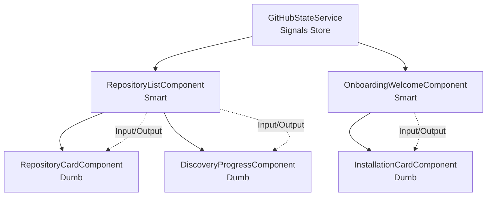

---
meta:
  id: specs-products-agent-alchemy-dev-features-github-app-onboarding-architecture-ui-components
  title: GitHub App Onboarding - UI Components Architecture
  version: 1.0.0
  status: draft
  specType: specification
  scope: feature
  tags: []
  createdBy: unknown
  createdAt: '2026-02-08'
  reviewedAt: null
title: GitHub App Onboarding - UI Components Architecture
category: architecture
feature: github-app-onboarding
lastUpdated: '2026-02-08'
source: Agent Alchemy
version: 1.0.0
aiContext: true
product: agent-alchemy-dev
phase: architecture
applyTo: []
keywords: []
topics: []
useCases: []
---

# GitHub App Onboarding - UI Components Architecture

## Executive Summary

This specification defines the complete Angular component architecture for GitHub App integration UI. The system uses Angular 18 with Signals-based state management, PrimeNG/Kendo UI for components, and TailwindCSS for styling. The architecture follows atomic design principles with smart/presentational component separation, OnPush change detection, and reactive forms.

**Key Design Decisions:**
- **Signal-Based State**: Replace RxJS for local state with Angular Signals
- **Atomic Design**: Button → Molecule → Organism → Page hierarchy
- **Smart/Dumb Components**: Container components manage state, presentational components render
- **OnPush Change Detection**: Optimize re-renders with immutable state
- **Form Management**: Reactive Forms with custom validators
- **Routing Strategy**: Lazy-loaded feature modules

---

## 1. Component Architecture Overview

### 1.1 Component Hierarchy

```
apps/agency/
└── src/
    └── app/
        ├── core/                          # Singleton services, guards
        │   ├── services/
        │   │   ├── auth.service.ts
        │   │   └── github.service.ts
        │   └── guards/
        │       └── auth.guard.ts
        │
        ├── shared/                        # Reusable components
        │   ├── components/
        │   │   ├── button/
        │   │   ├── card/
        │   │   ├── spinner/
        │   │   └── notification/
        │   └── pipes/
        │       └── relative-time.pipe.ts
        │
        └── features/
            └── github-onboarding/         # Feature module
                ├── github-onboarding.module.ts
                ├── github-onboarding-routing.module.ts
                │
                ├── pages/                 # Smart components (containers)
                │   ├── onboarding-welcome/
                │   │   ├── onboarding-welcome.component.ts
                │   │   ├── onboarding-welcome.component.html
                │   │   └── onboarding-welcome.component.scss
                │   │
                │   ├── oauth-callback/
                │   │   ├── oauth-callback.component.ts
                │   │   ├── oauth-callback.component.html
                │   │   └── oauth-callback.component.scss
                │   │
                │   ├── onboarding-success/
                │   │   └── ...
                │   │
                │   └── repository-list/
                │       └── ...
                │
                ├── components/            # Dumb components (presentational)
                │   ├── installation-card/
                │   │   ├── installation-card.component.ts
                │   │   ├── installation-card.component.html
                │   │   └── installation-card.component.scss
                │   │
                │   ├── repository-card/
                │   │   └── ...
                │   │
                │   ├── permission-badge/
                │   │   └── ...
                │   │
                │   └── discovery-progress/
                │       └── ...
                │
                ├── services/              # Feature-specific services
                │   ├── github-installation.service.ts
                │   ├── repository.service.ts
                │   └── github-state.service.ts
                │
                └── models/                # TypeScript interfaces
                    ├── installation.model.ts
                    ├── repository.model.ts
                    └── github-user.model.ts
```

### 1.2 Component Types

| Type | Responsibility | State Management | Change Detection | Example |
|------|---------------|------------------|------------------|---------|
| **Smart (Container)** | Business logic, data fetching, routing | Yes (Signals) | OnPush | `RepositoryListComponent` |
| **Dumb (Presentational)** | Render UI, emit events | No (inputs only) | OnPush | `RepositoryCardComponent` |
| **Shared** | Reusable across features | No | OnPush | `ButtonComponent`, `SpinnerComponent` |
| **Layout** | Page structure, navigation | Minimal | OnPush | `AppLayoutComponent` |

---

## 2. State Management with Angular Signals

### 2.1 Signal Architecture



### 2.2 GitHub State Service (Signals-Based)

```typescript
// services/github-state.service.ts
import { Injectable, signal, computed, effect } from '@angular/core';
import { GitHubInstallation, Repository, User } from '../models';

@Injectable({
  providedIn: 'root'
})
export class GitHubStateService {
  // Private signals (state)
  private readonly _user = signal<User | null>(null);
  private readonly _installations = signal<GitHubInstallation[]>([]);
  private readonly _repositories = signal<Repository[]>([]);
  private readonly _selectedInstallation = signal<GitHubInstallation | null>(null);
  private readonly _loading = signal<boolean>(false);
  private readonly _error = signal<string | null>(null);

  // Public readonly signals (computed or direct exposure)
  readonly user = this._user.asReadonly();
  readonly installations = this._installations.asReadonly();
  readonly repositories = this._repositories.asReadonly();
  readonly selectedInstallation = this._selectedInstallation.asReadonly();
  readonly loading = this._loading.asReadonly();
  readonly error = this._error.asReadonly();

  // Computed signals (derived state)
  readonly activeInstallations = computed(() => 
    this._installations().filter(i => i.status === 'active')
  );

  readonly repositoryCount = computed(() => 
    this._repositories().length
  );

  readonly hasActiveInstallation = computed(() => 
    this.activeInstallations().length > 0
  );

  readonly filteredRepositories = computed(() => {
    const installation = this._selectedInstallation();
    if (!installation) return this._repositories();
    return this._repositories().filter(r => r.installationId === installation.id);
  });

  constructor(
    private readonly githubService: GitHubService,
    private readonly repositoryService: RepositoryService
  ) {
    // Effect: Log state changes (dev only)
    if (!environment.production) {
      effect(() => {
        console.log('[GitHub State]', {
          user: this._user(),
          installations: this._installations().length,
          repositories: this._repositories().length
        });
      });
    }
  }

  // State mutations
  setUser(user: User | null): void {
    this._user.set(user);
  }

  setInstallations(installations: GitHubInstallation[]): void {
    this._installations.set(installations);
  }

  addInstallation(installation: GitHubInstallation): void {
    this._installations.update(current => [...current, installation]);
  }

  updateInstallation(id: string, updates: Partial<GitHubInstallation>): void {
    this._installations.update(current =>
      current.map(i => i.id === id ? { ...i, ...updates } : i)
    );
  }

  removeInstallation(id: string): void {
    this._installations.update(current => current.filter(i => i.id !== id));
  }

  setRepositories(repositories: Repository[]): void {
    this._repositories.set(repositories);
  }

  selectInstallation(installation: GitHubInstallation | null): void {
    this._selectedInstallation.set(installation);
  }

  setLoading(loading: boolean): void {
    this._loading.set(loading);
  }

  setError(error: string | null): void {
    this._error.set(error);
  }

  clearError(): void {
    this._error.set(null);
  }

  // Async actions (with loading/error handling)
  async loadInstallations(): Promise<void> {
    try {
      this.setLoading(true);
      this.clearError();
      const installations = await this.githubService.getInstallations();
      this.setInstallations(installations);
    } catch (error) {
      this.setError(error.message || 'Failed to load installations');
      throw error;
    } finally {
      this.setLoading(false);
    }
  }

  async loadRepositories(installationId: string): Promise<void> {
    try {
      this.setLoading(true);
      this.clearError();
      const repositories = await this.repositoryService.getRepositories(installationId);
      this.setRepositories(repositories);
    } catch (error) {
      this.setError(error.message || 'Failed to load repositories');
      throw error;
    } finally {
      this.setLoading(false);
    }
  }

  // Reset state (e.g., on logout)
  reset(): void {
    this._user.set(null);
    this._installations.set([]);
    this._repositories.set([]);
    this._selectedInstallation.set(null);
    this._loading.set(false);
    this._error.set(null);
  }
}
```

---

## 3. Page Components (Smart Components)

### 3.1 Onboarding Welcome Page

**Purpose**: Entry point for GitHub App onboarding flow

```typescript
// pages/onboarding-welcome/onboarding-welcome.component.ts
import { Component, OnInit, signal, computed } from '@angular/core';
import { Router } from '@angular/router';
import { AuthService } from '@core/services/auth.service';
import { GitHubStateService } from '../../services/github-state.service';

@Component({
  selector: 'app-onboarding-welcome',
  templateUrl: './onboarding-welcome.component.html',
  styleUrls: ['./onboarding-welcome.component.scss'],
  changeDetection: ChangeDetectionStrategy.OnPush
})
export class OnboardingWelcomeComponent implements OnInit {
  // Local component state
  private readonly _initiatingAuth = signal<boolean>(false);
  
  // Public signals
  readonly initiatingAuth = this._initiatingAuth.asReadonly();
  readonly isAuthenticated = computed(() => !!this.authService.currentUser());
  readonly hasInstallations = this.githubState.hasActiveInstallation;

  constructor(
    private readonly authService: AuthService,
    private readonly githubState: GitHubStateService,
    private readonly router: Router
  ) {}

  ngOnInit(): void {
    // Redirect if already onboarded
    if (this.isAuthenticated() && this.hasInstallations()) {
      this.router.navigate(['/repositories']);
    }
  }

  async onConnectGitHub(): Promise<void> {
    try {
      this._initiatingAuth.set(true);
      
      // Initiate OAuth flow (redirects to GitHub)
      const authUrl = await this.authService.initiateGitHubOAuth();
      window.location.href = authUrl;
      
    } catch (error) {
      console.error('Failed to initiate GitHub OAuth:', error);
      this._initiatingAuth.set(false);
      // Show error notification
    }
  }

  onLearnMore(): void {
    // Open documentation modal or navigate to help page
    this.router.navigate(['/help/github-permissions']);
  }
}
```

**Template**:

```html
<!-- pages/onboarding-welcome/onboarding-welcome.component.html -->
<div class="onboarding-welcome">
  <div class="hero-section">
    
    <h1 class="hero-title">Connect Your GitHub Repositories</h1>
    <p class="hero-subtitle">
      Manage specifications with seamless GitHub integration
    </p>
  </div>

  <div class="features-section">
    <div class="feature-card">
      <i class="pi pi-shield feature-icon"></i>
      <h3>Secure OAuth</h3>
      <p>Industry-standard OAuth 2.0 with PKCE for maximum security</p>
    </div>

    <div class="feature-card">
      <i class="pi pi-eye feature-icon"></i>
      <h3>Read-Only Access</h3>
      <p>We only request read permissions for your repositories</p>
    </div>

    <div class="feature-card">
      <i class="pi pi-bolt feature-icon"></i>
      <h3>Auto-Discovery</h3>
      <p>Automatically find and index specification files</p>
    </div>
  </div>

  <div class="cta-section">
    <p-button
      label="Connect with GitHub"
      icon="pi pi-github"
      [loading]="initiatingAuth()"
      [disabled]="initiatingAuth()"
      (onClick)="onConnectGitHub()"
      styleClass="p-button-lg p-button-success">
    </p-button>

    <a class="learn-more-link" (click)="onLearnMore()">
      Learn more about permissions
      <i class="pi pi-arrow-right"></i>
    </a>
  </div>

  <div class="time-estimate">
    <i class="pi pi-clock"></i>
    <span>Setup takes less than 60 seconds</span>
  </div>
</div>
```

**Styles**:

```scss
// pages/onboarding-welcome/onboarding-welcome.component.scss
.onboarding-welcome {
  @apply flex flex-col items-center justify-center min-h-screen p-8;
  background: linear-gradient(135deg, #667eea 0%, #764ba2 100%);

  .hero-section {
    @apply text-center mb-12;

    .github-logo {
      @apply w-24 h-24 mb-6 mx-auto;
    }

    .hero-title {
      @apply text-5xl font-bold text-white mb-4;
    }

    .hero-subtitle {
      @apply text-xl text-gray-200;
    }
  }

  .features-section {
    @apply grid grid-cols-1 md:grid-cols-3 gap-6 mb-12 max-w-4xl;

    .feature-card {
      @apply bg-white rounded-lg p-6 shadow-lg text-center;

      .feature-icon {
        @apply text-4xl text-indigo-600 mb-4;
      }

      h3 {
        @apply text-xl font-semibold mb-2;
      }

      p {
        @apply text-gray-600 text-sm;
      }
    }
  }

  .cta-section {
    @apply flex flex-col items-center gap-4;

    .learn-more-link {
      @apply text-white hover:text-gray-200 cursor-pointer flex items-center gap-2;
      transition: color 0.2s;
    }
  }

  .time-estimate {
    @apply flex items-center gap-2 text-white mt-8;
  }
}
```

### 3.2 OAuth Callback Page

**Purpose**: Handle GitHub OAuth callback and display processing state

```typescript
// pages/oauth-callback/oauth-callback.component.ts
import { Component, OnInit, signal } from '@angular/core';
import { ActivatedRoute, Router } from '@angular/router';
import { AuthService } from '@core/services/auth.service';
import { GitHubStateService } from '../../services/github-state.service';

interface CallbackState {
  status: 'processing' | 'success' | 'error';
  message: string;
}

@Component({
  selector: 'app-oauth-callback',
  templateUrl: './oauth-callback.component.html',
  styleUrls: ['./oauth-callback.component.scss'],
  changeDetection: ChangeDetectionStrategy.OnPush
})
export class OAuthCallbackComponent implements OnInit {
  private readonly _callbackState = signal<CallbackState>({
    status: 'processing',
    message: 'Connecting to GitHub...'
  });

  readonly callbackState = this._callbackState.asReadonly();

  constructor(
    private readonly route: ActivatedRoute,
    private readonly router: Router,
    private readonly authService: AuthService,
    private readonly githubState: GitHubStateService
  ) {}

  ngOnInit(): void {
    this.handleCallback();
  }

  private async handleCallback(): Promise<void> {
    try {
      // Extract query parameters
      const code = this.route.snapshot.queryParamMap.get('code');
      const state = this.route.snapshot.queryParamMap.get('state');
      const installationId = this.route.snapshot.queryParamMap.get('installation_id');
      const error = this.route.snapshot.queryParamMap.get('error');

      // Handle OAuth errors
      if (error) {
        throw new Error(this.getErrorMessage(error));
      }

      // Validate required parameters
      if (!code || !state) {
        throw new Error('Missing required OAuth parameters');
      }

      // Update state
      this._callbackState.set({
        status: 'processing',
        message: 'Verifying authorization...'
      });

      // Exchange code for tokens
      const authResult = await this.authService.handleOAuthCallback(code, state, installationId);

      // Load installations
      this._callbackState.set({
        status: 'processing',
        message: 'Loading your repositories...'
      });

      await this.githubState.loadInstallations();

      // Success
      this._callbackState.set({
        status: 'success',
        message: 'Successfully connected to GitHub!'
      });

      // Redirect to success page after 2 seconds
      setTimeout(() => {
        this.router.navigate(['/onboarding/success']);
      }, 2000);

    } catch (error) {
      console.error('OAuth callback error:', error);
      this._callbackState.set({
        status: 'error',
        message: error.message || 'Failed to connect to GitHub'
      });
    }
  }

  private getErrorMessage(error: string): string {
    const errorMessages: Record<string, string> = {
      'access_denied': 'You denied access to Agent Alchemy',
      'invalid_scope': 'Invalid permission scope requested',
      'server_error': 'GitHub server error, please try again'
    };
    return errorMessages[error] || 'An unknown error occurred';
  }

  onRetry(): void {
    this.router.navigate(['/onboarding/welcome']);
  }
}
```

**Template**:

```html
<!-- pages/oauth-callback/oauth-callback.component.html -->
<div class="oauth-callback">
  <div class="callback-card">
    <!-- Processing State -->
    @if (callbackState().status === 'processing') {
      <div class="processing-state">
        <p-progressSpinner strokeWidth="4"></p-progressSpinner>
        <h2>{{ callbackState().message }}</h2>
        <p class="subtitle">This should only take a moment...</p>
      </div>
    }

    <!-- Success State -->
    @if (callbackState().status === 'success') {
      <div class="success-state">
        <i class="pi pi-check-circle success-icon"></i>
        <h2>{{ callbackState().message }}</h2>
        <p class="subtitle">Redirecting to your dashboard...</p>
      </div>
    }

    <!-- Error State -->
    @if (callbackState().status === 'error') {
      <div class="error-state">
        <i class="pi pi-times-circle error-icon"></i>
        <h2>Connection Failed</h2>
        <p class="error-message">{{ callbackState().message }}</p>
        
        <p-button
          label="Try Again"
          icon="pi pi-refresh"
          (onClick)="onRetry()"
          styleClass="p-button-lg">
        </p-button>
      </div>
    }
  </div>
</div>
```

### 3.3 Repository List Page

**Purpose**: Display connected repositories with search, filter, and discovery status

```typescript
// pages/repository-list/repository-list.component.ts
import { Component, OnInit, signal, computed } from '@angular/core';
import { FormControl } from '@angular/forms';
import { debounceTime, distinctUntilChanged } from 'rxjs/operators';
import { GitHubStateService } from '../../services/github-state.service';
import { Repository } from '../../models/repository.model';

@Component({
  selector: 'app-repository-list',
  templateUrl: './repository-list.component.html',
  styleUrls: ['./repository-list.component.scss'],
  changeDetection: ChangeDetectionStrategy.OnPush
})
export class RepositoryListComponent implements OnInit {
  // Search control
  readonly searchControl = new FormControl('');
  
  // Local state
  private readonly _searchQuery = signal<string>('');
  private readonly _selectedStatus = signal<string>('all');
  private readonly _viewMode = signal<'grid' | 'list'>('grid');

  // Public signals
  readonly searchQuery = this._searchQuery.asReadonly();
  readonly selectedStatus = this._selectedStatus.asReadonly();
  readonly viewMode = this._viewMode.asReadonly();

  // Derived state from GitHubStateService
  readonly repositories = this.githubState.repositories;
  readonly loading = this.githubState.loading;
  readonly error = this.githubState.error;

  // Computed filtered repositories
  readonly filteredRepositories = computed(() => {
    let repos = this.repositories();
    
    // Filter by search query
    const query = this._searchQuery().toLowerCase();
    if (query) {
      repos = repos.filter(r => 
        r.fullName.toLowerCase().includes(query) ||
        r.description?.toLowerCase().includes(query)
      );
    }

    // Filter by status
    const status = this._selectedStatus();
    if (status !== 'all') {
      repos = repos.filter(r => r.discoveryStatus === status);
    }

    return repos;
  });

  readonly repositoryCount = computed(() => this.filteredRepositories().length);

  readonly discoveryStats = computed(() => {
    const repos = this.repositories();
    return {
      total: repos.length,
      completed: repos.filter(r => r.discoveryStatus === 'completed').length,
      inProgress: repos.filter(r => r.discoveryStatus === 'in_progress').length,
      failed: repos.filter(r => r.discoveryStatus === 'failed').length
    };
  });

  constructor(
    readonly githubState: GitHubStateService
  ) {}

  ngOnInit(): void {
    // Load repositories on init
    this.loadRepositories();

    // Setup search debounce
    this.searchControl.valueChanges.pipe(
      debounceTime(300),
      distinctUntilChanged()
    ).subscribe(query => {
      this._searchQuery.set(query || '');
    });
  }

  async loadRepositories(): Promise<void> {
    const installation = this.githubState.selectedInstallation();
    if (installation) {
      await this.githubState.loadRepositories(installation.id);
    }
  }

  onStatusFilterChange(status: string): void {
    this._selectedStatus.set(status);
  }

  onViewModeToggle(): void {
    this._viewMode.update(current => current === 'grid' ? 'list' : 'grid');
  }

  onRefresh(): void {
    this.loadRepositories();
  }

  onRepositoryClick(repository: Repository): void {
    // Navigate to repository detail page
  }
}
```

---

## 4. Presentational Components

### 4.1 Repository Card Component

**Purpose**: Display individual repository information

```typescript
// components/repository-card/repository-card.component.ts
import { Component, Input, Output, EventEmitter, ChangeDetectionStrategy } from '@angular/core';
import { Repository } from '../../models/repository.model';

@Component({
  selector: 'app-repository-card',
  templateUrl: './repository-card.component.html',
  styleUrls: ['./repository-card.component.scss'],
  changeDetection: ChangeDetectionStrategy.OnPush
})
export class RepositoryCardComponent {
  @Input({ required: true }) repository!: Repository;
  @Input() viewMode: 'grid' | 'list' = 'grid';

  @Output() repositoryClick = new EventEmitter<Repository>();

  get statusIcon(): string {
    const icons: Record<string, string> = {
      'completed': 'pi-check-circle',
      'in_progress': 'pi-spin pi-spinner',
      'failed': 'pi-times-circle',
      'pending': 'pi-clock'
    };
    return icons[this.repository.discoveryStatus] || 'pi-question-circle';
  }

  get statusClass(): string {
    return `status-${this.repository.discoveryStatus}`;
  }

  get specCount(): number {
    return this.repository.specifications?.length || 0;
  }

  onClick(): void {
    this.repositoryClick.emit(this.repository);
  }
}
```

**Template**:

```html
<!-- components/repository-card/repository-card.component.html -->
<div class="repository-card" 
     [class.grid-view]="viewMode === 'grid'"
     [class.list-view]="viewMode === 'list'"
     (click)="onClick()">
  
  <div class="card-header">
    <div class="repo-info">
      <i class="pi pi-github repo-icon"></i>
      <div>
        <h3 class="repo-name">{{ repository.fullName }}</h3>
        @if (repository.private) {
          <span class="private-badge">
            <i class="pi pi-lock"></i> Private
          </span>
        }
      </div>
    </div>
    
    <div class="discovery-status" [ngClass]="statusClass">
      <i class="pi" [ngClass]="statusIcon"></i>
    </div>
  </div>

  @if (repository.description) {
    <p class="repo-description">{{ repository.description }}</p>
  }

  <div class="card-footer">
    <div class="repo-stats">
      <span class="stat">
        <i class="pi pi-file"></i>
        {{ specCount }} specs
      </span>
      
      <span class="stat">
        <i class="pi pi-star"></i>
        {{ repository.stars || 0 }}
      </span>
      
      @if (repository.language) {
        <span class="stat language">
          <span class="language-dot" [style.background-color]="repository.languageColor"></span>
          {{ repository.language }}
        </span>
      }
    </div>

    <span class="updated-time">
      Updated {{ repository.updatedAt | relativeTime }}
    </span>
  </div>
</div>
```

### 4.2 Discovery Progress Component

**Purpose**: Real-time discovery progress indicator

```typescript
// components/discovery-progress/discovery-progress.component.ts
import { Component, Input, ChangeDetectionStrategy } from '@angular/core';

interface DiscoveryStats {
  total: number;
  completed: number;
  inProgress: number;
  failed: number;
}

@Component({
  selector: 'app-discovery-progress',
  templateUrl: './discovery-progress.component.html',
  styleUrls: ['./discovery-progress.component.scss'],
  changeDetection: ChangeDetectionStrategy.OnPush
})
export class DiscoveryProgressComponent {
  @Input({ required: true }) stats!: DiscoveryStats;

  get progressPercent(): number {
    if (this.stats.total === 0) return 0;
    return Math.round((this.stats.completed / this.stats.total) * 100);
  }

  get statusMessage(): string {
    const { completed, total, inProgress } = this.stats;
    if (inProgress > 0) {
      return `Discovering specifications... ${completed}/${total} repositories completed`;
    }
    if (completed === total) {
      return `Discovery complete! Found specifications in ${completed} repositories`;
    }
    return `${completed}/${total} repositories scanned`;
  }
}
```

**Template**:

```html
<!-- components/discovery-progress/discovery-progress.component.html -->
<div class="discovery-progress">
  <div class="progress-header">
    <i class="pi pi-search progress-icon"></i>
    <span class="progress-message">{{ statusMessage }}</span>
  </div>

  <p-progressBar 
    [value]="progressPercent"
    [showValue]="true">
  </p-progressBar>

  <div class="progress-stats">
    <div class="stat-item success">
      <i class="pi pi-check"></i>
      <span>{{ stats.completed }} Completed</span>
    </div>

    @if (stats.inProgress > 0) {
      <div class="stat-item processing">
        <i class="pi pi-spin pi-spinner"></i>
        <span>{{ stats.inProgress }} In Progress</span>
      </div>
    }

    @if (stats.failed > 0) {
      <div class="stat-item failed">
        <i class="pi pi-times"></i>
        <span>{{ stats.failed }} Failed</span>
      </div>
    }
  </div>
</div>
```

---

## 5. Routing Configuration

### 5.1 Feature Module Routing

```typescript
// github-onboarding-routing.module.ts
import { NgModule } from '@angular/core';
import { RouterModule, Routes } from '@angular/router';
import { AuthGuard } from '@core/guards/auth.guard';

import { OnboardingWelcomeComponent } from './pages/onboarding-welcome/onboarding-welcome.component';
import { OAuthCallbackComponent } from './pages/oauth-callback/oauth-callback.component';
import { OnboardingSuccessComponent } from './pages/onboarding-success/onboarding-success.component';
import { RepositoryListComponent } from './pages/repository-list/repository-list.component';

const routes: Routes = [
  {
    path: '',
    redirectTo: 'welcome',
    pathMatch: 'full'
  },
  {
    path: 'welcome',
    component: OnboardingWelcomeComponent,
    data: { title: 'Connect GitHub' }
  },
  {
    path: 'callback',
    component: OAuthCallbackComponent,
    data: { title: 'Connecting...' }
  },
  {
    path: 'success',
    component: OnboardingSuccessComponent,
    canActivate: [AuthGuard],
    data: { title: 'Success!' }
  },
  {
    path: 'repositories',
    component: RepositoryListComponent,
    canActivate: [AuthGuard],
    data: { title: 'Repositories' }
  }
];

@NgModule({
  imports: [RouterModule.forChild(routes)],
  exports: [RouterModule]
})
export class GitHubOnboardingRoutingModule {}
```

### 5.2 Lazy Loading Configuration

```typescript
// app-routing.module.ts
const routes: Routes = [
  {
    path: 'onboarding',
    loadChildren: () => import('./features/github-onboarding/github-onboarding.module')
      .then(m => m.GitHubOnboardingModule),
    data: { preload: true } // Preload this module
  }
];
```

---

## 6. Form Management

### 6.1 Reactive Forms Example (Repository Filter Form)

```typescript
// components/repository-filter/repository-filter.component.ts
import { Component, Output, EventEmitter, OnInit } from '@angular/core';
import { FormBuilder, FormGroup } from '@angular/forms';
import { debounceTime, distinctUntilChanged } from 'rxjs/operators';

interface FilterCriteria {
  search: string;
  status: string;
  language: string;
  private: boolean | null;
}

@Component({
  selector: 'app-repository-filter',
  templateUrl: './repository-filter.component.html',
  changeDetection: ChangeDetectionStrategy.OnPush
})
export class RepositoryFilterComponent implements OnInit {
  @Output() filterChange = new EventEmitter<FilterCriteria>();

  filterForm: FormGroup;

  statusOptions = [
    { label: 'All', value: 'all' },
    { label: 'Completed', value: 'completed' },
    { label: 'In Progress', value: 'in_progress' },
    { label: 'Failed', value: 'failed' },
    { label: 'Pending', value: 'pending' }
  ];

  languageOptions = [
    { label: 'All Languages', value: 'all' },
    { label: 'TypeScript', value: 'TypeScript' },
    { label: 'JavaScript', value: 'JavaScript' },
    { label: 'Python', value: 'Python' },
    { label: 'Go', value: 'Go' }
  ];

  constructor(private readonly fb: FormBuilder) {
    this.filterForm = this.fb.group({
      search: [''],
      status: ['all'],
      language: ['all'],
      private: [null] // null = all, true = private only, false = public only
    });
  }

  ngOnInit(): void {
    // Emit filter changes with debounce for search
    this.filterForm.valueChanges.pipe(
      debounceTime(300),
      distinctUntilChanged((prev, curr) => JSON.stringify(prev) === JSON.stringify(curr))
    ).subscribe(criteria => {
      this.filterChange.emit(criteria);
    });
  }

  onReset(): void {
    this.filterForm.reset({
      search: '',
      status: 'all',
      language: 'all',
      private: null
    });
  }
}
```

---

## 7. Performance Optimization

### 7.1 Change Detection Strategy

**All components use OnPush**:
- Reduces unnecessary change detection cycles
- Requires immutable state updates
- Compatible with Angular Signals

### 7.2 Virtual Scrolling for Large Lists

```typescript
// repository-list.component.html with virtual scroll
<cdk-virtual-scroll-viewport 
  itemSize="120" 
  class="repository-viewport"
  [style.height.px]="600">
  
  @for (repository of filteredRepositories(); track repository.id) {
    <app-repository-card
      [repository]="repository"
      [viewMode]="viewMode()"
      (repositoryClick)="onRepositoryClick($event)">
    </app-repository-card>
  }
</cdk-virtual-scroll-viewport>
```

### 7.3 Lazy Loading Images

```html
<!-- Use native lazy loading -->

```

---

## 8. Accessibility (A11Y)

### 8.1 ARIA Attributes

```html
<!-- repository-card.component.html -->
<div 
  class="repository-card"
  role="article"
  [attr.aria-label]="'Repository ' + repository.fullName"
  tabindex="0"
  (keydown.enter)="onClick()"
  (keydown.space)="onClick()">
  <!-- Card content -->
</div>
```

### 8.2 Keyboard Navigation

```typescript
@HostListener('keydown', ['$event'])
handleKeyboardEvent(event: KeyboardEvent): void {
  if (event.key === 'Enter' || event.key === ' ') {
    event.preventDefault();
    this.onClick();
  }
}
```

---

## 9. Testing Strategy

### 9.1 Component Unit Tests

```typescript
// repository-card.component.spec.ts
import { ComponentFixture, TestBed } from '@angular/core/testing';
import { RepositoryCardComponent } from './repository-card.component';
import { Repository } from '../../models/repository.model';

describe('RepositoryCardComponent', () => {
  let component: RepositoryCardComponent;
  let fixture: ComponentFixture<RepositoryCardComponent>;

  const mockRepository: Repository = {
    id: '1',
    fullName: 'owner/repo',
    description: 'Test repository',
    private: false,
    discoveryStatus: 'completed',
    specifications: [{ id: '1', name: 'spec1' }],
    stars: 100,
    language: 'TypeScript',
    updatedAt: new Date()
  };

  beforeEach(async () => {
    await TestBed.configureTestingModule({
      declarations: [RepositoryCardComponent]
    }).compileComponents();

    fixture = TestBed.createComponent(RepositoryCardComponent);
    component = fixture.componentInstance;
    component.repository = mockRepository;
    fixture.detectChanges();
  });

  it('should create', () => {
    expect(component).toBeTruthy();
  });

  it('should display repository name', () => {
    const compiled = fixture.nativeElement;
    const repoName = compiled.querySelector('.repo-name');
    expect(repoName.textContent).toContain('owner/repo');
  });

  it('should emit repositoryClick event on click', () => {
    spyOn(component.repositoryClick, 'emit');
    component.onClick();
    expect(component.repositoryClick.emit).toHaveBeenCalledWith(mockRepository);
  });

  it('should display correct spec count', () => {
    expect(component.specCount).toBe(1);
  });

  it('should show correct status icon for completed status', () => {
    expect(component.statusIcon).toBe('pi-check-circle');
  });
});
```

### 9.2 Integration Tests with Signals

```typescript
// github-state.service.spec.ts
import { TestBed } from '@angular/core/testing';
import { GitHubStateService } from './github-state.service';

describe('GitHubStateService', () => {
  let service: GitHubStateService;

  beforeEach(() => {
    TestBed.configureTestingModule({
      providers: [GitHubStateService]
    });
    service = TestBed.inject(GitHubStateService);
  });

  it('should initialize with empty state', () => {
    expect(service.installations()).toEqual([]);
    expect(service.repositories()).toEqual([]);
    expect(service.loading()).toBe(false);
  });

  it('should update installations signal', () => {
    const mockInstallations = [{ id: '1', name: 'Test' }];
    service.setInstallations(mockInstallations);
    expect(service.installations()).toEqual(mockInstallations);
  });

  it('should compute activeInstallations correctly', () => {
    const installations = [
      { id: '1', status: 'active' },
      { id: '2', status: 'suspended' },
      { id: '3', status: 'active' }
    ];
    service.setInstallations(installations);
    expect(service.activeInstallations().length).toBe(2);
  });
});
```

---

## 10. Acceptance Criteria

### 10.1 Functional Acceptance

- [ ] Onboarding welcome page renders correctly with call-to-action
- [ ] GitHub OAuth flow initiates on button click
- [ ] OAuth callback processes successfully with loading states
- [ ] Repository list displays all connected repositories
- [ ] Search and filter functionality works as expected
- [ ] Discovery progress indicator updates in real-time
- [ ] Repository cards display accurate information
- [ ] Navigation between pages works correctly
- [ ] Error states display appropriate messages

### 10.2 Non-Functional Acceptance

- [ ] All components use OnPush change detection
- [ ] State management uses Angular Signals exclusively
- [ ] Page load time <2 seconds
- [ ] First Contentful Paint <1.5 seconds
- [ ] No accessibility violations (WCAG 2.1 AA)
- [ ] Responsive design works on mobile, tablet, desktop
- [ ] Unit test coverage >80% for components
- [ ] No console errors in production build

---

## 11. References

- Angular Signals: https://angular.io/guide/signals
- PrimeNG Components: https://primeng.org
- Angular Reactive Forms: https://angular.io/guide/reactive-forms
- Change Detection: https://angular.io/guide/change-detection
- Accessibility: https://www.w3.org/WAI/WCAG21/quickref/

**Document Status**: Draft v1.0.0  
**Next Review**: 2026-03-08  
**Maintained By**: Agent Alchemy Frontend Team
