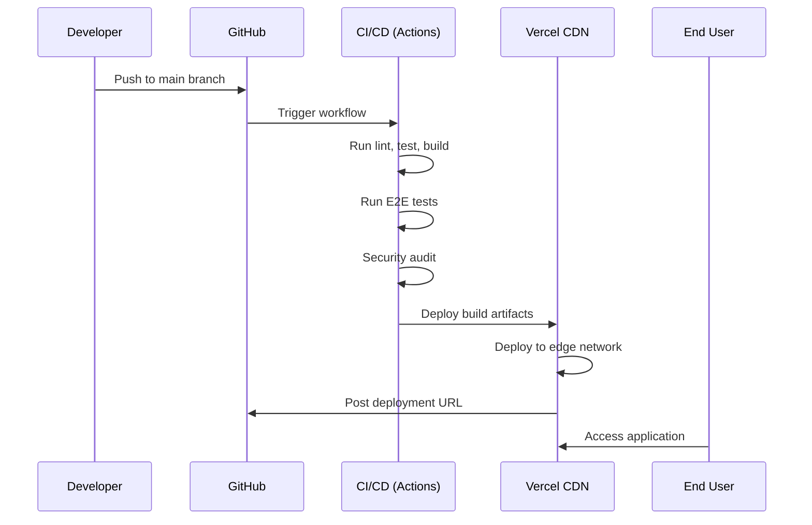

---
meta:
  id: canvas-research-angular-canvas-libraries-devops-deployment-specification
  title: DevOps & Deployment Architecture - Canvas Libraries for Angular
  version: 1.0.0
  status: draft
  specType: specification
  scope: product:canvas-research
  tags: []
  createdBy: Agent Alchemy Architecture
  createdAt: 2026-02-25T00:00:00.000Z
  reviewedAt: null
title: DevOps & Deployment Architecture - Canvas Libraries for Angular
category: Products
feature: angular-canvas-libraries
lastUpdated: '2026-03-12'
source: Agent Alchemy
version: 1.0.0
aiContext: true
product: canvas-research
phase: architecture
applyTo: []
keywords: []
topics: []
useCases: []
references:
  - .agent-alchemy/specs/stack/stack.json
depends-on:
  - architecture/system-architecture.specification.md
  - plan/implementation-sequence.specification.md
specification: 07-devops-deployment
---

# DevOps & Deployment Architecture: Canvas Libraries for Angular

## Overview

**Purpose**: Define CI/CD pipelines, deployment strategy, and infrastructure for canvas feature.

**Deployment Model**: JAMstack (JavaScript, APIs, Markup)  
**Hosting**: Vercel / Netlify (CDN-based)  
**Build Tool**: Nx 19.8.4  
**CI/CD**: GitHub Actions

## Deployment Architecture

### Environment Topology

```
Production
├── Vercel CDN (Global Edge Network)
│   ├── Static Assets (HTML, CSS, JS, Images)
│   ├── Angular Application Bundle
│   │   ├── Main bundle (~500KB gzipped)
│   │   └── Canvas feature lazy loaded (~200KB gzipped)
│   └── HTTPS/HTTP2 + Brotli compression
│
Staging
├── Vercel Preview Deployments
│   └── Branch-based automatic previews
│
Development
└── Local Development (nx serve)
    ├── Hot Module Replacement (HMR)
    └── Source maps enabled
```

### Deployment Targets

| Environment | Branch | URL Pattern | Purpose |
|-------------|--------|-------------|---------|
| Production | `main` | `buildmotion-ai.com` | Live production site |
| Staging | `develop` | `develop.vercel.app` | Pre-production testing |
| Preview | feature/* | `pr-123.vercel.app` | PR review deployments |
| Local | N/A | `localhost:4200` | Local development |

## CI/CD Pipelines

### GitHub Actions Workflow

**File**: `.github/workflows/ci.yml`

```yaml
name: CI/CD Pipeline

on:
  push:
    branches: [main, develop]
  pull_request:
    branches: [main, develop]

env:
  NODE_VERSION: '18.x'
  NX_BRANCH: ${{ github.event.number || github.ref_name }}

jobs:
  # Job 1: Code Quality & Linting
  lint:
    runs-on: ubuntu-latest
    steps:
      - uses: actions/checkout@v4
        with:
          fetch-depth: 0
      
      - uses: actions/setup-node@v4
        with:
          node-version: ${{ env.NODE_VERSION }}
          cache: 'yarn'
      
      - name: Install dependencies
        run: yarn install --frozen-lockfile
      
      - name: Run ESLint
        run: npx nx affected --target=lint --parallel=3
      
      - name: Check formatting
        run: npx prettier --check "**/*.{ts,html,scss,json}"

  # Job 2: Unit Tests
  test:
    runs-on: ubuntu-latest
    steps:
      - uses: actions/checkout@v4
        with:
          fetch-depth: 0
      
      - uses: actions/setup-node@v4
        with:
          node-version: ${{ env.NODE_VERSION }}
          cache: 'yarn'
      
      - name: Install dependencies
        run: yarn install --frozen-lockfile
      
      - name: Run unit tests
        run: npx nx affected --target=test --parallel=3 --ci --code-coverage
      
      - name: Upload coverage to Codecov
        uses: codecov/codecov-action@v3
        with:
          files: ./coverage/*/lcov.info

  # Job 3: Build
  build:
    runs-on: ubuntu-latest
    needs: [lint, test]
    steps:
      - uses: actions/checkout@v4
      
      - uses: actions/setup-node@v4
        with:
          node-version: ${{ env.NODE_VERSION }}
          cache: 'yarn'
      
      - name: Install dependencies
        run: yarn install --frozen-lockfile
      
      - name: Build application
        run: npx nx build canvas-feature --configuration=production
      
      - name: Upload build artifacts
        uses: actions/upload-artifact@v3
        with:
          name: canvas-feature-build
          path: dist/libs/canvas-feature
          retention-days: 7

  # Job 4: E2E Tests (Playwright)
  e2e:
    runs-on: ubuntu-latest
    needs: build
    steps:
      - uses: actions/checkout@v4
      
      - uses: actions/setup-node@v4
        with:
          node-version: ${{ env.NODE_VERSION }}
          cache: 'yarn'
      
      - name: Install dependencies
        run: yarn install --frozen-lockfile
      
      - name: Install Playwright browsers
        run: npx playwright install --with-deps
      
      - name: Run E2E tests
        run: npx nx e2e canvas-feature-e2e
      
      - name: Upload test results
        if: always()
        uses: actions/upload-artifact@v3
        with:
          name: playwright-results
          path: dist/cypress/apps/canvas-feature-e2e/videos

  # Job 5: Security Audit
  security:
    runs-on: ubuntu-latest
    steps:
      - uses: actions/checkout@v4
      
      - uses: actions/setup-node@v4
        with:
          node-version: ${{ env.NODE_VERSION }}
          cache: 'yarn'
      
      - name: Install dependencies
        run: yarn install --frozen-lockfile
      
      - name: Run npm audit
        run: npm audit --audit-level=high
        continue-on-error: true
      
      - name: Run Snyk security scan
        uses: snyk/actions/node@master
        env:
          SNYK_TOKEN: ${{ secrets.SNYK_TOKEN }}
        with:
          args: --severity-threshold=high

  # Job 6: Deploy to Vercel
  deploy:
    runs-on: ubuntu-latest
    needs: [build, e2e]
    if: github.ref == 'refs/heads/main' || github.ref == 'refs/heads/develop'
    steps:
      - uses: actions/checkout@v4
      
      - name: Deploy to Vercel
        uses: amondnet/vercel-action@v20
        with:
          vercel-token: ${{ secrets.VERCEL_TOKEN }}
          vercel-org-id: ${{ secrets.VERCEL_ORG_ID }}
          vercel-project-id: ${{ secrets.VERCEL_PROJECT_ID }}
          vercel-args: '--prod'
          working-directory: ./
```

### Nx Cloud Integration

**Configuration**: `nx.json`

```json
{
  "tasksRunnerOptions": {
    "default": {
      "runner": "nx-cloud",
      "options": {
        "cacheableOperations": ["build", "lint", "test", "e2e"],
        "accessToken": "${NX_CLOUD_ACCESS_TOKEN}",
        "parallel": 3
      }
    }
  }
}
```

**Benefits**:
- Distributed task execution
- Remote caching across CI runs
- Build analytics and insights

## Build Configuration

### Production Build

**Command**: `nx build canvas-feature --configuration=production`

**Optimizations**:
- Tree shaking (remove unused code)
- Minification (Terser)
- Code splitting (lazy loading)
- Brotli compression
- Source map generation (external)
- AOT compilation
- CSS purging (PurgeCSS)

**Bundle Analysis**:
```bash
# Analyze bundle size
nx build canvas-feature --configuration=production --stats-json
npx webpack-bundle-analyzer dist/apps/agency/stats.json
```

**Performance Budget**:
```json
{
  "budgets": [
    {
      "type": "initial",
      "maximumWarning": "500kb",
      "maximumError": "1mb"
    },
    {
      "type": "anyComponentStyle",
      "maximumWarning": "50kb",
      "maximumError": "100kb"
    }
  ]
}
```

### Development Build

**Command**: `nx serve canvas-feature`

**Features**:
- Hot Module Replacement (HMR)
- Source maps
- No minification (faster builds)
- Live reload
- Debug mode enabled

## Deployment Strategy

### Vercel Deployment

**Configuration**: `vercel.json`

```json
{
  "version": 2,
  "builds": [
    {
      "src": "dist/apps/agency/**",
      "use": "@vercel/static"
    }
  ],
  "routes": [
    {
      "src": "/canvas/(.*)",
      "dest": "/index.html"
    },
    {
      "handle": "filesystem"
    },
    {
      "src": "/(.*)",
      "dest": "/index.html"
    }
  ],
  "headers": [
    {
      "source": "/(.*)",
      "headers": [
        {
          "key": "X-Content-Type-Options",
          "value": "nosniff"
        },
        {
          "key": "X-Frame-Options",
          "value": "DENY"
        },
        {
          "key": "X-XSS-Protection",
          "value": "1; mode=block"
        },
        {
          "key": "Referrer-Policy",
          "value": "strict-origin-when-cross-origin"
        },
        {
          "key": "Permissions-Policy",
          "value": "camera=(), microphone=(), geolocation=()"
        }
      ]
    },
    {
      "source": "/static/(.*)",
      "headers": [
        {
          "key": "Cache-Control",
          "value": "public, max-age=31536000, immutable"
        }
      ]
    }
  ]
}
```

### Deployment Process



## Monitoring & Observability

### Application Monitoring

**Datadog RUM Integration**:
```typescript
// apps/agency/src/main.ts
import { datadogRum } from '@datadog/browser-rum';

if (environment.production) {
  datadogRum.init({
    applicationId: environment.datadog.applicationId,
    clientToken: environment.datadog.clientToken,
    site: 'datadoghq.com',
    service: 'canvas-feature',
    env: 'production',
    version: environment.version,
    sessionSampleRate: 100,
    sessionReplaySampleRate: 20,
    trackUserInteractions: true,
    trackResources: true,
    trackLongTasks: true,
    defaultPrivacyLevel: 'mask-user-input'
  });
}
```

### Performance Metrics

**Core Web Vitals**:
- **LCP (Largest Contentful Paint)**: < 2.5s
- **FID (First Input Delay)**: < 100ms
- **CLS (Cumulative Layout Shift)**: < 0.1

**Custom Metrics**:
- Canvas initialization time: < 200ms
- Object creation latency: < 50ms
- Export operation time: < 5s
- Memory usage: < 100MB

### Error Tracking

**Sentry Integration**:
```typescript
import * as Sentry from '@sentry/angular';

Sentry.init({
  dsn: environment.sentry.dsn,
  environment: environment.production ? 'production' : 'development',
  tracesSampleRate: 0.1,
  integrations: [
    new Sentry.BrowserTracing({
      tracingOrigins: ['localhost', 'buildmotion-ai.com'],
      routingInstrumentation: Sentry.routingInstrumentation,
    }),
  ],
});
```

### Logging Strategy

**Log Levels**:
- **ERROR**: Critical failures, exceptions
- **WARN**: Business rule violations, performance degradation
- **INFO**: User actions, state changes
- **DEBUG**: Detailed debugging (development only)

**Structured Logging**:
```typescript
logger.info('Canvas object created', {
  objectId: object.id,
  type: object.type,
  canvasId: this.canvasId,
  timestamp: Date.now()
});
```

## Scaling Strategy

### Horizontal Scaling (CDN)

- Vercel automatically scales across global edge network
- Assets cached at edge locations worldwide
- Auto-scaling based on traffic

### Performance Optimization

1. **Code Splitting**: Lazy load canvas feature (~200KB)
2. **Asset Optimization**: Image compression, WebP format
3. **Caching Strategy**:
   - Static assets: `Cache-Control: public, max-age=31536000`
   - HTML: `Cache-Control: no-cache`
   - API responses: Client-side caching (no server)

## Rollback Strategy

### Automated Rollback

- Vercel maintains deployment history
- One-click rollback to previous deployment
- Automatic rollback on failed health checks

### Manual Rollback

```bash
# List deployments
vercel ls canvas-feature

# Rollback to specific deployment
vercel rollback canvas-feature deployment-id

# Promote staging to production
vercel promote https://develop.vercel.app --scope=org
```

## Disaster Recovery

### Backup Strategy

- **Source Code**: GitHub (multiple replicas)
- **Build Artifacts**: Nx Cloud cache (30-day retention)
- **Deployment History**: Vercel (90-day retention)
- **User Data**: Client-side only (user-managed backups)

### Recovery Time Objective (RTO)

- **Critical Failure**: < 15 minutes (rollback deployment)
- **Build Pipeline Failure**: < 30 minutes (fix and redeploy)
- **CDN Outage**: < 5 minutes (Vercel auto-failover)

## Evaluation Criteria

- [x] CI/CD pipeline comprehensive (lint, test, build, deploy)
- [x] Multi-environment deployment strategy defined
- [x] Build optimizations configured
- [x] Monitoring and observability integrated
- [x] Performance budgets enforced
- [x] Security headers configured
- [x] Rollback strategy documented
- [x] Disaster recovery plan included
- [x] Scaling strategy addresses traffic growth
- [x] Nx Cloud integration for build optimization

---

**Specification**: 07-devops-deployment ✅  
**Next**: architecture-decisions.specification.md (FINAL)
