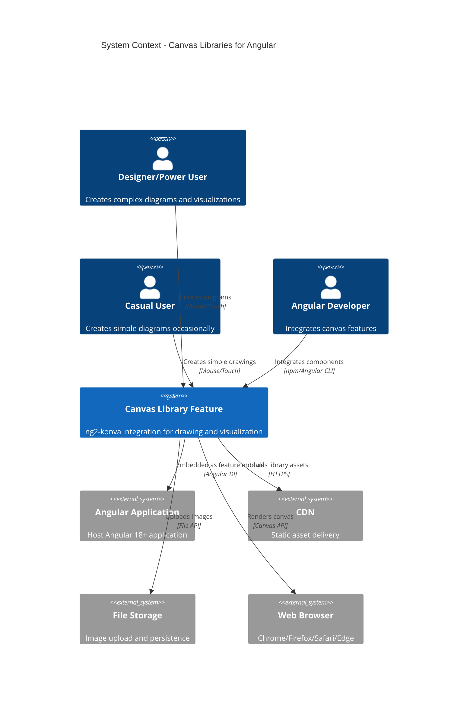
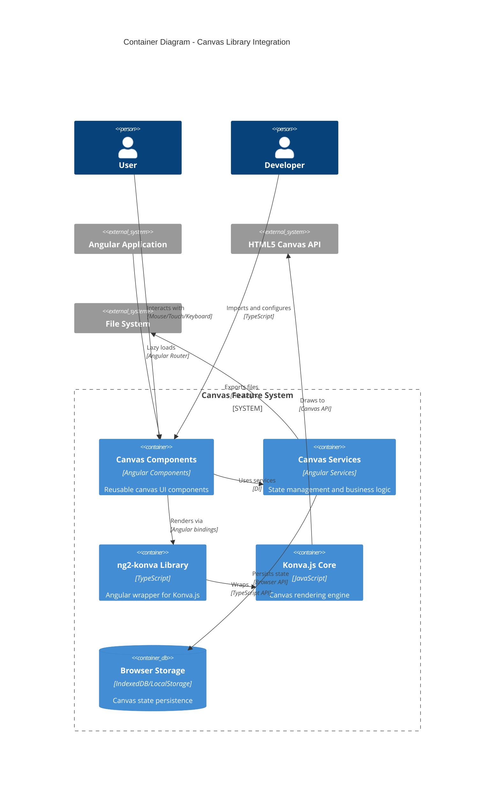
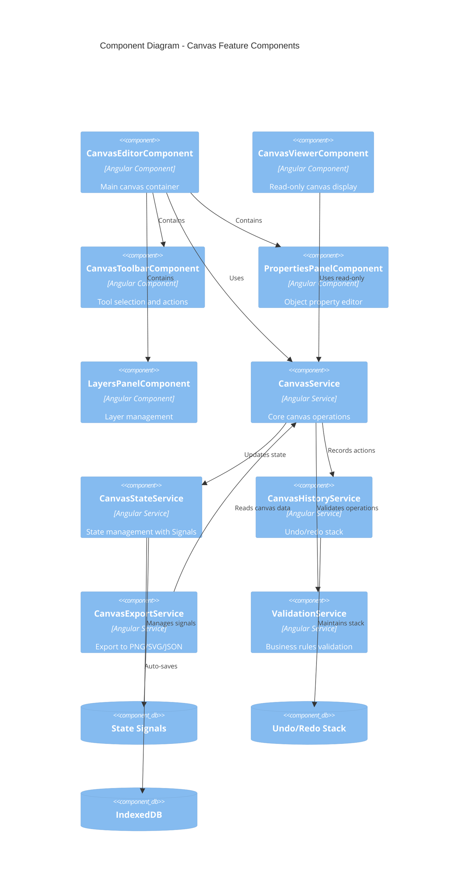
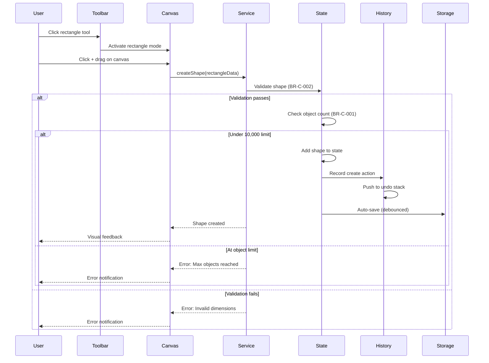
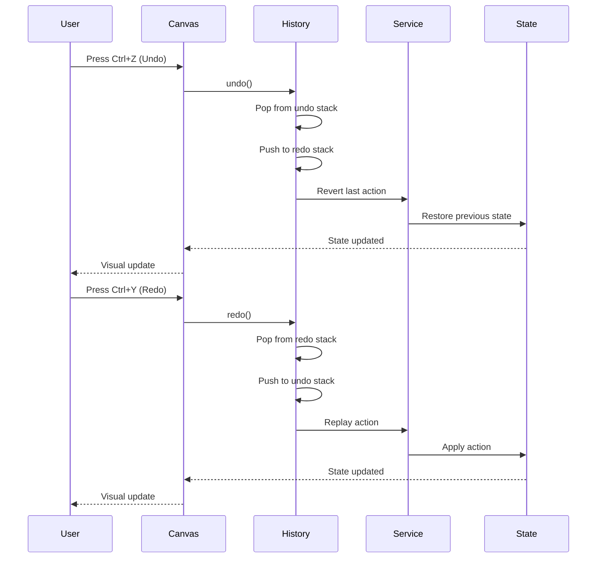
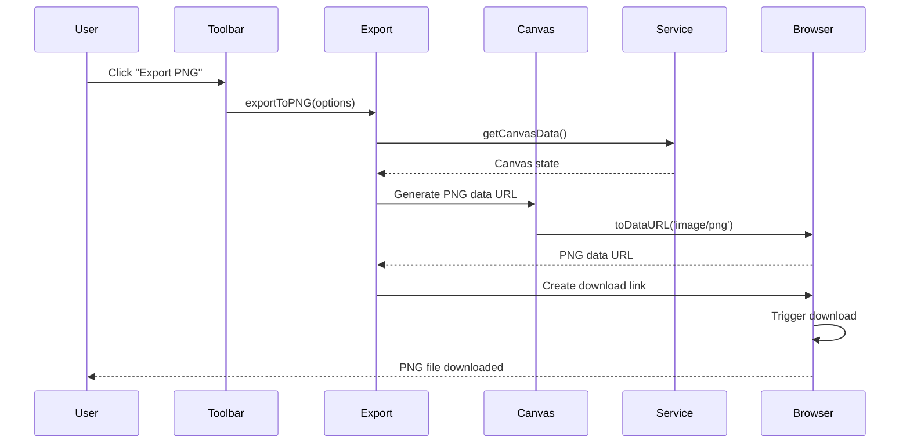

---
meta:
  id: canvas-research-angular-canvas-libraries-system-architecture-specification
  title: System Architecture - Canvas Libraries for Angular
  version: 1.0.0
  status: draft
  specType: specification
  scope: product:canvas-research
  tags: []
  createdBy: Agent Alchemy Architecture
  createdAt: 2026-02-25T00:00:00.000Z
  reviewedAt: null
title: System Architecture - Canvas Libraries for Angular
category: Products
feature: angular-canvas-libraries
lastUpdated: '2026-03-12'
source: Agent Alchemy
version: 1.0.0
aiContext: true
product: canvas-research
phase: architecture
applyTo: []
keywords: []
topics: []
useCases: []
references:
  - .agent-alchemy/specs/stack/stack.json
  - .agent-alchemy/specs/standards/architectural-guidelines.specification.md
depends-on:
  - plan/functional-requirements.specification.md
  - plan/non-functional-requirements.specification.md
  - research-and-ideation/FEASIBILITY-SUMMARY.md
specification: 01-system-architecture
---

# System Architecture: Canvas Libraries for Angular

## Overview

**Purpose**: Define high-level system architecture using C4 model for ng2-konva integration into Angular applications.

**Technology Stack** (from stack.json):

- **Frontend**: Angular 18.2.0 with TypeScript 5.5.2
- **Canvas Library**: ng2-konva (primary), Fabric.js (fallback)
- **State Management**: Angular Signals + RxJS 7.8.0
- **Styling**: TailwindCSS 3.4.10 + PrimeNG 18.0.2
- **Testing**: Jest 29.7.0 + Playwright
- **Build**: Nx 19.8.4 monorepo
- **Package Manager**: Yarn

**Complexity Assessment**: Medium (established library with Angular integration patterns)  
**Estimated Effort**: 18-21 weeks (per implementation-sequence.specification.md)  
**Bundle Impact**: +70KB gzipped (within acceptable limits)

## C4 Architecture Diagrams

### Level 1: System Context Diagram

**Purpose**: Show how the canvas feature fits into the broader Angular application landscape



**Key Elements**:

- **Users**: Designers (power users), Casual users (simple diagrams), Angular developers (integration)
- **External Systems**: Host Angular app, CDN for library delivery, browser storage, file storage services
- **Integration Points**: Angular component imports, file upload APIs, local storage persistence

### Level 2: Container Diagram

**Purpose**: Show high-level technical architecture of the canvas feature



**Container Descriptions**:

1. **Canvas Components (Angular)**
   - **Technology**: Angular 18 components, PrimeNG UI controls
   - **Responsibility**: User interface, toolbar, properties panel, canvas wrapper
   - **Deployment**: Part of Angular application bundle
   - **Scaling**: Lazy loaded feature module

2. **Canvas Services (Angular)**
   - **Technology**: Angular services with Signals + RxJS
   - **Responsibility**: State management, undo/redo stack, export/import logic
   - **Deployment**: Singleton services via providedIn: 'root'
   - **Scaling**: Client-side only, no server dependency

3. **ng2-konva Library**
   - **Technology**: Angular components wrapping Konva.js
   - **Responsibility**: Angular-native declarative canvas API
   - **Deployment**: NPM package, lazy loaded with feature
   - **Bundle Size**: ~70KB gzipped

4. **Konva.js Core**
   - **Technology**: JavaScript canvas rendering library
   - **Responsibility**: Low-level canvas operations, hit detection, transformations
   - **Deployment**: Bundled with ng2-konva
   - **Performance**: 60fps target for <1000 objects

5. **Browser Storage**
   - **Technology**: IndexedDB (preferred) or LocalStorage (fallback)
   - **Responsibility**: Auto-save canvas state, template storage
   - **Capacity**: ~5MB localStorage, ~50MB+ IndexedDB
   - **Persistence**: Client-side only, optional cloud sync (future)

### Level 3: Component Diagram

**Purpose**: Show internal components within the Canvas Feature



**Component Descriptions**:

1. **CanvasEditorComponent**
   - Main container for canvas editing
   - Coordinates toolbar, properties, and layers panels
   - Handles user input events (mouse, touch, keyboard)
   - Manages canvas lifecycle (init, destroy, reset)

2. **CanvasToolbarComponent**
   - Shape tool selection (rectangle, circle, line, polygon, text)
   - Action buttons (undo, redo, delete, export)
   - Color pickers and styling controls
   - Responsive layout (mobile vs desktop)

3. **PropertiesPanelComponent**
   - Displays properties of selected objects
   - Real-time property editing (position, size, color, opacity)
   - Validation feedback
   - Collapsible for more workspace

4. **LayersPanelComponent**
   - Layer list with drag-to-reorder
   - Visibility toggles
   - Lock/unlock controls
   - Z-index management

5. **CanvasService**
   - Core canvas operations (add, update, delete objects)
   - Selection management
   - Transformation operations (move, resize, rotate)
   - Event emission for state changes

6. **CanvasStateService**
   - Centralized state with Angular Signals
   - Reactive state updates
   - Computed properties (object count, active objects)
   - State reset and initialization

7. **CanvasHistoryService**
   - Undo/redo stack management (max 50 operations)
   - Action recording and replay
   - Stack overflow handling
   - Keyboard shortcut integration (Ctrl+Z/Y)

8. **CanvasExportService**
   - PNG export (configurable resolution)
   - JPEG export (quality settings)
   - SVG export (vector output)
   - JSON export/import (full state serialization)

9. **ValidationService**
   - Business rule enforcement (BR-C-001 to BR-P-002)
   - Input validation (dimensions, file types, property values)
   - Error message generation
   - Warning thresholds (object count, memory usage)

## System Integration Points

### External Dependencies

1. **ng2-konva Library**
   - **Version**: Latest stable (check for Angular 18 compatibility)
   - **Purpose**: Angular wrapper for Konva.js canvas library
   - **Integration**: npm install, Angular module import
   - **Error Handling**: Graceful degradation if library fails to load

2. **Konva.js Core**
   - **Version**: Bundled with ng2-konva
   - **Purpose**: Canvas rendering engine
   - **Integration**: Transitive dependency via ng2-konva
   - **Error Handling**: Canvas feature disabled if unavailable

3. **PrimeNG UI Components**
   - **Version**: 18.0.2 (already in stack)
   - **Purpose**: Toolbar buttons, dialogs, panels, form controls
   - **Integration**: Import specific modules as needed
   - **Error Handling**: Fallback to native HTML controls

4. **TailwindCSS**
   - **Version**: 3.4.10 (already in stack)
   - **Purpose**: Responsive layout, utility styling
   - **Integration**: PostCSS configuration
   - **Error Handling**: Basic CSS fallback

### Internal Services (Nx Workspace)

1. **@buildmotion/foundation**
   - **Purpose**: Shared utilities and base classes
   - **Used For**: Logging, configuration
   - **Integration**: Import from Nx library

2. **@buildmotion/validation**
   - **Purpose**: Reusable validation rules
   - **Used For**: Input validation, business rule checks
   - **Integration**: Import validation decorators and functions

3. **@buildmotion/error-handling**
   - **Purpose**: Centralized error handling
   - **Used For**: Error logging, user-friendly error messages
   - **Integration**: Global error handler

## Data Flow Diagrams

### Create Shape Flow



### Undo/Redo Flow



### Export to PNG Flow



## Non-Functional Architecture

### Performance Targets (from NFR)

- **Initial Load Time**: < 2 seconds (p95) - canvas library lazy loaded
- **Canvas Initialization**: < 200ms
- **Frame Rate**: 60fps with <1,000 objects, 30fps with <10,000 objects
- **Memory Usage**: < 100MB for typical canvas (50-100 objects)
- **Export Time**: < 5 seconds for PNG/JPEG, < 10 seconds for complex SVG

### Scalability Strategy

**Client-Side Scaling**:
- Lazy loading of canvas library (reduces initial bundle)
- Object virtualization for large canvases (render only visible objects)
- Debounced auto-save (prevent excessive storage writes)
- Throttled event handlers (prevent excessive redraws)

**Performance Monitoring**:
- FPS counter (warns if drops below 30fps for 5 seconds)
- Object count warnings (5,000, 8,000, 10,000 thresholds)
- Memory usage tracking (browser API)
- Render time profiling (development mode)

### Reliability Targets

- **Uptime**: 99.9% (client-side feature, depends on browser availability)
- **Error Rate**: < 0.1% of user operations
- **Auto-save Frequency**: Every 60 seconds (configurable)
- **State Recovery**: Auto-restore from last save on browser crash

## Technology Stack Justification

### ng2-konva (Primary Choice)

**Reasoning**:
- Angular-native declarative API (natural for Angular developers)
- TypeScript-first with excellent type definitions
- Free MIT license, active community
- Best cost-to-value: $40K-$80K initial vs $100K-$250K for custom
- Moderate bundle size (70KB vs 100KB for Fabric.js)
- 2-3 day integration time

**Trade-offs**:
- ✅ Familiar Angular patterns (components, directives)
- ✅ Strong typing reduces runtime errors
- ✅ Good performance for typical use cases
- ❌ Dependency on ng2-konva + Konva.js maintenance
- ❌ Less flexible than Fabric.js for advanced features
- ❌ Smaller ecosystem than React-based solutions

### Fabric.js (Fallback Option)

**Reasoning**:
- More mature, feature-rich than Konva
- Better for advanced design tool features
- Larger community and plugin ecosystem

**When to Use**:
- If ng2-konva POC reveals performance issues
- If advanced features not available in Konva are required
- If migration from existing Fabric.js app

**Trade-offs**:
- ✅ More features out of the box
- ✅ Better documentation
- ❌ Less Angular-friendly (requires custom wrappers)
- ❌ Larger bundle size (100KB)
- ❌ More boilerplate code

### Angular Signals (State Management)

**Reasoning**:
- Native Angular 18 feature, no external library needed
- Better performance than Zone.js change detection
- Cleaner API than RxJS for simple state
- Automatic dependency tracking

**Trade-offs**:
- ✅ Built-in, no additional bundle cost
- ✅ Automatic reactivity without manual subscriptions
- ✅ Better performance than traditional change detection
- ❌ Newer pattern, less community resources
- ❌ Limited to Angular 16+

## Deployment Architecture

### Environment Topology

```
Production (Vercel/Netlify)
├── Angular Application (CDN)
│   ├── Main bundle (~500KB gzipped)
│   ├── Canvas feature module (~200KB gzipped, lazy loaded)
│   │   ├── ng2-konva (~70KB)
│   │   ├── Canvas components (~50KB)
│   │   ├── Canvas services (~30KB)
│   │   └── PrimeNG modules (~50KB)
│   └── Static assets (icons, images)
│
└── Browser Runtime
    ├── Canvas rendering (GPU-accelerated)
    ├── IndexedDB (canvas state persistence)
    └── LocalStorage (user preferences)

Staging (mirrors production, Vercel preview)
Development (local: ng serve, Nx)
```

### Network Architecture

- **Frontend Only**: No backend required for core canvas functionality
- **Optional Backend**: File upload service for image hosting (future enhancement)
- **CDN**: Global edge distribution for static assets
- **Browser Storage**: Client-side persistence, no server dependency

### Bundle Optimization

**Code Splitting**:
```typescript
// Lazy load canvas feature
{
  path: 'canvas',
  loadChildren: () => import('@buildmotion-ai/canvas-feature')
    .then(m => m.CanvasFeatureModule)
}
```

**Tree Shaking**:
- Import only used ng2-konva components
- Import specific PrimeNG modules (not full library)
- Remove unused Konva.js features (if possible)

**Performance Budget**:
- Main bundle: < 500KB gzipped
- Canvas feature: < 200KB gzipped
- Initial page load: < 2 seconds (p95)

## Disaster Recovery

### Backup Strategy

- **Canvas State**: Auto-saved to IndexedDB every 60 seconds
- **User Preferences**: Stored in LocalStorage
- **Export Backups**: User-initiated JSON exports for manual backup
- **No Server Dependency**: No server-side backups needed (client-only)

### Recovery Procedures

1. **Browser Crash Recovery**
   - Auto-restore from last IndexedDB save on page reload
   - Show recovery notification with timestamp
   - Option to discard recovered state

2. **Data Corruption**
   - Validate JSON structure on load
   - Fallback to empty canvas if unrecoverable
   - Log error for debugging

3. **Storage Quota Exceeded**
   - Warn user at 80% quota
   - Offer to export and clear old canvases
   - Purge oldest auto-saves first

## Monitoring and Observability

### Key Metrics (Client-Side)

- **Performance**: FPS, render time, memory usage, object count
- **User Actions**: Canvas operations per session, tool usage frequency
- **Errors**: JavaScript errors, validation failures, export failures
- **Browser Compatibility**: Feature support detection, fallback usage

### Logging Strategy

**Console Logging** (Development):
- DEBUG: State changes, method calls
- INFO: User actions, performance milestones
- WARN: Business rule violations, performance degradation
- ERROR: Exceptions, validation failures

**Analytics** (Production):
- Feature usage tracking (Google Analytics / Datadog RUM)
- Error tracking (Sentry / Datadog)
- Performance monitoring (Web Vitals)

### Alerting (Future Enhancement)

- **Critical**: Canvas load failures > 1%
- **Warning**: FPS < 30 for > 10% of sessions
- **Info**: High memory usage (> 150MB) frequency

## Accessibility Architecture

### WCAG 2.1 AA Compliance

**Keyboard Navigation**:
- All toolbar actions accessible via keyboard
- Tab order: Toolbar → Canvas → Properties → Layers
- Escape key: Cancel current operation
- Arrow keys: Nudge selected objects

**Screen Reader Support**:
- ARIA labels for all interactive elements
- ARIA live regions for state changes
- Alt text for canvas content (generated from object list)
- Semantic HTML structure

**Visual Accessibility**:
- High contrast mode support
- Minimum 4.5:1 color contrast
- Focus indicators on all interactive elements
- No color-only information (patterns/labels as alternatives)

**Implementation Pattern**:
```typescript
@Component({
  selector: 'app-canvas-toolbar',
  template: `
    <div role="toolbar" aria-label="Canvas tools">
      <button 
        [attr.aria-pressed]="activeTool() === 'rectangle'"
        aria-label="Rectangle tool (R key)"
        (click)="selectTool('rectangle')">
        <i class="pi pi-square"></i>
      </button>
    </div>
    
    <div role="status" aria-live="polite" aria-atomic="true">
      {{ statusMessage() }}
    </div>
  `
})
```

## Security Considerations

### Client-Side Security

1. **Input Validation**
   - Validate all user inputs (BR-V-003)
   - Sanitize text content before rendering
   - File type validation before upload (BR-V-001)

2. **XSS Prevention**
   - Angular's built-in sanitization for text rendering
   - No innerHTML usage with user content
   - CSP headers configured

3. **Data Protection**
   - Canvas data stored locally (no transmission)
   - Optional encryption for sensitive canvas data (future)
   - Clear data on logout (if authentication added)

4. **Third-Party Libraries**
   - Regular security audits (npm audit)
   - Monitor ng2-konva and Konva.js for CVEs
   - Keep dependencies updated

## Evaluation Criteria

- [x] All C4 diagrams complete (Context, Container, Component)
- [x] Technology stack matches stack.json (Angular 18.2.0, TypeScript 5.5.2)
- [x] Data flow diagrams show critical paths (create, undo/redo, export)
- [x] Integration points documented with error handling
- [x] Performance targets defined from NFR specifications
- [x] Scalability strategy addresses object count limits (BR-C-001)
- [x] Disaster recovery plan includes browser storage backup
- [x] Monitoring strategy covers client-side metrics
- [x] Each technology choice has clear justification with trade-offs
- [x] Accessibility architecture includes WCAG 2.1 AA compliance
- [x] Security considerations address client-side risks

---

**Specification**: 01-system-architecture ✅  
**Next**: ui-components.specification.md
