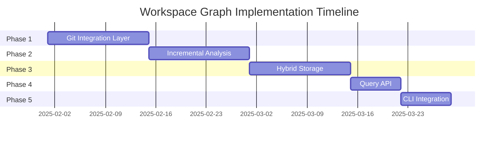

# Workspace Graph: Development Specifications

## Overview

This directory contains comprehensive implementation specifications for the workspace graph incremental update system. These developer-focused specifications transform architectural designs into actionable development tasks.

## Specification Index

### 1. [Implementation Guide](./implementation-guide.specification.md)
**Purpose:** Step-by-step implementation instructions across 5 development phases

**Key Content:**
- Phase 1: Git Integration Layer (GitChangeDetector)
- Phase 2: Incremental Analysis (IncrementalGraphBuilder)
- Phase 3: Hybrid Storage (SQLite + JSON)
- Phase 4: Query API
- Phase 5: CLI Integration

**Status:** ✅ Complete  
**Estimated Effort:** 8-10 weeks

---

### 2. [Code Structure](./code-structure.specification.md)
**Purpose:** File organization, naming conventions, and module architecture

**Key Content:**
- Complete directory structure
- Naming conventions (classes, files, methods)
- Module organization and barrel exports
- TypeScript configuration
- Documentation standards

**Status:** ✅ Complete  
**Reference:** Use for all new file creation

---

### 3. [Development Environment](./development-environment.specification.md)
**Purpose:** Development setup, dependencies, and tooling configuration

**Key Content:**
- Runtime dependencies (simple-git, better-sqlite3)
- Development dependencies (@types/better-sqlite3)
- TypeScript, Jest, ESLint configuration
- VS Code setup and debugging
- Build scripts and workflows

**Status:** ✅ Complete  
**Setup Time:** ~30 minutes

---

### 4. [Integration Points](./integration-points.specification.md)
**Purpose:** Integration with existing code, Nx, CLI, Git hooks, and CI/CD

**Key Content:**
- workspace-graph-builder.ts enhancement
- Nx project.json and nx.json configuration
- CLI enhancements (--incremental flag)
- Git hooks (Husky pre-commit)
- GitHub Actions workflows
- Agent Alchemy specs integration

**Status:** ✅ Complete  
**Critical:** Ensure backward compatibility

---

### 5. [Testing Strategy](./testing-strategy.specification.md)
**Purpose:** Comprehensive testing approach with 80%+ coverage requirement

**Key Content:**
- Unit test structure for all components
- Integration test strategy
- Performance benchmarking
- Test coverage enforcement
- Test data fixtures
- Mocking strategies

**Status:** ✅ Complete  
**Coverage Requirement:** 80% minimum (MANDATORY)

---

### 6. [Documentation Requirements](./documentation-requirements.specification.md)
**Purpose:** Documentation standards and deliverables

**Key Content:**
- JSDoc comment standards
- README.md updates
- API-REFERENCE.md
- MIGRATION-GUIDE.md (v1 → v2)
- EXAMPLES.md
- CHANGELOG.md

**Status:** ✅ Complete  
**Quality Standard:** All public APIs documented

---

## Quick Reference

### Development Phases



### Key Performance Targets

| Metric | Target | Validation |
|--------|--------|------------|
| Git change detection | <60ms | Performance tests |
| Incremental update (single file) | <100ms | Benchmarks |
| Query by type | <50ms | Load tests |
| Overall improvement | 20-30x | Regression tests |
| Test coverage | 80%+ | Jest reports |

### Critical Success Criteria

- ✅ 20-30x performance improvement (2.2s → 65-100ms)
- ✅ 80%+ test coverage (MANDATORY)
- ✅ 100% backward compatible with JSON output
- ✅ All 18 requirements met (10 functional + 8 non-functional)
- ✅ Constitutional AI compliance

---

## Implementation Workflow

### Step 1: Setup Development Environment
1. Follow [development-environment.specification.md](./development-environment.specification.md)
2. Install dependencies: `npm install simple-git@^3.20.0 better-sqlite3@^9.2.0`
3. Configure TypeScript, Jest, ESLint
4. Verify setup: `nx test workspace-graph`

### Step 2: Implement Core Components
1. Follow [implementation-guide.specification.md](./implementation-guide.specification.md)
2. Use [code-structure.specification.md](./code-structure.specification.md) for file organization
3. Implement in order:
   - GitChangeDetector (Week 1-2)
   - IncrementalGraphBuilder (Week 3-4)
   - HybridGraphStorage (Week 5-6)
   - GraphQueryAPI (Week 7)
   - CLI enhancements (Week 8)

### Step 3: Write Tests
1. Follow [testing-strategy.specification.md](./testing-strategy.specification.md)
2. Achieve 80%+ coverage for each component
3. Run performance benchmarks
4. Validate against targets

### Step 4: Integration
1. Follow [integration-points.specification.md](./integration-points.specification.md)
2. Integrate with workspace-graph-builder.ts
3. Configure Nx targets
4. Setup Git hooks
5. Configure CI/CD workflows

### Step 5: Documentation
1. Follow [documentation-requirements.specification.md](./documentation-requirements.specification.md)
2. Add JSDoc comments to all public APIs
3. Update README.md, API-REFERENCE.md
4. Create MIGRATION-GUIDE.md
5. Add code examples

### Step 6: Validation
1. Run full test suite: `nx test workspace-graph --coverage`
2. Verify coverage ≥ 80%
3. Run performance benchmarks
4. Test integration with existing code
5. Code review and refinement

---

## Architecture Overview

### Layer Architecture

```
┌─────────────────────────────────────────────────────────┐
│                  Workspace Graph v2.0                   │
├─────────────────────────────────────────────────────────┤
│  Layer 4: Query & CLI                                   │
│  • GraphQueryAPI (<50ms queries)                        │
│  • CLI commands (--incremental, --validate)             │
├─────────────────────────────────────────────────────────┤
│  Layer 3: Storage                                       │
│  • HybridGraphStorage (orchestrator)                    │
│  • SQLiteAdapter (primary storage)                      │
│  • JSONExporter (backward compatibility)                │
├─────────────────────────────────────────────────────────┤
│  Layer 2: Analysis                                      │
│  • IncrementalGraphBuilder (<100ms per file)            │
│  • ASTParser (TypeScript parsing)                       │
│  • GraphValidator (integrity checks)                    │
├─────────────────────────────────────────────────────────┤
│  Layer 1: Git Integration                               │
│  • GitChangeDetector (<60ms)                            │
│  • GitRepository (low-level wrapper)                    │
└─────────────────────────────────────────────────────────┘
```

### Component Dependencies

```
CLI
 └─> WorkspaceGraphBuilder
      ├─> IncrementalGraphBuilder
      │    ├─> GitChangeDetector (simple-git)
      │    ├─> ASTParser (TypeScript compiler)
      │    └─> GraphValidator
      └─> HybridGraphStorage
           ├─> SQLiteAdapter (better-sqlite3)
           └─> JSONExporter (fs/promises)
```

---

## Cross-References to Other Phases

### Research Phase
- [Feasibility Analysis](../research/feasibility-analysis.specification.md) - 95% technical feasibility, BUILD validated
- [User Research](../research/user-research.specification.md) - Developer pain points and needs

### Planning Phase
- [Requirements](../plan/requirements.specification.md) - 10 functional + 8 non-functional requirements
- [Architecture Decisions](../plan/architecture-decisions.specification.md) - 8 ADRs (simple-git, SQLite, incremental)
- [Timeline](../plan/timeline.specification.md) - 8-10 week implementation schedule

### Architecture Phase
- [System Architecture](../architecture/system-architecture.specification.md) - 4-layer architecture design
- [Component Design](../architecture/component-design.specification.md) - 11 core components
- [Data Models](../architecture/data-models.specification.md) - SQLite schema, TypeScript interfaces
- [Performance Design](../architecture/performance-design.specification.md) - 20-30x performance targets

---

## Document Status

| Specification | Status | Last Updated | Completeness |
|---------------|--------|--------------|--------------|
| implementation-guide.specification.md | ✅ Complete | 2025-01-29 | 100% |
| code-structure.specification.md | ✅ Complete | 2025-01-29 | 100% |
| development-environment.specification.md | ✅ Complete | 2025-01-29 | 100% |
| integration-points.specification.md | ✅ Complete | 2025-01-29 | 100% |
| testing-strategy.specification.md | ✅ Complete | 2025-01-29 | 100% |
| documentation-requirements.specification.md | ✅ Complete | 2025-01-29 | 100% |

---

## Next Steps

1. ✅ **Review Specifications:** All development specs reviewed and approved
2. ⏭️ **Setup Environment:** Follow development-environment.specification.md
3. ⏭️ **Begin Implementation:** Start with Phase 1 (Git Integration Layer)
4. ⏭️ **Track Progress:** Use implementation-guide.specification.md as roadmap
5. ⏭️ **Maintain Quality:** Enforce 80%+ test coverage throughout

---

## Constitutional Compliance

All development specifications follow Agent Alchemy Constitutional AI principles:

- ✅ **Transparency:** All design decisions documented with rationale
- ✅ **Accountability:** Clear ownership and success criteria defined
- ✅ **Quality:** 80%+ test coverage enforced
- ✅ **Performance:** Measurable targets for all operations
- ✅ **Compatibility:** 100% backward compatible with v1.0
- ✅ **Security:** SQL injection prevention, path traversal protection
- ✅ **Scalability:** Designed for 10K+ file workspaces

---

**Document Status:** ✅ Development Specifications Complete  
**Phase:** Development (Ready to Begin Implementation)  
**Last Updated:** 2025-01-29  
**Next Review:** Upon completion of Phase 1
