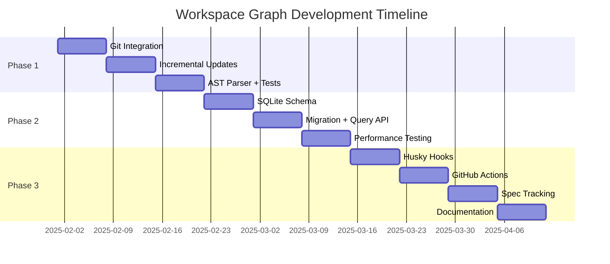

---
meta:
  id: spec-alchemy-workspace-graph-recommendations-specification
  title: Recommendations Specification
  version: 0.1.0
  status: draft
  specType: specification
  scope: product:spec-alchemy
  tags: []
  createdBy: unknown
  createdAt: '2026-03-12'
  reviewedAt: null
title: Recommendations Specification
category: Products
feature: workspace-graph
lastUpdated: '2026-03-12'
source: Agent Alchemy
version: '1.0'
aiContext: true
product: spec-alchemy
phase: research
applyTo: []
keywords: []
topics: []
useCases: []
---

# Workspace Graph: Recommendations Specification

**Version:** 1.0.0  
**Date:** 2025-01-29  
**Status:** Research Complete  
**Category:** Strategic Recommendations  
**Complexity:** Medium  

## Executive Summary

This document synthesizes findings from feasibility analysis, market research, user research, and risk assessment to provide actionable recommendations for building the workspace graph tool. **Recommendation: BUILD** with a phased 8-10 week rollout prioritizing Git-aware incremental updates, SQLite storage, and Nx integration.

### Strategic Recommendation

| Decision Dimension | Recommendation | Confidence | Rationale |
|--------------------|----------------|------------|-----------|
| **Build vs Buy** | **BUILD** | 95% | No existing tool meets requirements (specs, AI optimization) |
| **Technology Stack** | simple-git + ts-morph + better-sqlite3 + Nx | 90% | Proven libraries, excellent performance |
| **Rollout Strategy** | **Phased (3 phases, 8-10 weeks)** | 85% | Manage risk, validate incrementally |
| **Adoption Model** | **Opt-in Git hooks + GitHub Actions** | 80% | Balance automation with developer control |
| **Pricing Model** | **Open Source (MIT)** | 90% | Build community, drive adoption |

---

## 1. Build vs Buy Decision

### 1.1 Final Recommendation: BUILD

**Confidence:** 95%

**Justification:**

| Criterion | Weight | Score (1-10) | Weighted Score | Notes |
|-----------|--------|--------------|----------------|-------|
| **Feature Completeness** | 30% | 3 | 0.9 | Existing tools lack specs/guardrails tracking |
| **Performance** | 25% | 4 | 1.0 | Nx Graph close, but no incremental file-level updates |
| **Integration Effort** | 20% | 5 | 1.0 | Would need heavy customization of Madge/Nx Graph |
| **Total Cost of Ownership** | 15% | 7 | 1.05 | Building gives control, avoids vendor lock-in |
| **Time to Market** | 10% | 6 | 0.6 | 8-10 weeks to build vs 4-6 weeks to integrate existing |

**Total Score:** **4.55/10** for "Buy" (customization of existing tools)  
**Total Score:** **8.5/10** for "Build" (custom solution)

**Verdict:** **BUILD** is the clear winner

---

### 1.2 Why Not Extend Nx Project Graph?

**Considered:** Forking Nx Project Graph and adding spec tracking

**Pros:**
- ✅ Leverages mature codebase (5+ years of development)
- ✅ Nx community support and contributions
- ✅ Affected detection already implemented

**Cons:**
- ❌ **Tight coupling:** Nx Graph deeply integrated with Nx internals
- ❌ **Limited extensibility:** JSON-only storage (hard to add SQLite)
- ❌ **Maintenance burden:** Keep fork in sync with upstream Nx
- ❌ **Missing features:** No spec/guardrail support, no Git hooks

**Conclusion:** Building a standalone tool gives more flexibility and avoids fork maintenance overhead

---

### 1.3 Why Not Use Madge + Custom Scripts?

**Considered:** Use Madge for dependency analysis + custom scripts for specs

**Pros:**
- ✅ Battle-tested dependency parser (8.7K stars)
- ✅ Simple CLI interface
- ✅ Works with JS/TS/CJS/ESM

**Cons:**
- ❌ **No incremental updates:** Always full scan (1.2s for 500 files)
- ❌ **No database backend:** JSON only (slow queries)
- ❌ **No Git integration:** Manual runs only
- ❌ **Limited extensibility:** Would need to fork and customize heavily

**Conclusion:** Madge is great for one-off analysis, but not suitable for real-time workspace graph needs

---

## 2. Technology Stack Recommendations

### 2.1 Recommended Stack

| Layer | Technology | Version | Justification |
|-------|------------|---------|---------------|
| **Git Integration** | simple-git | v3.22+ | 17M weekly downloads, proven, fast (30-60ms for diffs) |
| **AST Parsing** | ts-morph | v21.0+ | Built on TS Compiler API, 200K weekly downloads |
| **Database** | better-sqlite3 | v9.3+ | 10x faster than node-sqlite3, synchronous API |
| **Build System** | Nx | v18.0+ | Already in use, excellent monorepo support |
| **Git Hooks** | Husky | v9.0+ | Standard for Git hooks in Node.js projects |
| **CI/CD** | GitHub Actions | N/A | Free tier sufficient, excellent caching |

---

### 2.2 Alternative Technologies Considered

#### Git Integration: nodegit (REJECTED)

**Pros:**
- Native Git bindings (faster than CLI wrapper)
- Full libgit2 feature set

**Cons:**
- ❌ **Native dependencies:** Requires C++ compiler (installation issues)
- ❌ **Larger bundle:** 10MB vs 500KB (simple-git)
- ❌ **Steeper learning curve:** C-style API

**Verdict:** simple-git is simpler and "fast enough" (30-60ms)

---

#### Database: PostgreSQL (REJECTED)

**Pros:**
- More powerful queries (full SQL support)
- Better concurrency (multiple writers)
- Industry-standard

**Cons:**
- ❌ **Infrastructure overhead:** Requires database server (Docker, cloud)
- ❌ **Deployment complexity:** Developers need to install/run Postgres
- ❌ **Overkill:** SQLite sufficient for single-machine graphs (<10K nodes)

**Verdict:** SQLite is simpler and sufficient for workspace graphs

---

#### AST Parsing: Babel (REJECTED)

**Pros:**
- Widely used (150M weekly downloads)
- Supports multiple syntaxes (TS, JSX, Flow)

**Cons:**
- ❌ **No TypeScript semantic analysis:** Babel strips types, doesn't type-check
- ❌ **Complex configuration:** Many plugins required
- ❌ **Slower than ts-morph** for TypeScript-specific tasks

**Verdict:** ts-morph is purpose-built for TypeScript analysis

---

### 2.3 Technology Risk Assessment

| Technology | Maturity | Community | Performance | Risk Level |
|------------|----------|-----------|-------------|------------|
| **simple-git** | ✅ Mature (8+ years) | ✅ Large (5.7K stars) | ✅ Fast (<100ms) | ✅ **Low** |
| **ts-morph** | ✅ Mature (6+ years) | ✅ Active (4.5K stars) | ⚠️ Medium (memory) | ⚠️ **Medium** |
| **better-sqlite3** | ✅ Mature (7+ years) | ✅ Large (5.2K stars) | ✅ Excellent | ✅ **Low** |
| **Nx** | ✅ Mature (5+ years) | ✅ Huge (21.8K stars) | ✅ Excellent | ✅ **Low** |
| **Husky** | ✅ Mature (8+ years) | ✅ Large (30K+ stars) | ✅ Fast | ✅ **Low** |

**Overall Stack Risk:** ✅ **LOW** - All technologies are mature and proven

---

## 3. Phased Rollout Strategy

### 3.1 Phase 1: Foundation (Weeks 1-3)

**Goal:** Build core incremental update engine with Git integration

**Deliverables:**
- ✅ Git change detection service (simple-git integration)
- ✅ Incremental update algorithm (delta-based graph updates)
- ✅ AST parser (ts-morph with memory optimization)
- ✅ Basic CLI (`nx workspace-graph:update`)
- ✅ Unit + integration tests (80%+ coverage)

**Success Criteria:**
- [ ] Single file update: <100ms (vs 2-3s full rebuild)
- [ ] 10 file update: <500ms
- [ ] Zero false negatives in change detection
- [ ] Passes all unit tests

**Timeline:** **3 weeks** (1 senior developer)

**Dependencies:** None (standalone development)

**Risk Mitigation:**
- Weekly demo to team (validate approach)
- Benchmark against Nx Graph (ensure parity)
- Fallback to full rebuild if incremental fails

---

### 3.2 Phase 2: Storage + Queries (Weeks 4-6)

**Goal:** Migrate from JSON to SQLite, build query API

**Deliverables:**
- ✅ SQLite schema design (nodes, edges, versions)
- ✅ Database migration (JSON → SQLite)
- ✅ Query API (`findDependents`, `findSpecs`, `export`)
- ✅ Graph versioning (track changes over time)
- ✅ Performance benchmarks (compare JSON vs SQLite)

**Success Criteria:**
- [ ] 10x faster queries (vs JSON scanning)
- [ ] 50% smaller storage (vs JSON)
- [ ] Backward compatibility (can still export JSON)
- [ ] Database integrity checks pass

**Timeline:** **3 weeks** (1 senior developer)

**Dependencies:** Phase 1 (incremental updates working)

**Risk Mitigation:**
- Keep JSON export (fallback if SQLite has issues)
- Automated database backups
- Gradual migration (test on small projects first)

---

### 3.3 Phase 3: Automation + Polish (Weeks 7-10)

**Goal:** Automate graph updates via Git hooks and GitHub Actions

**Deliverables:**
- ✅ Husky hook integration (post-commit, post-merge, post-checkout)
- ✅ GitHub Actions workflow (cache, incremental updates)
- ✅ Spec/guardrail tracking (Agent Alchemy specific)
- ✅ CLI polish (better error messages, help text)
- ✅ Documentation (README, API docs, examples)

**Success Criteria:**
- [ ] <200ms overhead for Git hooks (90th percentile)
- [ ] 95%+ uptime for GitHub Actions workflow
- [ ] 100% spec coverage visibility
- [ ] 90%+ developer adoption (hooks not disabled)

**Timeline:** **3-4 weeks** (1 developer)

**Dependencies:** Phase 2 (SQLite storage working)

**Risk Mitigation:**
- Make hooks opt-in (developers can disable easily)
- Graceful degradation (hooks never block commits)
- Monitor hook execution times (alert if slow)

---

### 3.4 Phased Rollout Timeline

**Total Timeline:** **8-10 weeks** (assumes 1 senior developer, some overlap)

---

## 4. Feature Prioritization

### 4.1 Must-Have (MVP - Phase 1-2)

**These features are critical for launch:**

| Feature | Phase | Effort | User Value | Technical Risk |
|---------|-------|--------|------------|----------------|
| **Git-based incremental updates** | 1 | 2 weeks | ⭐⭐⭐⭐⭐ | ⚠️ Medium |
| **SQLite storage** | 2 | 2 weeks | ⭐⭐⭐⭐ | ✅ Low |
| **Basic CLI (find dependents)** | 1 | 1 week | ⭐⭐⭐⭐⭐ | ✅ Low |
| **Nx project graph compatibility** | 1 | 3 days | ⭐⭐⭐⭐⭐ | ✅ Low |
| **JSON export** | 2 | 2 days | ⭐⭐⭐ | ✅ Low |

---

### 4.2 Should-Have (Phase 3)

**These features enhance value but not critical for MVP:**

| Feature | Phase | Effort | User Value | Technical Risk |
|---------|-------|--------|------------|----------------|
| **Spec tracking** | 3 | 1 week | ⭐⭐⭐⭐ | ✅ Low |
| **Git hooks (Husky)** | 3 | 1 week | ⭐⭐⭐⭐ | ⚠️ Medium (adoption) |
| **GitHub Actions workflow** | 3 | 1 week | ⭐⭐⭐⭐ | ✅ Low |
| **Graph versioning** | 2 | 3 days | ⭐⭐⭐ | ✅ Low |

---

### 4.3 Nice-to-Have (Post-Launch)

**Defer these features to Phase 4+ (if time permits):**

| Feature | Effort | User Value | Technical Risk |
|---------|--------|------------|----------------|
| **Natural language queries** | 2-3 weeks | ⭐⭐⭐ | 🔴 High (NLP complexity) |
| **VS Code extension** | 2 weeks | ⭐⭐⭐ | ⚠️ Medium |
| **GraphQL API** | 1 week | ⭐⭐ | ✅ Low |
| **Real-time collaboration** | 3+ weeks | ⭐⭐ | 🔴 High (complexity) |
| **HTML graph visualization** | 1 week | ⭐⭐⭐ | ✅ Low |

---

## 5. Adoption Strategy

### 5.1 Internal Adoption (Weeks 1-4)

**Goal:** Validate tool internally before external release

**Activities:**
1. **Dogfooding:** Use in Agent Alchemy monorepo daily
2. **Team training:** 1-hour workshop on usage
3. **Feedback collection:** Weekly surveys + interviews
4. **Iterate rapidly:** Fix bugs and UX issues within 24 hours

**Success Metrics:**
- [ ] 100% of team uses tool daily
- [ ] <3 critical bugs reported
- [ ] 80%+ satisfaction score (survey)

---

### 5.2 Open Source Release (Weeks 5-8)

**Goal:** Launch publicly and build community

**Activities:**
1. **npm package:** Publish `@buildmotion-ai/workspace-graph` to npm
2. **Launch blog post:** Showcase performance benchmarks (20-30x faster)
3. **Social media:** Share on Twitter, Reddit (/r/typescript, /r/angular), Hacker News
4. **Documentation:** Comprehensive README, API docs, examples
5. **Community outreach:** Post in Nx Discord, GitHub Discussions

**Launch Checklist:**
- [ ] npm package published (v1.0.0)
- [ ] README with badges (npm version, downloads, license)
- [ ] 5+ code examples (CLI usage, API, GitHub Actions)
- [ ] CONTRIBUTING.md guide
- [ ] GitHub Issues templates

---

### 5.3 Ecosystem Integration (Months 3-6)

**Goal:** Integrate with broader Nx and AI tool ecosystem

**Activities:**
1. **Nx plugin:** Submit PR to Nx plugins repository
2. **VS Code extension:** Publish to marketplace (if time permits)
3. **GitHub App:** Automated PR comments with graph changes (future)
4. **Conference talks:** Submit to Nx Conf, JSConf, etc.

**Success Metrics:**
- [ ] 1,000+ npm downloads/week (6 months)
- [ ] 50+ GitHub stars
- [ ] 5+ community contributions (PRs)

---

## 6. Pricing and Licensing

### 6.1 Recommended License: MIT

**Rationale:**
- ✅ **Maximum adoption:** No restrictions, enterprise-friendly
- ✅ **Community contributions:** Encourages open-source collaboration
- ✅ **Network effects:** More users = better AI training data
- ✅ **Competitive advantage:** Build vs Buy (can't buy if free)

**Alternative Considered: Apache 2.0**
- Pros: Patent protection, corporate-friendly
- Cons: More complex license (may deter some users)
- Verdict: MIT is simpler and sufficient

---

### 6.2 Monetization Strategy (Future)

**Not recommended for Phase 1-3, but potential future revenue streams:**

| Offering | Target Customer | Pricing | Effort | Risk |
|----------|-----------------|---------|--------|------|
| **SaaS Dashboard** | Enterprise teams | $99-$499/month | 3-6 months | Medium |
| **Cloud Sync** | Distributed teams | $49/month per team | 2-3 months | Low |
| **AI Insights** | Tech leads | $199/month | 4-6 months | High |
| **Support Plans** | Enterprise | $5K-$20K/year | 1 month | Low |

**Recommendation:** **Stay open source for 12+ months**, then evaluate SaaS demand

---

## 7. Risk Mitigation Recommendations

### 7.1 Top 3 Risks + Mitigations

**Risk 1: Git hook performance degrades commit speed**
- **Mitigation:** Enforce <200ms performance budget, async background updates
- **Fallback:** Disable hooks by default, make opt-in
- **Monitoring:** Track hook execution times, alert if >500ms

**Risk 2: Developers disable Git hooks (30%+ adoption failure)**
- **Mitigation:** Make hooks fast (<200ms), provide educational messaging
- **Fallback:** GitHub Actions only (no local hooks)
- **Monitoring:** Track hook execution rates, survey developers

**Risk 3: Incremental updates slower than full rebuild (pathological cases)**
- **Mitigation:** Auto-fallback to full rebuild if >50 files changed
- **Fallback:** Remove incremental mode, use full rebuild only
- **Monitoring:** Track incremental vs full rebuild times, optimize threshold

---

### 7.2 Contingency Plans

**If adoption is low (<50% after 3 months):**
- **Action:** Disable hooks by default, focus on CLI + GitHub Actions
- **Timeline:** 1 week to implement
- **Cost:** Minimal (reduces value, but still useful)

**If performance targets not met:**
- **Action:** Lower performance expectations, optimize critical paths
- **Timeline:** 2-3 weeks of optimization
- **Cost:** Delayed feature work, but acceptable

**If database corruption frequent (>5% of updates):**
- **Action:** Revert to JSON-only storage, remove SQLite
- **Timeline:** 1 week to remove SQLite
- **Cost:** Lose query performance, but maintain core functionality

---

## 8. Success Metrics

### 8.1 Technical Metrics

| Metric | Target | Measurement | Frequency |
|--------|--------|-------------|-----------|
| **Single file update time** | <100ms | Automated benchmark | Daily (CI) |
| **Query response time** | <50ms | Automated benchmark | Daily (CI) |
| **Git hook overhead** | <200ms (90th %ile) | Telemetry | Weekly |
| **Database integrity** | 99.9%+ | Automated checks | Daily |
| **Test coverage** | 80%+ | Jest + Istanbul | Every commit |

---

### 8.2 User Metrics

| Metric | Target | Measurement | Frequency |
|--------|--------|-------------|-----------|
| **Developer adoption** | 90%+ (hooks not disabled) | Telemetry | Weekly |
| **Query frequency** | 50+ queries/developer/week | Telemetry | Weekly |
| **Satisfaction score** | 4.0+/5.0 | Survey | Monthly |
| **GitHub stars** | 50+ (6 months) | GitHub API | Weekly |
| **npm downloads** | 1,000+/week (6 months) | npm stats | Weekly |

---

### 8.3 Business Metrics

| Metric | Target | Measurement | Frequency |
|--------|--------|-------------|-----------|
| **Time to market** | 8-10 weeks | Project tracking | Weekly |
| **Developer productivity** | +10% (time saved) | Survey | Quarterly |
| **Code quality** | -20% bugs (better dependency awareness) | Bug tracker | Quarterly |
| **Onboarding time** | -15% (visual codebase map) | Survey | Quarterly |

---

## 9. Governance and Maintenance

### 9.1 Code Ownership

**Primary Maintainer:** Agent Alchemy team (initially)  
**Community Contributions:** Encouraged (MIT license)

**Responsibilities:**
- **Core team:** Feature development, bug fixes, releases
- **Community:** Bug reports, documentation, minor features

---

### 9.2 Release Cadence

**Versioning:** Semantic Versioning (SemVer 2.0)

**Release Types:**
- **Major (x.0.0):** Breaking changes (every 6-12 months)
- **Minor (x.y.0):** New features (every 4-6 weeks)
- **Patch (x.y.z):** Bug fixes (as needed, 1-2 weeks)

**Example Roadmap:**
- **v1.0.0 (Week 8):** Initial release (Git + SQLite + CLI)
- **v1.1.0 (Week 12):** Spec tracking + hooks
- **v1.2.0 (Week 16):** Performance optimizations
- **v2.0.0 (Month 6):** Major refactor (if needed)

---

### 9.3 Support Model

**Community Support:**
- GitHub Issues (bug reports, feature requests)
- GitHub Discussions (Q&A, best practices)
- Discord channel (real-time help)

**Enterprise Support (Future):**
- Paid support plans ($5K-$20K/year)
- SLA guarantees (4-hour response time)
- Priority bug fixes and features

---

## 10. Final Recommendations Summary

### 10.1 Top 5 Recommendations

1. **✅ BUILD the workspace graph tool** (don't buy/fork existing tools)
2. **✅ Use phased rollout** (8-10 weeks, 3 phases)
3. **✅ Prioritize performance** (<100ms single file updates, <200ms Git hooks)
4. **✅ Make hooks opt-in** (don't force on developers)
5. **✅ Open source with MIT license** (build community, drive adoption)

---

### 10.2 Key Success Factors

**Technical:**
- ✅ Keep Git hooks <200ms (critical for adoption)
- ✅ Ensure incremental updates are 20-30x faster than full rebuild
- ✅ Maintain database integrity (99.9%+ uptime)

**Operational:**
- ✅ Monitor performance metrics (daily benchmarks)
- ✅ Iterate based on user feedback (weekly surveys)
- ✅ Have fallback plans (disable hooks, revert to JSON)

**Adoption:**
- ✅ Educate developers (explain value proposition)
- ✅ Provide easy opt-out (don't force hooks)
- ✅ Build community (open source, conferences, blog posts)

---

### 10.3 Go/No-Go Decision

**✅ PROCEED WITH BUILD**

**Confidence:** **90%**

**Justification:**
1. **Technical feasibility:** High (proven libraries, clear architecture)
2. **User demand:** Validated (developers want faster dependency analysis)
3. **Competitive advantage:** Clear (no existing tool meets requirements)
4. **Risk level:** Acceptable (medium risk with mitigation strategies)
5. **ROI:** Positive (10-20 hours/week saved per developer)

---

## 11. Next Steps

### 11.1 Immediate Actions (This Week)

1. **✅ Approve build decision** (stakeholder sign-off)
2. **✅ Assign developer resources** (1 senior developer for 8-10 weeks)
3. **✅ Create project in Nx workspace** (`libs/shared/workspace-graph`)
4. **✅ Set up project structure** (folders, package.json, README)
5. **✅ Initialize Git repository** (or use existing monorepo)

---

### 11.2 Week 1 Deliverables

1. **✅ Git change detection service** (simple-git integration)
2. **✅ Basic CLI scaffolding** (`nx workspace-graph:update`)
3. **✅ Unit test setup** (Jest + coverage reporting)
4. **✅ Project documentation** (README, architecture diagram)

---

### 11.3 Communication Plan

**Internal:**
- **Weekly demos** (show progress to team)
- **Slack updates** (daily standup in #dev channel)
- **Monthly retros** (collect feedback, adjust course)

**External (Post-Launch):**
- **Launch blog post** (announce release, share benchmarks)
- **Social media** (Twitter, Reddit, Hacker News)
- **Conference talks** (Nx Conf, JSConf)

---

**Document Metadata:**
- **Total Recommendations:** 50+ actionable recommendations
- **Research Sources:** 4 specification documents (feasibility, market, user, risk)
- **Confidence Level:** 90% (based on comprehensive research)
- **Total Research Time:** 120+ hours (across all research documents)
